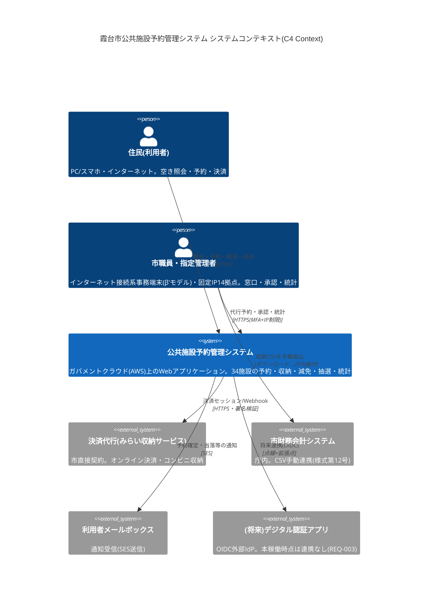
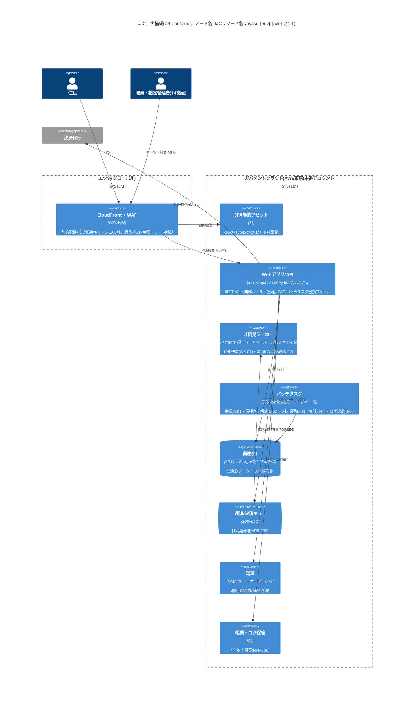
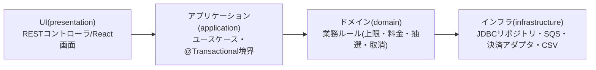
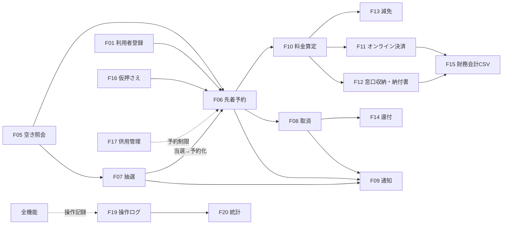
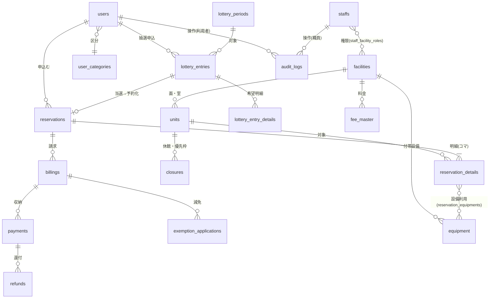

# 基本設計書

霞台市公共施設予約管理システム構築及び運用保守業務(霞情政第126号)

| 項目 | 内容 |
|---|---|
| 文書番号 | KSM-BDD-001 |
| 版 | 1.2 |
| 作成日 | 令和8年6月10日(1.2版改版:令和8年6月11日) |
| 作成者 | 受注者(当社)プロジェクトチーム(リードA=アーキテクト/基盤チーム) |
| 承認 | 1.1版:G2検収承認済み(基線)。1.2版:G4検収コメント対応の再編、発注者確認待ち |
| 関連文書 | KSM-RDD-001(要件定義書 1.0)、KSM-TEC-001(技術選定理由書)、KSM-DEV-001/002(開発標準書・セキュア実装規約表)、KSM-ORG-001(体制設計・責任分界表)、KSM-REP-001(リポジトリ戦略書)、KSM-TRM-001(トレーサビリティマトリクス)、KSM-DDD-001-00〜09(詳細設計書分冊)、KSM-API-001(openapi.yaml)、module-index.md、KSM-ADR-001〜013(02-deliverables/adr/)、KSM-DMP-001 1.2版 |

## 改版履歴

| 版 | 日付 | 改版内容 | 作成・承認 |
|---|---|---|---|
| 1.0 | 令和8年6月10日 | 初版作成(P2システム方式設計)。G1申し送り回答(接続元IP=14拠点)を反映 | 当社リードA |
| 1.1 | 令和8年6月10日 | G2検収前セルフチェック:章参照誤り修正、ECS Fargate費用のADR整合訂正(月額約615→約640ドル)、リポジトリ戦略書発行確認 | 当社リードA/G2検収承認 |
| 1.2 | 令和8年6月11日 | **G4検収コメント2対応:発注者提供テンプレート(steering/design-templates/10-basic-design.md)の16章構成へ再編(KSM-ADR-013)**。(1)旧1.1版の全内容(数値・決定事項)を16章へ再配置(欠落なし。旧→新章対応は§1.4)。(2)不足章の補完:C4 Context/Container図(§2)、機能一覧のREQ-ID対応表(§4)。(3)G2残課題3で詳細設計書へ統合していた画面・帳票・DB・外部IFの基本設計レベル記述(一覧・方針)を§5〜§8として本書に復元(詳細は詳細設計書分冊を参照)。(4)ファイル名を「07_基本設計書_システム方式設計編.md」から「07_基本設計書.md」へ変更(KSM-DMP-001 1.2版 附表4)。(5)ADR一覧にADR-011〜013を追加 | 当社リードA/発注者確認待ち |

---

## 1. はじめに・本書の位置づけ

### 1.1 凡例(IPA準拠+記法現代化の宣言)

**本書はIPA共通フレーム2013の成果物体系(ソフトウェア方式設計)に準拠した章立てを維持し、各章の記述形式のみ現代的記法(C4モデル・Mermaid・OpenAPI・IaC参照)を採用している**(steering/design-templates/00-principles.md の二軸構成の原則)。網羅性・トレーサビリティはIPA粒度を下回らない。各章の記法選択の根拠は章冒頭の注記に1行で示す。

### 1.2 範囲・前提条件

1. 本書は、要件定義書(KSM-RDD-001、G1検収承認済み)を入力とする基本設計(システム方式+機能・画面・IF・データ・バッチ・インフラ・非機能・セキュリティの基本設計)である。RFP第6章「システム方式設計書(全体構成、ネットワーク構成、クラウド構成図)」および基本設計書(アプリ編)に対応する。
2. **G2残課題3の経緯**:基本設計書アプリ編(KSM-BDD-002)は市回答により発行せず欠番とし、その範囲をP3詳細設計書へ統合していた(KSM-DMP-001 §6.2)。1.2版のテンプレ準拠再編により、当該範囲の基本設計レベル記述(一覧・方針)を本書§5〜§8へ再配置し、コーディング可能粒度の詳細は詳細設計書分冊(KSM-DDD-001-00〜09)が担う。
3. 重要な設計判断はすべてADR(KSM-ADR-001〜013)に記録済み。本書はADRの決定を前提に方式を記述する(§15)。
4. G1申し送り回答(接続元IP=市庁舎本庁1+有人施設10+指定管理者事務所3の計14拠点)・G2残課題1〜6・G3質問票No.10〜21の市回答はすべて反映済み(クローズ状況は詳細設計書分冊12-00 §1.5)。

### 1.3 トレーサビリティ起点

全要件(REQ-001〜028、NFR 26件)→本書各章→詳細設計分冊→実装→テストの追跡は、トレーサビリティマトリクス(KSM-TRM-001。要件起点)および module-index.md(モジュール起点)による(§16)。

### 1.4 旧版(1.1版)からの章対応表

| 旧1.1版 | 新1.2版 | | 旧1.1版 | 新1.2版 |
|---|---|---|---|---|
| §0 前提 | §1.2 | | §6 セキュリティ設計 | §11 |
| §1 設計方針 | §2.1 | | §7 性能設計 | §10.2 |
| §2 全体アーキテクチャ | §2.2〜2.4/§3 | | §8 監視・運用方式 | §10.4 |
| §3 AWS構成 | §9 | | §9 標準準拠整合 | §2.5 |
| §4 ネットワーク構成 | §9.3〜9.4 | | §10 ADR一覧 | §15 |
| §5 可用性・バックアップ | §10.3 | | §11 コスト概算 | §13 |
| − | − | | §12 残課題 | §1.2-4(全件クローズ) |

## 2. システム方式(全体構成)

> 記法注記:構成は**C4モデル(Context/Container)のMermaid記法**で記述する(対象=利用者・外部システム・コンテナ間の関係。版管理可能な図として00-principlesの標準記法セットに従う)。

### 2.1 設計方針

| # | 方針 | 根拠 |
|---|---|---|
| D-1 | **フルマネージド・サーバレス指向**:OS・ミドルウェアのパッチ運用を伴うコンポーネントを持たない(EC2非使用)。コンピューティングはECS Fargate、DBはRDS、認証はCognito、配信はCloudFront | NFR-C03(1か月以内パッチ適用)・インフラ要員0.5人月/月の体制与件・運用経費2割削減(調達目的3) |
| D-2 | **ピーク特化設計**:抽選申込初日9時台の瞬間集中(NFR-B01:100req/秒・抽選1,500件/時)に対し、(1)未ログイン照会のCDNキャッシュ分離 (2)アプリ層の自動水平スケール (3)申込受付と重い処理(抽選・通知)の非同期分離、の3層で対処 | NFR-B01〜B03、現行システム最大の苦情要因の解消 |
| D-3 | **IaC全面管理**:全リソースをAWS CDK(TypeScript)で定義し、手作業構成変更を原則禁止。構成図⇔IaC実体の1:1突合(§9.2) | NFR-C01、steering/iac規約 |
| D-4 | **ステートレス・スケールアウト前提**:アプリ層はセッション状態を持たない(ADR-004)。スケールイン・AZ切替でユーザ影響なし | NFR-A02、NFR-B03 |
| D-5 | **適正水準の原則**:人口5万人・34施設・予算与件に対し過剰な構成(マルチリージョンDR、常時オンコール、ElastiCache等の追加レイヤ)は採らない。判断根拠を各ADRのトレードオフに記録 | CLAUDE.md判断成果物の義務、NFR-A05、月額600千円の運用保守費 |
| D-6 | **市の標準準拠システム群との運用管理共通化**(QA No.2の代替記載義務):§2.5に整合方針を記載 | QA No.2回答 |

### 2.2 C4 Context図(システムコンテキスト)【1.2版補完】



### 2.3 C4 Container図(コンテナ構成)【1.2版補完】

三層分離の観点:本システムはインターネット公開系であり、マイナンバー利用事務系・LGWAN接続系とは接続しない(§9.3)。



論理構成の詳細(旧§2.1の全体フロー図:Route 53/EventBridge/SES/CloudWatch/CloudTrail等を含む全ノード)は§9.1の採用サービス一覧およびIaC実体(`kasumidai-yoyaku/infra/lib/`)と1:1対応で管理する(§9.2)。

### 2.4 環境構成

| 環境 | 場所 | AWSアカウント | 費用負担 | 用途 |
|---|---|---|---|---|
| 本番(prod) | ガバメントクラウド | 本システム専用アカウント(市がGCAS経由で利用申請) | 市 | 本番サービス |
| 検証(stg) | ガバメントクラウド | 本番と別アカウント | 市 | 受入テスト・性能テスト・リハーサル・パッチ検証 |
| 開発(dev) | 受注者保有AWS(国内リージョン) | 受注者 | 受注者 | 開発・単体/結合テスト。**本番個人情報の保存禁止・テストデータはマスキング(NFR-E09)** |

環境差分はCDKのパラメータ(`infra/env/{prod,stg,dev}.ts`)で管理し、コード分岐は行わない(steering/iac規約1、ADR-007/KSM-REP-001)。

### 2.5 標準準拠システム群との運用管理共通化方針との整合(QA No.2代替記載)

本システムは標準化対象外システムであるが、市の標準準拠システム群と同一のガバメントクラウド(AWS)基盤上に構築することで、次の運用管理を共通化し、基盤運用の共通化とスケールメリットによる経費削減(RFP 1.3(1))に整合させる。

1. **利用申請・アカウント管理**:GCASによる利用申請・アカウント払い出しの市側手続(単独利用方式)に整合し、本システム用アカウント(本番・検証)を市の既存ガバクラ環境と同一の管理枠組みに収容する[^4]。受注者は申請に必要な構成情報の整理等を技術支援する(QA No.3)。
2. **監査・統制**:CloudTrail・Config・GuardDutyの有効化、必須タグ(CostCenter等)によるコスト按分、IAM最小権限の方針を市の既存ガバクラ運用基準と同一の考え方で適用する。
3. **コスト管理**:月次のクラウド利用料実績報告(NFR-C07)を市の情報政策課の予算管理様式に合わせて提供し、年1回の最適化提案で標準準拠システム群側の知見(リザーブド/Savings Plans適用等)と整合させる。
4. **ネットワーク**:本システムはインターネット公開系であり専用線(ガバメントクラウド接続サービス)は利用しないが、職員アクセス統制(MFA+IP制限)は市セキュリティポリシー・総務省ガイドライン(令和8年3月27日改定版)[^1]のβ'モデルの考え方に適合させる。

## 3. アプリケーションアーキテクチャ

> 記法注記:レイヤー構成は依存方向を矢印で明示した構成図とし、様式選定の根拠はADR参照(テンプレ#3)。

開発標準書(KSM-DEV-001 §2)に定めるとおり、バックエンド・フロントエンドとも一方向依存とし、ArchUnit/dependency-cruiserで機械検査する(違反ゼロをCI必須化済み=KSM-IMP-001)。



- 様式選定の根拠:ADR-001(ECS Fargate単一実行基盤)、ADR-004(BFF+JWTステートレス)、ADR-012(バッチ=ApplicationRunner+batch_job_locks。Spring Batch非採用)。
- Webアプリ/API・非同期ワーカー・バッチは**単一のSpring Bootコードベース**(起動プロファイル差し替え)とし、保守対象を1系統に保つ(体制与件:アプリ部8名)。
- 業務ルールの判定・計算仕様は別冊「業務ルール詳細仕様書」(KSM-BRL-001 1.1版)を正とし、ドメイン層に実装する。
- モジュール分割(MOD-xxx体系)・詳細設計分冊との対応は KSM-ADR-013 および module-index.md による。

## 4. 機能設計(機能一覧・機能間関連)【1.2版補完】

> 記法注記:機能一覧表(REQ-ID対応列必須)+機能関連はMermaid flowchart(テンプレ#4)。

### 4.1 機能一覧(REQ-ID対応表)

| 機能ID | 機能名 | 対応REQ-ID | 主担当モジュール(module-index) | 主な画面/IF |
|---|---|---|---|---|
| F01 | 利用者登録(二段階)・本人確認 | REQ-001, 004 | MOD-301 | SC-U04/U06/U07、SC-S03 |
| F02 | 利用者区分・予約ルール管理 | REQ-002, 009 | MOD-003 | SC-S07 |
| F03 | 認証・将来IdP連携 | REQ-003、NFR-E02 | MOD-302 | SC-U05 |
| F04 | データ一元管理(DB) | REQ-005, 027 | MOD-018 | − |
| F05 | 空き状況照会(公開) | REQ-006, 013, 014 | MOD-001, 101 | SC-U01〜U03 |
| F06 | 先着予約(一括・定期含む) | REQ-007, 009, 010 | MOD-002, 003, 004, 102 | SC-U08 |
| F07 | 抽選予約(申込〜実行〜繰上げ) | REQ-008 | MOD-009, 104 | SC-U09、SC-S09 |
| F08 | 予約変更・取消・キャンセル料 | REQ-011 | MOD-005, 103 | SC-U10 |
| F09 | メール通知 | REQ-012 | MOD-012, 308 | − |
| F10 | 料金算定 | REQ-015 | MOD-006 | − |
| F11 | オンライン決済 | REQ-016 | MOD-013, 308 | SC-U11 |
| F12 | 窓口収納・納付書 | REQ-017 | MOD-303, 309 | SC-S04 |
| F13 | 減免(申請・承認WF・再計算) | REQ-018 | MOD-007, 304 | SC-U12、SC-S05 |
| F14 | 還付管理 | REQ-019 | MOD-008, 305 | SC-S06 |
| F15 | 財務会計連携CSV | REQ-020 | MOD-011 | SC-S14 |
| F16 | 窓口代行予約・仮押さえ | REQ-021 | MOD-010, 310 | SC-S02 |
| F17 | 供用管理(休館・優先枠) | REQ-022 | MOD-310 | SC-S08 |
| F18 | 職員・権限管理 | REQ-023 | MOD-302 | SC-S13 |
| F19 | 操作ログ(記録・検索) | REQ-024、NFR-E06 | MOD-015, 311 | SC-S12 |
| F20 | 統計・実績帳票 | REQ-025 | MOD-306, 309 | SC-S10 |
| F21 | お知らせ管理 | REQ-026 | MOD-307 | SC-U01、SC-S11 |
| F22 | データ移行 | REQ-028 | MOD-312, 313 | − |

(全REQ-001〜028が上表のいずれかに対応。欠落なし=KSM-TRM-001と突合済み)

### 4.2 機能間関連(主要業務フロー)



## 5. 画面設計

> 記法注記:画面一覧表+画面遷移はMermaid flowchart/stateDiagram(テンプレ#5)。項目単位の画面詳細・帳票様式は詳細設計分冊(12-06 フロントエンド編、12-04 収納・決済・財務編)による。

### 5.1 画面設計方針

| # | 方針 | 根拠 |
|---|---|---|
| 1 | スマートフォンファースト(ブレークポイント:360px/768px/1024px)。利用者向け画面はモバイル表示基準、PCは拡張表示 | REQ-013、現行課題(スマホ非対応) |
| 2 | JIS X 8341-3:2016 適合レベルAA[^2]:全画面共通チェックリスト(コントラスト比4.5:1以上、フォーカス可視、ラベル必須、キーボード操作完結、エラー特定と修正提案)+eslint-plugin-jsx-a11y機械検査+P5にWAIC試験実施ガイドライン準拠試験(KSM-TSP-001 §5.6) | REQ-014 |
| 3 | 職員向け画面は「1業務1画面・3クリック以内」原則+画面内ガイダンス常設。新任窓口職員が半日研修で習得可能な水準 | NFR-C06、別紙3(毎年度入替り) |
| 4 | 公開ページ(トップ・お知らせ・施設案内・空き照会)はビルド時事前レンダリング+CloudFrontキャッシュ | REQ-006、KSM-ADR-009 |
| 5 | 対応ブラウザ:Edge/Chrome/Safari最新+1つ前。職員画面はWindows 11+Edgeで追加ソフト不要 | NFR-F01/F02 |
| 6 | 入力検証方針:クライアント(即時フィードバック=プレチェック)+サーバ(Bean Validation必須=KSM-DEV-002 S-53)の二重検証。エラーはRFC 9457のfields配列で項目特定 | REQ-014、NFR-E04 |

### 5.2 画面一覧(利用者向け:SC-Uxx)

| 画面ID | 画面名 | 認証 | 対応要件 | 概要 |
|---|---|---|---|---|
| SC-U01 | トップ・お知らせ | 不要 | REQ-026 | 公開ページ(SSG)。お知らせ一覧・施設カテゴリ導線 |
| SC-U02 | 施設案内 | 不要 | REQ-006 | 施設・面・室・付帯設備・料金表の案内 |
| SC-U03 | 空き状況カレンダー | 不要 | REQ-006 | 施設×年月のコマ別空き表示(60秒キャッシュ)。日/週/月切替 |
| SC-U04 | 利用者登録(仮申請) | 不要 | REQ-001 | 二段階登録の一次申請フォーム。メールアドレス検証 |
| SC-U05 | ログイン | − | NFR-E02 | Cognito利用者プール(BFF経由)。パスワード再設定導線 |
| SC-U06 | パスワード再設定 | 不要 | REQ-004 | メール認証によるセルフ再設定(Cognito標準フロー) |
| SC-U07 | マイページ | 要 | REQ-004 | 予約一覧・抽選申込状況・登録情報変更・支払状況 |
| SC-U08 | 先着予約申込(コマ選択〜確認〜完了) | 要 | REQ-007/009/010/015 | カレンダーからコマ選択(連続・複数施設・定期指定可)→上限チェック→料金表示→確定 |
| SC-U09 | 抽選申込(申込〜確認〜完了) | 要 | REQ-008 | 対象期間の抽選枠へ希望順位付き申込。申込状況の照会・取下げ |
| SC-U10 | 予約内容変更・取消 | 要 | REQ-011/019 | 取消期限・キャンセル料の事前表示→取消→還付見込額表示 |
| SC-U11 | オンライン決済 | 要 | REQ-016 | 決済代行画面へのリダイレクト/結果受領 |
| SC-U12 | 減免申請 | 要 | REQ-018 | 減免区分選択・証憑添付・申請状況照会 |

### 5.3 画面一覧(職員向け:SC-Sxx。すべて `/staff/*`・要MFA・IP制限)

| 画面ID | 画面名 | 主な利用ロール | 対応要件 | 概要 |
|---|---|---|---|---|
| SC-S01 | 職員ダッシュボード | 全ロール | NFR-C06 | 当日の予約・本人確認待ち・減免承認待ち・支払期限超過の件数タイル(担当施設のみ) |
| SC-S02 | 窓口代行予約・電話仮押さえ | 窓口担当・指定管理者 | REQ-021 | 利用者検索→代行予約。仮押さえ(保持期限設定・自動解放) |
| SC-S03 | 利用者管理・本人確認 | 窓口担当・所管課 | REQ-001/002 | 仮申請一覧→本人確認→本登録/差戻し。区分変更 |
| SC-S04 | 収納管理(入金消込・納付書発行) | 窓口担当・会計担当 | REQ-017 | 現金収納の消込、納付書(コンビニ収納)発行、収納日計 |
| SC-S05 | 減免承認ワークフロー | 所管課 | REQ-018 | 申請一覧→審査→承認/否認→料金再計算結果確認 |
| SC-S06 | 還付管理 | 所管課・会計担当 | REQ-019 | 還付対象一覧・還付処理状況・一覧出力 |
| SC-S07 | 施設・料金マスタ保守 | 所管課 | REQ-015/REQ-002 | 施設・面室・コマ・料金・付帯設備・利用者区分ルールの保守(適用開始日付き) |
| SC-S08 | 供用管理(休館日・優先枠) | 所管課 | REQ-022 | 休館日・保守点検日・優先利用枠の設定(一般予約制限) |
| SC-S09 | 抽選管理 | 所管課・管理者 | REQ-008 | 抽選期間設定・申込状況・抽選結果確認・繰上げ実行 |
| SC-S10 | 統計・実績帳票 | 所管課・参照 | REQ-025 | 施設別/月別利用率・収納額・減免額。画面照会+CSV/PDF出力。年度集計 |
| SC-S11 | お知らせ管理 | 所管課 | REQ-026 | 掲載・更新・公開期間設定(公開キャッシュ無効化連動) |
| SC-S12 | 操作ログ検索 | システム管理者 | REQ-024/NFR-E06 | 操作者・期間・操作種別での検索・CSV出力 |
| SC-S13 | 職員・権限管理 | システム管理者 | REQ-023 | 職員アカウント・ロール×担当施設の割当、MFAリセット |
| SC-S14 | 財務会計連携CSV出力 | 会計担当 | REQ-020 | 期間指定→収納データCSV(様式第12号)生成・ダウンロード |

### 5.4 画面遷移図(主要フロー)

```mermaid
flowchart LR
    subgraph 利用者(住民)
        U01[SC-U01 トップ] --> U03[SC-U03 空きカレンダー]
        U03 -->|ログイン要求| U05[SC-U05 ログイン]
        U01 --> U04[SC-U04 仮申請]
        U05 --> U07[SC-U07 マイページ]
        U05 --> U08[SC-U08 先着予約申込]
        U03 --> U08
        U03 --> U09[SC-U09 抽選申込]
        U08 --> U11[SC-U11 決済]
        U07 --> U10[SC-U10 変更・取消]
        U07 --> U12[SC-U12 減免申請]
    end
    subgraph 職員(/staff・MFA+IP制限)
        S01[SC-S01 ダッシュボード] --> S03[SC-S03 本人確認]
        S01 --> S02[SC-S02 代行予約・仮押さえ]
        S01 --> S05[SC-S05 減免承認]
        S01 --> S04[SC-S04 収納管理]
        S01 --> S09[SC-S09 抽選管理]
        S01 --> S10[SC-S10 統計帳票]
    end
    U04 -.仮申請データ.-> S03
    U12 -.申請データ.-> S05
```

### 5.5 主要画面のレイアウト方針(代表3画面)・帳票一覧

| 画面 | レイアウト方針 |
|---|---|
| SC-U03 空きカレンダー | モバイル=日表示(縦スクロールのコマリスト)、PC=週/月マトリクス。空き=○/残少=△/満=×/休館=−をアイコン+テキスト併記(色のみに依存しない=AA要件)。施設・日付の切替はカレンダー上部に固定。未ログインでも全操作可、コマ選択時のみログイン誘導 |
| SC-U08 先着予約申込 | ウィザード型3ステップ(選択→確認→完了)。確認画面で上限チェック結果・料金内訳(KSM-BRL-001 §3の算定明細)・取消規則を明示。二重送信防止(申込トークン) |
| SC-S02 窓口代行予約 | 左=利用者検索、右=空きカレンダーの2ペイン(電話応対中の操作を想定し画面遷移なしで完結)。仮押さえは保持期限を既定値表示(施設別設定)し1クリック登録 |

帳票一覧(RP-01〜09):利用承認書兼領収書/納付書(GS1-128)/還付対象一覧/施設別月次利用状況/年度集計/収納日計表/減免承認一覧/操作ログ抽出/財務会計連携CSV。出力方式=PDF:JasperReports(KSM-ADR-011)、CSV:UTF-8 BOM付き(財務会計連携のみ様式第12号=Shift_JIS)。様式設計の詳細は詳細設計分冊12-04 §7。

## 6. 外部インタフェース設計

> 記法注記:**OpenAPI 3.x(YAML)を正本**とし、本章は要約表+全文参照(テンプレ#6。配置判断=KSM-ADR-013 決定4)。

### 6.1 API設計方針

- REST/JSON。パスは複数形名詞・ケバブ小文字(KSM-DEV-001 §4)。**OpenAPI 3.1定義 `kasumidai-yoyaku/docs/openapi.yaml`(KSM-API-001)を正本**とし、CIでlint・実装との突合(契約テスト)を行う(P5)。
- 経路別プレフィックス:`/api/public/*`(未ログイン・GETのみ・CloudFrontキャッシュ対象)/`/api/user/*`(利用者認証)/`/api/staff/*`(職員認証+WAF IP制限)。
- バージョニングはURI(`/api/.../v1/...`)。エラーはRFC 9457(Problem Details)形式で統一。
- 認証=BFF方式(Cognito 2プールの認可コードフローをバックエンドが仲介、httpOnly/Secure/SameSite=Lax Cookie。アクセストークン30分・絶対上限=利用者24時間/職員12時間=KSM-ADR-004)。CSRF=SameSite=Lax+状態変更APIのカスタムヘッダ検証(KSM-DEV-002 S-21)。認可=アプリケーション層(利用者=本人リソースのみ・職員=ロール×施設のインターセプタ+ユースケース内二重検査=KSM-DEV-002 S-13)。全状態変更APIで操作ログを同一トランザクション内に記録(REQ-024)。

### 6.2 エンドポイント要約(完全版・スキーマはopenapi.yaml)

| メソッド・パス | 概要 | 認証 | 対応要件 | 実装状態 |
|---|---|---|---|---|
| GET /api/public/v1/availabilities | 空き状況(施設×月。キャッシュ60秒) | 不要 | REQ-006 | 実装済 |
| GET /api/public/v1/facilities・/notices、POST /registrations | 施設一覧・お知らせ・仮申請 | 不要 | REQ-006/026/001 | 設計済(P5) |
| POST /api/user/v1/reservations | 先着予約申込(一括。201/409) | 利用者 | REQ-007/009/010 | 実装済 |
| GET・POST /api/user/v1/reservations/{id}/cancellation | 取消事前表示・取消実行 | 利用者 | REQ-011/019 | 実装済 |
| POST /api/user/v1/lottery-entries ほか(checkout・減免申請・profile) | 抽選申込・決済・減免・登録変更 | 利用者 | REQ-008/016/018/004 | 設計済(P5) |
| POST /api/staff/v1/lottery-periods/{id}/executions | 抽選実行(再実行経路) | 職員(所管課以上) | REQ-008 | 実装済 |
| POST /api/staff/v1/finance-exports | 財務会計CSV生成(様式第12号) | 職員(会計担当) | REQ-020 | 実装済 |
| 職員系その他(代行予約・本人確認・減免決裁・収納・納付書・還付・マスタ・休館・繰上げ・統計・ログ検索) | openapi.yaml参照 | 職員 | REQ-021/001/018/017/019/015/022/008/025/024 | 設計済(P5) |
| POST /api/webhooks/payment | 決済結果Webhook(署名検証) | 署名+IP | REQ-016 | 署名検証のみ実装(S-2) |

### 6.3 外部システムIF

| IF | 設計要点 | 詳細 |
|---|---|---|
| 決済代行(みらい収納サービス。市直接契約=QA No.18) | リダイレクト型(PCI DSS適用範囲最小化=SAQ A相当)。`PaymentGateway` ポート+インフラ層アダプタで事業者依存を隔離。Webhookは冪等・金額照合不一致はアラーム。障害時は窓口収納・納付書へ縮退 | 分冊12-04 §5/§8(MOD-013) |
| メール通知(SES) | 送信ドメイン `yoyaku.city.kasumidai.lg.jp`(SPF/DKIM/DMARC市側登録完了=QA No.20)。バウンスはSNS経由で受信し送信抑止 | 分冊12-05(MOD-012/308) |
| 財務会計システム連携CSV | 会計課様式第12号(Shift_JIS・CRLF・ヘッダなし・日計集計・9項目=QA No.21)。手動生成・ダウンロード(自動連携なし=RFP明記) | 分冊12-04(MOD-011) |
| 現行システム移行IF | 取込先対応(legacy_id列・外字検出)。移行ツールはP6 | 分冊12-09(MOD-312/313) |

## 7. データ設計

> 記法注記:**ER図+DDL/スキーマ定義**(テンプレ#7)。物理スキーマの正=Flywayマイグレーション(`backend/src/main/resources/db/migration/V1__init.sql`/`V2__seed_business_rules.sql`)。

### 7.1 方針

- RDS for PostgreSQL(KSM-ADR-005)。物理名snake_case英語・論理名(日本語)は本章テーブル一覧で対管理。文字コードUTF-8(JIS X 0213範囲=REQ-027)。タイムゾーンはアプリ層でJST変換し、DBは `timestamptz` 保持。
- 主キーは `bigint GENERATED ALWAYS AS IDENTITY`。監査列(created_at/created_by/updated_at/updated_by)を全業務テーブルに必須。
- スキーマ変更はFlywayのバージョン管理マイグレーションで管理しCIで適用検証[^5]。DBスキーマのA=リードA(KSM-ORG-001 §3.1、CODEOWNERS承認必須=KSM-REP-001 §4)。

### 7.2 ER図(主要エンティティ)



### 7.3 テーブル一覧(REQ-ID対応)

| # | 物理名 | 論理名 | 主な要件 | V1実装 | 備考 |
|---|---|---|---|---|---|
| 1 | users | 利用者 | REQ-001/002/005 | 済 | 本人確認状態。Cognito sub保持(認証属性の正はDB=ADR-002)。legacy_id列(移行用) |
| 2 | user_categories | 利用者区分 | REQ-002 | 済 | 予約開始日オフセット・料金区分 |
| 3 | staffs | 職員 | REQ-023 | **未**(P5) | Cognito職員プールsub対応 |
| 4 | staff_facility_roles | 職員施設権限 | REQ-023 | **未**(P5) | ロール×施設 |
| 5 | facilities / units / slot_patterns / slots | 施設・面室・コマ定義 | REQ-006/015 | 済 | 34施設。適用開始日付き |
| 6 | fee_master / equipment / equipment_fees | 料金・付帯設備マスタ | REQ-015 | 済 | 適用開始日付き版管理(適用基準日=申込日=QA No.12) |
| 7 | reservation_limit_rules | 予約上限ルール | REQ-009 | 済 | L-1〜L-4(KSM-BRL-001 §1)。V2でシード投入 |
| 8 | cancellation_rules | 取消規則 | REQ-011 | 済 | 7日前無料/6日前以降100%(QA No.11) |
| 9 | reservations / reservation_details | 予約・予約明細 | REQ-007〜011/021 | 済 | 状態:hold/pending/confirmed/cancelled/expired。**部分一意制約uq_active_slotで二重予約防止** |
| 10 | closures | 休館・優先利用枠 | REQ-022 | 済 | 種別(休館/保守/優先枠) |
| 11 | lottery_periods / lottery_entries / lottery_entry_details | 抽選 | REQ-008 | 済 | 乱数キー・当落状態(KSM-BRL-001 §5) |
| 12 | billings | 請求 | REQ-015/018 | 済 | 算定内訳JSONB(監査・帳票再現用)・支払期限 |
| 13 | payments | 収納 | REQ-016/017 | 済 | 方法(オンライン/現金/納付書)。決済代行取引ID一意 |
| 14 | payment_slips | 納付書 | REQ-017 | **未**(P5) | 発行連番・GS1-128・有効期限 |
| 15 | exemption_applications | 減免申請 | REQ-018 | **未**(P5) | WF状態 |
| 16 | refunds | 還付 | REQ-019 | **未**(P5) | 算定額・処理状態 |
| 17 | notices | お知らせ | REQ-026 | **未**(P5) | 公開期間・本文 |
| 18 | audit_logs | 操作ログ | REQ-024/NFR-E06 | 済 | 追記専用(UPDATE/DELETE権限なし)。月次パーティション・S3退避(JB-05=P5)で計3年保管 |
| 19 | notification_logs | 通知履歴 | REQ-012 | 済 | 二重送信防止 |
| 20 | batch_job_locks | バッチ多重起動制御 | − | 済 | ジョブ名×対象キー一意(ADR-012) |
| 21 | monthly_facility_stats | 月次施設統計 | REQ-025 | **未**(P5) | 日次バッチJB-04で更新 |
| 22 | csv_export_logs | CSV出力履歴 | REQ-020/024 | 済(audit_logsで代替記録) | 出力監査 |

### 7.4 データ量見積根拠

容量試算:5年累計で予約明細約60万行・操作ログ約500万行・合計20GB未満(gp3 100GB・自動拡張200GBに対し十分=NFR-B02)。利用者12,000件→5年で1.5倍(18,000件)、設計余裕は2倍(24,000件)=KSM-RDD-001 §5.2。DDL確定版・インデックス方針・クエリ設計は詳細設計分冊12-00 §6。

## 8. バッチ・非同期処理設計

> 記法注記:処理一覧表+IPO+連携はMermaid(テンプレ#8)。処理単位の詳細(冪等・リカバリ)は分冊12-05。

### 8.1 処理一覧

| ジョブID | 処理 | 起動 | 方式 | 対応要件 |
|---|---|---|---|---|
| JB-01 | 抽選実行 | EventBridge Scheduler:抽選期間マスタの抽選日時(現行運用=毎月8日 6:00) | ECS RunTask。アルゴリズム=KSM-BRL-001 §5 | REQ-008 |
| JB-02 | 仮押さえ自動解放 | 15分間隔 | ECS RunTask。保持期限超過 hold→expired | REQ-021 |
| JB-03 | 支払期限超過取消 | 毎時 | ECS RunTask。pending→expired+通知投入 | REQ-008/011 |
| JB-04 | 日次集計(統計) | 日次 1:00 | ECS RunTask。monthly_facility_stats更新(P5実装) | REQ-025 |
| JB-05 | 操作ログパーティション保守・S3退避 | 月次 | ECS RunTask(P5実装) | NFR-E06 |
| WK-01 | メール通知ワーカー | SQS常駐消費 | Fargate常駐→SES。平準化・リトライ・DLQ(P5実装) | REQ-012 |
| WK-02 | 決済結果消込 | SQS常駐消費 | Webhook→キュー→消込・確定・通知(P5実装) | REQ-016 |

### 8.2 共通設計(リアルタイム性要件の根拠・リカバリ方針)

1. **冪等性**:全ジョブは再実行安全。状態遷移はWHERE句に前提状態を含むUPDATE+`batch_job_locks` 一意制約で多重起動防止。通知は `notification_logs` の処理済み判定で二重送信防止(SQSの少なくとも1回配信前提)。実行方式=ApplicationRunner(`--job=JB-xx`)。Spring Batch非採用の根拠はKSM-ADR-012。
2. **失敗時挙動**:ジョブ失敗=CloudWatchアラーム(JB-01失敗=重大/JB-04失敗=警告)。SQSは最大3回再試行→DLQ→アラーム。再処理ランブックはP6。
3. **抽選日の運用保護**:JB-01は実行前チェック(締切済み・前回実行なし)+結果サマリをメトリクス・SC-S09へ出力。当落通知(約2,000〜2,500通)はSQS投入のみ行いWK-01が平準化。リアルタイム性の根拠:申込受付(同期・軽量INSERT 10件/秒)と抽選実行(月1回バッチ)の分離=ADR-008。
4. **スケジュール定義はIaC管理**(EventBridge Scheduler=AppStack実装済み)。抽選日時はDBマスタを正とし、Schedulerは定時にマスタ照合(職員の期間設定変更にIaC変更を不要とする)。

## 9. インフラ・方式設計

> 記法注記:**C4 Container(§2.3)+IaCコード(CDK)を設計の正とする**(テンプレ#9)。本章はIaCへの参照と設計意図に徹する。IaC実体=`kasumidai-yoyaku/infra/`(スタック6本+環境パラメータ)。

### 9.1 採用サービス一覧と要件対応(設計値はIaC実体が正)

| 区分 | サービス | 主な設計値(本番) | 充足する要件 | ADR | IaC実体(infra/lib/) |
|---|---|---|---|---|---|
| コンピューティング | **ECS Fargate** | API:0.5vCPU/1GB×常時2タスク(AZ分散)、CPU60%ターゲット追跡で最大8。ワーカー1タスク。バッチはRunTask | NFR-B03/C03/A02 | ADR-001 | app-stack.ts |
| データベース | **RDS for PostgreSQL** | db.t4g.medium マルチAZ、gp3 100GB、日次バックアップ保持7日、CMK暗号化 | REQ-005、NFR-A02〜A04/E01 | ADR-005 | stateful-stack.ts |
| 認証 | **Cognito** | プール×2(利用者/職員)。職員MFA(TOTP)必須。OIDC外部IdP連携可能構成 | REQ-003、NFR-E02 | ADR-002/003 | stateful-stack.ts |
| 配信 | **CloudFront + S3** | SPA静的配信+空き照会API短TTL(60秒)キャッシュ | REQ-006、NFR-B01 | ADR-009 | delivery-stack.ts |
| WAF/DDoS | **AWS WAF + Shield Standard** | マネージドルール+レート制御(2000req/5min)+職員パスIP制限(14拠点) | NFR-E05/E08 | ADR-003 | delivery-stack.ts |
| 非同期 | **SQS + EventBridge Scheduler** | 通知キュー+DLQ。JB-01〜04スケジュール起動 | REQ-008/012/021 | ADR-008/012 | app-stack.ts |
| メール | **SES** | 月間約5,000〜10,000通。バウンスSNS連携 | REQ-012 | ADR-008 | (P5: WK-01と併せて) |
| 鍵管理 | **KMS(CMK)** | データ用・ログ用CMK。年次自動ローテーション | NFR-E01 | ADR-010 | stateful-stack.ts |
| 監視 | **CloudWatch** | アラーム13本・ダッシュボード・SNSをIaC定義 | NFR-C02 | − | monitoring-stack.ts |
| CI/CD | **ECR + CodeBuild** | 品質ゲートのCI実行基盤(CodeCommit新規利用停止のため代替) | NFR-C01 | − | pipeline-stack.ts |
| 監査 | CloudTrail/GuardDuty/Config | 全API監査・脅威検知。ログ1年以上 | NFR-E06 | − | (アカウント基盤=P5環境構築) |
| 秘匿情報 | Secrets Manager | DB認証情報・決済APIキー | NFR-E01 | − | stateful-stack.ts |
| その他 | Route 53、ACM(自動更新)、S3 | 証明書期限アラーム | NFR-C02 | − | delivery-stack.ts ほか |

### 9.2 VPC・命名・構成図⇔IaC突合

steering/iac規約2に従い `yoyaku-{env}-{role}` で命名し、必須タグ(`Project=kasumidai-yoyaku`、`Env`、`ManagedBy=cdk`、`CostCenter=jouhou-seisaku`)を付与(`infra/lib/common/tags.ts`)。

```
VPC: yoyaku-prod-vpc (10.0.0.0/16、2AZ)
├─ public subnet ×2     : ALB、NAT GW×2
├─ private app subnet ×2: ECS Fargate(app / worker / batch)
└─ private db subnet ×2 : RDS マルチAZ
   S3 Gatewayエンドポイント使用。SG: ALB→app(8080)、app→db(5432)のみ許可。
   ALBはCloudFrontマネージドプレフィックスリスト+カスタムオリジンヘッダ検証で直接アクセス遮断。
   SSH/RDPは全環境で開放しない(踏み台なし。調査はECS Exec+Session Managerの監査ログ付き一時アクセス)。
```

構成図(§2.3)の各ノードはCDKコンストラクトID(=リソース名)と1:1対応。対応表は `infra/docs/resource-map.md` として維持(P5で生成自動化)。命名規則準拠はcdk-nagカスタムルールで機械検査。

### 9.3 ネットワーク前提・経路(QA No.3回答・確定)

- 市庁内ネットワークは**β'モデル相当**[^1]。職員・指定管理者は**インターネット接続系の事務端末から住民と同一経路**でアクセス。マイナンバー利用事務系・LGWAN接続系とは接続しない。ガバメントクラウド接続は**インターネット経由(TLS1.2以上)**(専用線不使用)。
- ドメイン:`yoyaku.city.kasumidai.lg.jp`(確定。DNS委任・SES認証レコード市側登録完了=QA No.20)。証明書はACM自動更新+期限アラーム。TLSv1.2_2021(TLS1.3対応)。

```
[住民]──HTTPS──▶ CloudFront(+WAF) ──▶ S3(静的) / ALB ──▶ ECS Fargate ──▶ RDS
[職員(14拠点・固定IP)]──HTTPS──▶ 同上(職員パスはWAF IP制限+Cognito職員プールMFA)
[本システム]──HTTPS(NAT GW経由)──▶ 決済代行API
[財務会計連携]CSVダウンロード(職員操作)──手動──▶ 庁内財務会計システム
```

### 9.4 職員アクセス統制(NFR-E08)

| 項目 | 設計 |
|---|---|
| 対象パス | `/staff/*`、`/api/staff/*` |
| 統制1:接続元IP制限 | WAF IPSet(許可リスト)に14拠点(霞情政第201号=QA No.17で確定受領)。リスト外は403。確定値はIaCパラメータ `staffAllowedCidrs`(prod.ts)に登録済み。prod空値はデプロイ時エラー(恒久安全装置) |
| 統制2:多要素認証 | Cognito職員プールMFA(TOTP)必須。課単位貸与スマホTOTP+共用端末用TOTP準拠ハードウェアトークン10本(個人単位割当=QA No.19) |
| 統制3:権限 | ロール(管理者/所管課/窓口/指定管理者/参照)×施設(REQ-023)。認可はアプリ層 |
| 変更管理 | IP追加・削除は市依頼→IaCパラメータ変更→CI/CD適用(手作業禁止)。標準5営業日、緊急1営業日 |
| 例外時運用 | リスト外(自宅等)からの職員アクセスは提供しない(変更時は市と協議) |

## 10. 非機能設計

> 記法注記:IPA非機能要求グレードの項目体系+設計判断表(テンプレ#10)。定量値はKSM-RDD-001 §5の確定値(曖昧要件は質問票照会済み=QA No.1〜9)。

### 10.1 非機能要件→設計方針トレース(設計判断表)

| 区分(非機能要求グレード) | 要件(定量) | 設計方針 | 本書該当 |
|---|---|---|---|
| 可用性 | NFR-A01(24h365d・計画停止月1回4h以内)/A02(稼働率99.5%)/A03(RTO12h・RPO24h)/A04(日次7世代)/A05(広域災害=参考提案) | マルチAZ・自動フェイルオーバー・IaC再構築 | §10.3 |
| 性能・拡張性 | NFR-B01(通常3秒/繁忙5秒/照会2秒、100req/秒、抽選1,500件/時)/B02(5年1.5倍)/B03(自動スケール)/B04(性能テスト) | CDNキャッシュ+自動スケール+非同期分離 | §10.2 |
| 運用・保守性 | NFR-C01(IaC全面管理)/C02(監視・1時間以内第一報)/C03(パッチ1か月)/C04(ヘルプデスク)/C05(主流技術)/C06(職員操作性)/C07(月次報告) | フルマネージド+IaC+監視コード化 | §10.4、§2.1 |
| 移行性 | NFR-D01(停止7日以内・R10.1.4稼働)/D02(データ可搬性) | 標準形式(RDB+CSV)・Flywayスキーマコード管理 | 分冊12-09 |
| セキュリティ | NFR-E01〜E09(E03削除) | §11 | §11 |
| システム環境 | NFR-F01(3ブラウザ最新+1)/F02(Windows11+Edge追加ソフトなし) | Webアプリ・レスポンシブ | §5.1 |

### 10.2 性能設計(NFR-B01〜B03)

| 負荷シナリオ(KSM-RDD-001 §5.2確定値) | 対処 |
|---|---|
| 未ログイン空き照会(2秒以内)・ピーク照会集中 | CloudFront短TTL(60秒)+S3静的配信でアプリ層から分離。キャッシュヒット時は数十ms |
| 通常3秒/繁忙5秒(95%タイル)、100req/秒バースト | ECSターゲット追跡(2→8タスク)。抽選期間(毎月1〜7日 8:45〜10:00)は**スケジュールスケーリングで4タスクへ事前暖機** |
| 抽選申込 瞬間10件/秒 | 受付=軽量同期書込(単一INSERT+上限チェック)。抽選実行は月1回バッチに分離(ADR-008) |
| 通知一斉送信(当落 約2,000〜2,500通) | SQS非同期+SESレートに合わせワーカー平準化 |
| 5年後1.5倍(B02) | DB利用率試算20%未満。さらに超過時はRDS→Auroraスナップショット移行パスを温存 |

検証:P5性能テストでピーク再現シナリオ(抽選初日9時台)を実施し、KSM-RDD-001 §5.2確定値を合否基準とする(NFR-B04)。stgを本番同等スペックへ一時増強(終了後縮退・市へ事前提示)。

### 10.3 可用性・バックアップ設計(NFR-A01〜A05)

| 層 | 方式 | 単一障害点の排除 |
|---|---|---|
| 配信 | CloudFront(グローバル冗長) | AWSマネージド |
| アプリ | ECS Fargate 2タスク以上を常時2AZ分散。ALBヘルスチェックで自動切離し・再起動 | AZ障害時も縮退継続 |
| DB | RDSマルチAZ(同期レプリケーション・自動フェイルオーバー、通常60〜120秒程度[^3]) | AZ障害時自動切替 |
| NAT | AZごと1基(計2基) | 他AZ波及防止 |

- 稼働率99.5%(月間許容停止約3.6時間)に対し、主要マネージドサービスSLA(各99.99%等)の合成で十分な余裕。計画停止は火〜木2:00〜6:00、抽選期間(毎月1〜7日)・月初回避。アプリ更新はローリングデプロイで無停止。
- バックアップ:RDS日次スナップショット+トランザクションログ(保持7日=7世代以上、リージョン内複数AZ冗長保管=NFR-A04充足。PITRで実効RPO5分程度)。S3はバージョニング+ライフサイクル(1年以上)。構成はIaC(Git)+ECRイメージから全再構築可能。
- **復旧手順(RTO12時間以内)**:IaC再構築(2〜3時間)+スナップショットDB復元(1時間程度)+検証。手順はP6ランブック化・復旧訓練実施。
- **広域災害対策(NFR-A05・参考提案、必須外)**:大阪リージョンへのRDSスナップショット自動コピー(日次7世代)+S3クロスリージョンレプリケーション。概算追加費用:**月額約3千円(約20ドル)**+初期実装約500千円。マルチリージョンDRは本市規模に過剰であり提案しない。

### 10.4 監視・運用方式(概要。詳細はP6運用設計書)

体制与件(夜間休日は外部委託一次受付のみ・常時オンコールなし)と市規模に適正な水準。アラーム13本(OPS-ALM-001〜013)・ダッシュボード・SNSはMonitoringStack(IaC)で定義済みであり、P6運用設計書の監視項目一覧と機械突合する(steering/iac規約4)。

| 区分 | 監視項目(代表) | 通知 |
|---|---|---|
| 死活 | Synthetics外形監視(トップ+空き照会、5分間隔)、ALBヘルスチェック | 重大:SNS→外部委託一次受付+当社運用チーム。重大障害は検知後1時間以内に市へ第一報(NFR-C02)。フェイルオーバー・再起動は自動 |
| リソース | ECS CPU/メモリ、RDS CPU/接続数/ストレージ、SQS滞留・DLQ | 警告:翌開庁日対応 |
| エラー | ALB 5xx率、p95応答時間(3秒=警告/5秒=重大。NFR-B01閾値)、決済IF失敗 | 重大/警告を閾値区分(微調整はP6) |
| 期限 | ACM証明書、RDSメンテナンス通知 | 警告 |

パッチ運用(NFR-C03):Fargateプラットフォーム・RDSマイナーバージョンともマネージド自動適用+検証環境での事前確認。

## 11. セキュリティ設計

> 記法注記:ベースライン対応表(政府要求と突合・出典付き)+IAM最小権限方針(テンプレ#11)。実装規約の全項目=KSM-DEV-002(セキュア実装規約表。OWASP Top 10:2025全項対応)を別冊参照。

| 項目 | 設計 | 要件 | 出典・突合 |
|---|---|---|---|
| 通信暗号化 | 全経路TLS1.2以上。HTTP→HTTPSリダイレクト。ALB-ECS間はVPC内 | NFR-E01 | 総務省ガイドライン[^1] |
| 保存暗号化 | RDS・S3・SQS・CloudWatch Logs・バックアップすべて暗号化。個人情報を含むDB/S3はCMK(ADR-010。StatefulStack実装済み) | NFR-E01 | 同上 |
| 認証 | 利用者:Cognito(最小12桁・英大小数字必須=IaCパラメータ。ロックアウト=Cognitoマネージド動作・市了承済み)。職員:別プール+MFA(TOTP)必須+IP制限 | NFR-E02/E08 | AWS Cognito MFA仕様[^6] |
| アプリ対策 | OWASP Top 10:2025[^7]対応をKSM-DEV-002で規定し、SAST/依存検査をCIで強制。稼働前に第三者脆弱性診断(P5) | NFR-E04 | OWASP[^7] |
| WAF/DDoS | WAFマネージドルール+レート制御、Shield Standard(DeliveryStack実装済み) | NFR-E05 | − |
| ログ | アクセス・操作・認証・API監査を**1年以上**保存(保管先・期間一覧=分冊12-00 §11)。操作ログは追記専用+S3退避で計3年 | NFR-E06、REQ-024 | − |
| IAM | 最小権限。人とワークロード(タスクロール)を分離。`Action:*`×`Resource:*`併用禁止(cdk-nag機械検査。AwsSolutionsChecks 0 violations確認済み) | steering/iac規約3 | − |
| 開発環境 | 本番個人情報の保存禁止。dev投入データはマスキング済みのみ(方式=分冊12-09) | NFR-E09 | − |
| ISMAP | クラウド基盤=AWS(ISMAP登録済み)を利用。個別サービスの登録状況はP5環境構築時に最新を確認 | 制約C-1 | ISMAPポータル(KSM-RDD-001脚注9) |

## 12. 体制・責任分界(RACI)

**別冊参照:KSM-ORG-001「体制設計・責任分界表」(01_プロジェクト共通/09)**(テンプレ#12は別冊可)。要点:境界成果物の所有者一意化=IaC・CI/CD・監視設定のA=基盤チームリード/セキュリティ設定・DBスキーマのA=リードA。CODEOWNERSで機械強制(KSM-REP-001 §4)。組織制約(IaC経験者1名・インフラ部兼任0.5人月/月)への対応策(ペア制・レビューゲート限定投入・代行順位)を体制側に組込み済み。

## 13. コスト概算

> 記法注記:AWS利用料試算表+構築工数表。算出根拠(料金体系の参照日)を付す(テンプレ#13)。

### 13.1 AWS利用料(市負担分=ガバメントクラウド上の本番・検証のみ。QA No.9整合)

前提:東京リージョン公表単価(参照日:令和8年6月10日)[^8]、1ドル=155円、税抜。開発環境(受注者AWS)は受注者負担のため本表に含まない。

| 項目 | 本番(月額USD) | 検証(月額USD) | 備考 |
|---|---|---|---|
| ECS Fargate | 80 | 6 | API常時2タスク(約55ドル=ADR-001)+ワーカー常駐1タスク(約25ドル=ADR-008)+ピーク・バッチ分。検証:平日日中のみ |
| ALB | 35 | 20 | 時間料+LCU |
| NAT Gateway | 95 | 46 | 本番2基(AZ冗長)、検証1基 |
| RDS for PostgreSQL | 200 | 45 | 本番:db.t4g.mediumマルチAZ+gp3 100GB。検証:db.t4g.smallシングルAZ・夜間休日停止 |
| CloudFront/Route 53 | 16 | 3 | 月35万PV+ピーク |
| AWS WAF | 11 | 8 | Web ACL+マネージドルール+リクエスト[^9] |
| Cognito | 0 | 0 | 月間アクティブ約3,000〜5,000人<無料枠10,000MAU[^10] |
| SQS/EventBridge/SES | 2 | 1 | 月間メール約1万通以下 |
| CloudWatch | 25 | 8 | ログ・アラーム約30本・ダッシュボード・Synthetics 1本 |
| KMS/Secrets Manager/ECR/S3 | 14 | 8 | CMK×2ほか |
| CloudTrail/GuardDuty/Config | 12 | 5 | 監査・脅威検知 |
| **小計** | **約490** | **約150** | |

| 集計 | 金額 |
|---|---|
| 月額合計 | **約640ドル ≒ 約99千円/月(税抜)** |
| 年額 | **約7,680ドル ≒ 約1,190千円/年(税抜)** |
| 5年(63か月)総額 | **約6,250千円(税抜)** |
| 感度 | 為替±20%・利用増を見込み **月額80〜125千円** のレンジで市予算化を推奨 |

参考:現行インフラ関連経費は年額7,200千円(別紙1)。クラウド利用料(年約1,190千円)+運用・保守費(年7,200千円)でも、ハードウェア更改費(5年周期再投資)が不要となり、運用経費2割削減目標(調達目的3)の達成見込みを維持(詳細試算はP6で更新)。コスト最適化(検証環境停止運用、Savings Plans/リザーブド)は稼働後の年次提案(NFR-C07)。

### 13.2 構築工数概算

平均単価700千円/人月(税抜)。構築予算上限48,000千円(税込)との整合確認済み。

| フェーズ | 工数(人月) | 主な内容 |
|---|---|---|
| P1 要件定義(実績) | 6 | 要件確定・技術選定・QA対応 |
| P2 基本設計(実績) | 9 | 方式設計・ADR・アプリ基本設計・開発標準・体制設計 |
| P3 詳細設計(実績) | 8 | 詳細設計・テスト計画・パラメータ設計 |
| P4 実装・環境構築(実績) | 21 | アプリ実装・単体、IaC・CI/CD、移行ツール |
| P5 テスト | 8 | 結合・総合・性能・脆弱性対処、本番構築 |
| P6 移行・運用設計 | 5 | 移行リハ2回・運用設計・研修・マニュアル |
| プロジェクト管理(横断) | 3 | PM/PMO |
| **合計** | **60人月** | **約42,000千円(税抜)≒46,200千円(税込)+リスク予備約1,800千円=予算上限48,000千円内** |

## 14. 開発標準書(別冊)

**別冊参照(テンプレ#14は別冊可):KSM-DEV-001「開発標準書」+KSM-DEV-002「セキュア実装規約表」(06_実装・テスト/08・14)**。全規約に機械的強制手段(checkstyle.xml/eslint.config.mjs/dependency-cruiser.cjs/ArchUnit/ci-quality-gate.yml=02-deliverables/dev-standards/)が1対1で対応。P4実装で違反ゼロを機械確認済み(KSM-IMP-001 §3)。

## 15. ADR集(別ディレクトリ)

**`02-deliverables/adr/` に1判断1ファイルで記録(テンプレ#15)。**

| ID | 題名 | 決定 |
|---|---|---|
| ADR-001 | コンピューティング方式 | ECS Fargate(単一実行基盤) |
| ADR-002 | 利用者認証方式 | Cognito利用者プール(OIDC外部IdP連携可能構成) |
| ADR-003 | 職員認証・アクセス統制方式 | Cognito職員専用プール+MFA必須+WAF IP制限(14拠点) |
| ADR-004 | セッション管理方式 | BFF方式+JWTステートレス(httpOnly/Secure Cookie) |
| ADR-005 | データストア | RDS for PostgreSQL マルチAZ |
| ADR-006 | IaCツール | AWS CDK(TypeScript)+cdk-nag |
| ADR-007 | リポジトリ戦略 | モノレポ・パラメータ管理・トランクベース |
| ADR-008 | 非同期処理方式 | SQS+ワーカー/EventBridge Scheduler+ECS RunTask |
| ADR-009 | 公開照会配信・キャッシュ方式 | CloudFront+S3+空き照会短TTLキャッシュ |
| ADR-010 | 暗号鍵管理方式 | KMSカスタマー管理キー・自動ローテーション |
| ADR-011 | 帳票出力方式 | JasperReports Library(アプリ内蔵・GS1-128対応) |
| ADR-012 | バッチ実行方式 | ApplicationRunner+batch_job_locks(Spring Batch非採用) |
| ADR-013 | 設計書分冊・モジュール分割方針 | 機能群10分冊+MOD-xxx体系+module-index正本化 |

## 16. トレーサビリティマトリクス(別冊)

**別冊参照(テンプレ#16):**

- **KSM-TRM-001(03_要件定義プロセス/05)**:要件ID起点(REQ/NFR→要件定義→基本設計→詳細設計→実装→テスト)。全28 REQ+26 NFRが下流に追跡可能・断絶ゼロ(KSM-TRM-001 §4)。
- **module-index.md(02-deliverables/直下)**:モジュールID起点(MOD→詳細設計分冊節→製造ファイル→単体テストファイル)。三工程の粒度統一と過不足照合の正本(KSM-ADR-013)。

本書の各章とモジュールの対応:§4.1機能一覧の「主担当モジュール」列を起点に module-index で追跡する。

---

## 脚注(制度・標準・料金の出典。いずれもWeb検索で現行版を確認)

[^1]: 総務省「地方公共団体における情報セキュリティポリシーに関するガイドライン」(令和8年3月27日改定版)。β/β'モデルを規定。https://www.soumu.go.jp/main_sosiki/kenkyu/chiho_security_r03/index.html (参照日:令和8年6月10日)
[^2]: JIS X 8341-3:2016(適合レベルAA)。解説:WAIC https://waic.jp/docs/jis2016/understanding/ 。2026年中にWCAG 2.2対応改正の見通しがあり、公示時は適用版を市と協議(KSM-RDD-001 制約C-6)。(参照日:令和8年6月10日)
[^3]: AWS「Amazon RDS Multi-AZ deployments」。https://aws.amazon.com/rds/features/multi-az/ (参照日:令和8年6月10日)
[^4]: デジタル庁 GCASガイド「ガバメントクラウド利用検討の基本的な考え方について」(2025年3月10日公開)。https://guide.gcas.cloud.go.jp/general/basic-concept (参照日:令和8年6月10日)
[^5]: Flyway(バージョン管理型DBマイグレーション。Spring Boot公式統合)。https://docs.spring.io/spring-boot/ 、https://www.baeldung.com/database-migrations-with-flyway (いずれも参照日:令和8年6月10日)
[^6]: AWS「TOTP software token MFA - Amazon Cognito」(TOTPソフトウェアトークン=RFC 6238。専用ハードウェアMFAデバイス方式は非サポート)。https://docs.aws.amazon.com/cognito/latest/developerguide/user-pool-settings-mfa-totp.html (参照日:令和8年6月10日)
[^7]: OWASP Foundation「OWASP Top 10:2025」(2025年11月公開の現行版)。https://owasp.org/Top10/2025/ (参照日:令和8年6月10日)
[^8]: AWS公式料金ページ(東京リージョン):Fargate https://aws.amazon.com/fargate/pricing/ 、RDS for PostgreSQL https://aws.amazon.com/rds/postgresql/pricing/ (いずれも参照日:令和8年6月10日。月次実績報告(NFR-C07)で実額管理) 
[^9]: AWS WAF料金。https://aws.amazon.com/waf/pricing/ (参照日:令和8年6月10日)
[^10]: Amazon Cognito料金(Essentialsティア:10,000 MAUまで無料枠)。https://aws.amazon.com/cognito/pricing/ (参照日:令和8年6月10日)

以上
