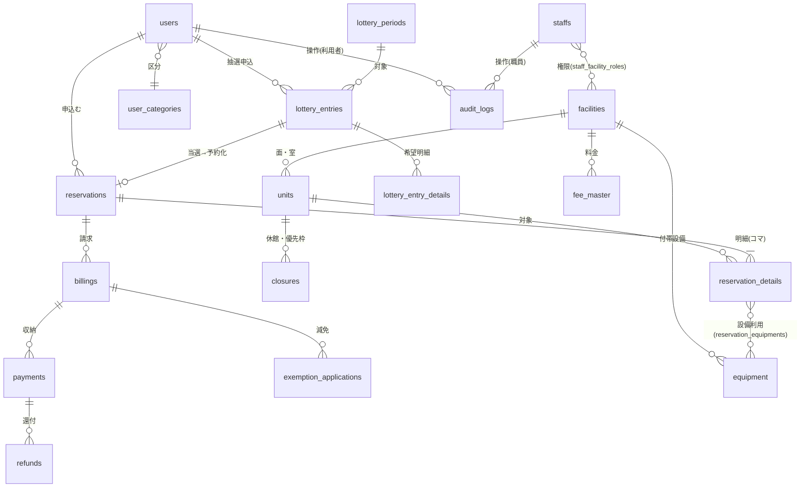

# 詳細設計書

霞台市公共施設予約管理システム構築及び運用保守業務(霞情政第126号)

| 項目 | 内容 |
|---|---|
| 文書番号 | KSM-DDD-001 |
| 版 | 1.0(初版) |
| 作成日 | 令和8年6月10日 |
| 作成者 | 受注者(当社)プロジェクトチーム(リードA/リードB/基盤チーム) |
| 承認 | 発注者検収待ち(G3) |
| 関連文書 | KSM-RDD-001(要件定義書 1.0)、KSM-BDD-001(基本設計書システム方式設計編 1.1)、KSM-BRL-001(業務ルール詳細仕様書)、KSM-DEV-001/002(開発標準書・セキュア実装規約表)、KSM-TSP-001(テスト計画書)、KSM-TRM-001 1.2版、KSM-ADR-001〜011、KSM-DMP-001(文書管理計画書) |

## 改版履歴

| 版 | 日付 | 改版内容 | 作成・承認 |
|---|---|---|---|
| 1.0 | 令和8年6月10日 | 初版作成(P3詳細設計)。G2残課題への市回答(残課題1:IPリストはP3中提供・IaCパラメータ先行可/残課題3:基本設計書アプリ編(KSM-BDD-002)の本書への統合/残課題4:職員MFA=課単位貸与スマートフォンTOTP+共用端末用ハードウェアトークン/残課題5:NFR-E02充足方式了承/残課題6:サブドメイン yoyaku.city.kasumidai.lg.jp 確定)を反映 | 当社リードA/発注者検収待ち |

---

## 0. 本書の範囲と前提

### 0.1 範囲

本書は、基本設計書(KSM-BDD-001、G2検収承認済み)のシステム方式を前提に、画面・帳票・DB物理・API・バッチ/非同期・外部IF・IaC詳細(環境パラメータ)を定める詳細設計書である。**G2残課題3に対する市回答により、基本設計書アプリ編(KSM-BDD-002)として予定していた画面・帳票・DB・外部IFの設計は本書に統合した**(KSM-BDD-002は欠番。KSM-DMP-001 §6.2)。

業務ルール(予約上限・一括予約整合・料金算定・減免・抽選ロジック)の計算仕様・判定仕様は別冊「業務ルール詳細仕様書」(KSM-BRL-001)を正とし、本書はその実装配置(ドメイン層モジュール・DB構造・API)を定める。

### 0.2 G2残課題への市回答の反映(前提条件)

| 残課題 | 市回答 | 本書での反映 |
|---|---|---|
| 1 IP確定リスト | 確定リストはP3期間中に文書で提供。IaCはパラメータ(プレースホルダ)で先行可 | §8.2:`staffAllowedCidrs` をIaC環境パラメータとして設計し、プレースホルダ(空リスト+デプロイ時必須検証)で先行実装。受領後にパラメータ登録のみで反映(コード変更なし) |
| 3 アプリ編統合 | P3詳細設計書で提出可 | 本書§1〜§7に統合(§0.1) |
| 4 職員MFA手段 | 窓口職員は課単位で市が貸与するスマートフォンのTOTPを基本、共用端末用に少数のハードウェアトークンを市が調達 | §5.2:TOTP登録・運用設計。ハードウェアトークンは**TOTP(RFC 6238)準拠・シード書込可能型**であることが調達要件(Cognitoは専用ハードウェアMFA方式を持たないため[^1])。§9申し送り1 |
| 5 NFR-E02充足方式 | 了承(桁数・文字種=IaCパラメータの変更管理、ロックアウト=Cognitoマネージド動作) | §5.1・§8.2:パスワードポリシーをIaCパラメータとして設計確定 |
| 6 サブドメイン | yoyaku.city.kasumidai.lg.jp で確定。DNS委任はP3中に市実施 | §8.1:ドメイン・証明書・SES送信ドメインの設計値を確定 |

(残課題2(決済代行事業者選定)は市手続中のため、外部IF設計(§7.1)は事業者非依存の抽象IFとして設計し、事業者確定後にアダプタ実装のみで対応する。§9申し送り2)

### 0.3 設計原則(KSM-BDD-001・KSM-DEV-001からの継承)

- レイヤー構成:UI→アプリケーション→ドメイン→インフラの一方向依存(ArchUnit/dependency-cruiserで機械検査)。
- 単一コードベース(Spring Boot)をAPI/ワーカー/バッチの起動プロファイルで使い分け(KSM-ADR-001/008)。
- 職員向け機能はパス `/staff/*`・`/api/staff/*` に限定(WAF IP制限と整合。KSM-ADR-003)。
- 個人情報を返すAPIレスポンスは `Cache-Control: no-store`(KSM-ADR-009)。

## 1. 画面設計

### 1.1 画面設計方針

| # | 方針 | 根拠 |
|---|---|---|
| 1 | スマートフォンファースト(ブレークポイント:360px/768px/1024px)。利用者向け画面はモバイル表示を基準に設計し、PCは拡張表示 | REQ-013、現行課題(スマホ非対応) |
| 2 | JIS X 8341-3:2016 適合レベルAA[^2]:全画面共通チェックリスト(コントラスト比4.5:1以上、フォーカス可視、ラベル必須、キーボード操作完結、エラー特定と修正提案)を画面定義に組込み。eslint-plugin-jsx-a11yで機械検査(KSM-DEV-001 §5.2)+P5にWAIC試験実施ガイドライン準拠の試験(KSM-TSP-001 §5.6) | REQ-014 |
| 3 | 職員向け画面は「1業務1画面・3クリック以内」を原則とし、画面内ガイダンス(操作ヒント・入力例)を常設。年度当初の新任窓口職員が半日研修で習得可能な水準 | NFR-C06、別紙3(毎年度入替り) |
| 4 | 公開ページ(トップ・お知らせ・施設案内・空き照会)はビルド時事前レンダリング+CloudFrontキャッシュ | REQ-006、KSM-ADR-009 |
| 5 | 対応ブラウザ:Edge/Chrome/Safari最新+1つ前。職員画面はWindows 11+Edgeで追加ソフト不要 | NFR-F01/F02 |

### 1.2 画面一覧(利用者向け:SC-Uxx)

| 画面ID | 画面名 | 認証 | 対応要件 | 概要 |
|---|---|---|---|---|
| SC-U01 | トップ・お知らせ | 不要 | REQ-026 | 公開ページ(SSG)。お知らせ一覧・施設カテゴリ導線 |
| SC-U02 | 施設案内 | 不要 | REQ-006 | 施設・面・室・付帯設備・料金表の案内 |
| SC-U03 | 空き状況カレンダー | 不要 | REQ-006 | 施設×年月のコマ別空き表示(60秒キャッシュ)。日/週/月切替 |
| SC-U04 | 利用者登録(仮申請) | 不要 | REQ-001 | 二段階登録の一次申請フォーム。メールアドレス検証 |
| SC-U05 | ログイン | − | NFR-E02 | Cognito利用者プール(BFF経由)。パスワード再設定導線 |
| SC-U06 | パスワード再設定 | 不要 | REQ-004 | メール認証によるセルフ再設定(Cognito標準フロー) |
| SC-U07 | マイページ | 要 | REQ-004 | 予約一覧・抽選申込状況・登録情報変更・支払状況 |
| SC-U08 | 先着予約申込(コマ選択〜確認〜完了) | 要 | REQ-007/009/010/015 | カレンダーからコマ選択(連続・複数施設・定期指定可)→上限チェック→料金表示→確定 |
| SC-U09 | 抽選申込(申込〜確認〜完了) | 要 | REQ-008 | 対象期間の抽選枠へ希望順位付き申込。申込状況の照会・取下げ |
| SC-U10 | 予約内容変更・取消 | 要 | REQ-011/019 | 取消期限・キャンセル料の事前表示→取消→還付見込額表示 |
| SC-U11 | オンライン決済 | 要 | REQ-016 | 決済代行画面へのリダイレクト/結果受領(§7.1) |
| SC-U12 | 減免申請 | 要 | REQ-018 | 減免区分選択・証憑添付・申請状況照会 |

### 1.3 画面一覧(職員向け:SC-Sxx。すべて `/staff/*`・要MFA・IP制限)

| 画面ID | 画面名 | 主な利用ロール | 対応要件 | 概要 |
|---|---|---|---|---|
| SC-S01 | 職員ダッシュボード | 全ロール | NFR-C06 | 当日の予約・本人確認待ち・減免承認待ち・支払期限超過の件数タイル(担当施設のみ) |
| SC-S02 | 窓口代行予約・電話仮押さえ | 窓口担当・指定管理者 | REQ-021 | 利用者検索→代行予約。仮押さえ(保持期限設定・自動解放) |
| SC-S03 | 利用者管理・本人確認 | 窓口担当・所管課 | REQ-001/002 | 仮申請一覧→本人確認→本登録/差戻し。区分変更 |
| SC-S04 | 収納管理(入金消込・納付書発行) | 窓口担当・会計担当 | REQ-017 | 現金収納の消込、納付書(コンビニ収納)発行、収納日計 |
| SC-S05 | 減免承認ワークフロー | 所管課 | REQ-018 | 申請一覧→審査→承認/否認→料金再計算結果確認 |
| SC-S06 | 還付管理 | 所管課・会計担当 | REQ-019 | 還付対象一覧・還付処理状況・一覧出力 |
| SC-S07 | 施設・料金マスタ保守 | 所管課 | REQ-015/REQ-002 | 施設・面室・コマ・料金・付帯設備・利用者区分ルールの保守(適用開始日付き) |
| SC-S08 | 供用管理(休館日・優先枠) | 所管課 | REQ-022 | 休館日・保守点検日・優先利用枠の設定(一般予約制限) |
| SC-S09 | 抽選管理 | 所管課・管理者 | REQ-008 | 抽選期間設定・申込状況・抽選結果確認・繰上げ実行 |
| SC-S10 | 統計・実績帳票 | 所管課・参照 | REQ-025 | 施設別/月別利用率・収納額・減免額。画面照会+CSV/PDF出力。年度集計 |
| SC-S11 | お知らせ管理 | 所管課 | REQ-026 | 掲載・更新・公開期間設定(公開キャッシュ無効化連動) |
| SC-S12 | 操作ログ検索 | システム管理者 | REQ-024/NFR-E06 | 操作者・期間・操作種別での検索・CSV出力 |
| SC-S13 | 職員・権限管理 | システム管理者 | REQ-023 | 職員アカウント・ロール×担当施設の割当、MFAリセット |
| SC-S14 | 財務会計連携CSV出力 | 会計担当 | REQ-020 | 期間指定→収納データCSV(所定様式)生成・ダウンロード |

### 1.4 画面遷移図(主要フロー)

```mermaid
flowchart LR
    subgraph 利用者(住民)
        U01[SC-U01 トップ] --> U03[SC-U03 空きカレンダー]
        U03 -->|ログイン要求| U05[SC-U05 ログイン]
        U01 --> U04[SC-U04 仮申請]
        U05 --> U07[SC-U07 マイページ]
        U05 --> U08[SC-U08 先着予約申込]
        U03 --> U08
        U03 --> U09[SC-U09 抽選申込]
        U08 --> U11[SC-U11 決済]
        U07 --> U10[SC-U10 変更・取消]
        U07 --> U12[SC-U12 減免申請]
    end
    subgraph 職員(/staff・MFA+IP制限)
        S01[SC-S01 ダッシュボード] --> S03[SC-S03 本人確認]
        S01 --> S02[SC-S02 代行予約・仮押さえ]
        S01 --> S05[SC-S05 減免承認]
        S01 --> S04[SC-S04 収納管理]
        S01 --> S09[SC-S09 抽選管理]
        S01 --> S10[SC-S10 統計帳票]
    end
    U04 -.仮申請データ.-> S03
    U12 -.申請データ.-> S05
```

### 1.5 主要画面のレイアウト方針(代表3画面)

| 画面 | レイアウト方針 |
|---|---|
| SC-U03 空きカレンダー | モバイル=日表示(縦スクロールのコマリスト)、PC=週/月マトリクス。空き=○/残少=△/満=×/休館=−をアイコン+テキスト併記(色のみに依存しない=AA要件)。施設・日付の切替はカレンダー上部に固定。未ログインでも全操作可、コマ選択時のみログイン誘導 |
| SC-U08 先着予約申込 | ウィザード型3ステップ(選択→確認→完了)。確認画面で上限チェック結果・料金内訳(KSM-BRL-001 §3の算定明細)・取消規則を明示。二重送信防止(申込トークン) |
| SC-S02 窓口代行予約 | 左=利用者検索、右=空きカレンダーの2ペイン(窓口での電話応対中の操作を想定し画面遷移なしで完結)。仮押さえは保持期限を既定値表示(施設別設定)し1クリック登録 |

## 2. 帳票設計

### 2.1 帳票一覧

出力方式:PDF=サーバサイド生成(KSM-ADR-011:JasperReports)、CSV=UTF-8(BOM付き)※財務会計連携CSVのみ市財務会計システムの所定様式に従う(§7.3)。

| 帳票ID | 帳票名 | 形式 | 出力画面 | 対応要件 |
|---|---|---|---|---|
| RP-01 | 利用承認書兼領収書 | PDF | SC-S02/S04、SC-U07 | REQ-017/021 |
| RP-02 | 納付書(コンビニ収納対応) | PDF | SC-S04 | REQ-017 |
| RP-03 | 還付対象一覧 | PDF/CSV | SC-S06 | REQ-019 |
| RP-04 | 施設別月次利用状況(利用率・収納額・減免額) | PDF/CSV | SC-S10 | REQ-025 |
| RP-05 | 年度集計(議会・監査対応) | PDF/CSV | SC-S10 | REQ-025 |
| RP-06 | 収納日計表 | PDF/CSV | SC-S04 | REQ-017 |
| RP-07 | 減免承認一覧 | PDF/CSV | SC-S05 | REQ-018/025 |
| RP-08 | 操作ログ抽出 | CSV | SC-S12 | REQ-024 |
| RP-09 | 財務会計連携CSV | CSV(所定様式) | SC-S14 | REQ-020 |

### 2.2 様式設計の要点

- **RP-02 納付書**:コンビニ収納用バーコードはGS1-128(AI(91)・44桁固定長)とし、GS1 Japan「GS1-128シンボルによる標準料金代理収納ガイドライン」の現行版に準拠する[^3]。収納企業コード・料金期別等の桁割は収納代行事業者の確定後にパラメータ確定(§9申し送り2)。再発行時は旧票無効化(発行連番管理)。
- **RP-04/05 統計帳票**:集計は日次集計バッチ(§6)が作成する集計テーブル(`monthly_facility_stats`)を参照し、オンライン照会時の重い集計クエリを排除する(NFR-B01)。年度集計は4月1日〜3月31日区切り。
- 帳票様式の最終確定(市ロゴ・公印の要否、納付書桁割)は実装着手前に業務部会で確認する(§9申し送り3)。様式モック(全帳票)は別添ファイルとしてP4第1週に提示する。

## 3. DB物理設計

### 3.1 方針

- RDS for PostgreSQL(KSM-ADR-005)。スキーマ名 `yoyaku`。物理名はsnake_case英語、論理名(日本語)は本書テーブル定義で対管理(KSM-DEV-001 §4)。
- 文字コードUTF-8(JIS X 0213範囲。REQ-027)。タイムゾーンはアプリ層でJST変換し、DBは `timestamptz` で保持。
- 主キーは `bigint GENERATED ALWAYS AS IDENTITY`(単一DB構成のため分散ID不要。KSM-ADR-005の適正水準判断と整合)。
- 監査列(`created_at`/`created_by`/`updated_at`/`updated_by`)を全業務テーブルに必須。
- スキーマ変更はFlywayのバージョン管理マイグレーション(`backend/src/main/resources/db/migration/V{版}__{内容}.sql`)で管理し、CIで適用検証する[^4]。DBスキーマのA=リードA(KSM-ORG-001 §3.1。マイグレーションはCODEOWNERSでリードA承認必須=KSM-REP-001 §4)。

### 3.2 ER図(主要エンティティ)



### 3.3 テーブル一覧

| # | 物理名 | 論理名 | 主な要件 | 備考 |
|---|---|---|---|---|
| 1 | users | 利用者 | REQ-001/002/005 | 個人・団体。本人確認状態(仮申請/本登録/停止)。Cognito subを保持(認証属性の正はDB=KSM-ADR-002) |
| 2 | user_categories | 利用者区分 | REQ-002 | 個人/団体/市外等。予約開始日オフセット・料金区分を保持 |
| 3 | staffs | 職員 | REQ-023 | 市職員・指定管理者。Cognito職員プールsub対応 |
| 4 | staff_facility_roles | 職員施設権限 | REQ-023 | ロール(admin/dept/counter/designated/readonly)×施設 |
| 5 | facilities | 施設 | REQ-006/022 | 34施設。所管課・指定管理区分 |
| 6 | units | 面・室 | REQ-006 | 施設配下の予約単位(テニス面・会議室等) |
| 7 | slot_patterns / slots | コマ定義 | REQ-006/015 | 施設別の時間帯パターン(午前/午後/夜間、1時間刻み等)。適用開始日付き |
| 8 | fee_master | 料金マスタ | REQ-015 | 施設×コマ×利用者区分×設備。適用開始日付き(履歴保持)。職員画面から保守 |
| 9 | equipment | 付帯設備 | REQ-015 | 照明・冷暖房・備品 |
| 9b | reservation_limit_rules | 予約上限ルール | REQ-009 | 施設×利用者区分のL-1〜L-4設定(KSM-BRL-001 §1)。適用開始日付き |
| 10 | reservations | 予約 | REQ-007〜011/021 | 状態:仮押さえ/確定待ち(支払期限)/確定/取消/期限切れ。一括予約は1予約に複数明細 |
| 11 | reservation_details | 予約明細(コマ) | REQ-007/010 | unit_id×use_date×slot_id。**部分一意制約**で二重予約防止(§3.4) |
| 12 | reservation_equipments | 予約設備 | REQ-015 | 明細×設備×数量 |
| 13 | closures | 休館・優先利用枠 | REQ-022 | 種別(休館/保守/優先枠)×unit×期間×コマ範囲 |
| 14 | lottery_periods | 抽選期間 | REQ-008 | 対象年月・施設グループ・申込期間・抽選予定日時 |
| 15 | lottery_entries | 抽選申込 | REQ-008 | 利用者×期間。乱数キー・当落状態(KSM-BRL-001 §5) |
| 16 | lottery_entry_details | 抽選希望明細 | REQ-008 | 希望順位×unit×日×コマ |
| 17 | billings | 請求 | REQ-015/018 | 算定明細(JSONBで内訳保持)・減免適用後額・支払期限 |
| 18 | payments | 収納 | REQ-016/017 | 方法(オンライン/現金/納付書)。決済代行取引ID・消込状態 |
| 19 | payment_slips | 納付書 | REQ-017 | 発行連番・GS1-128データ・有効期限・状態 |
| 20 | exemption_applications | 減免申請 | REQ-018 | 区分・証憑・WF状態(申請/審査中/承認/否認) |
| 21 | refunds | 還付 | REQ-019 | 対象payment・算定額(キャンセル料控除)・処理状態 |
| 22 | notices | お知らせ | REQ-026 | 公開期間・本文 |
| 23 | audit_logs | 操作ログ | REQ-024/NFR-E06 | 操作者種別(利用者/職員/システム)・操作・対象・前後値要約。月次パーティション(§3.5) |
| 24 | notification_logs | 通知履歴 | REQ-012 | SQSメッセージID・SES送信結果・バウンス状態 |
| 25 | batch_job_locks | バッチ多重起動制御 | − | ジョブ名×対象キーの一意制約(KSM-ADR-008の冪等設計) |
| 26 | monthly_facility_stats | 月次施設統計 | REQ-025 | 日次バッチで更新する集計テーブル |
| 27 | csv_export_logs | CSV出力履歴 | REQ-020/024 | 財務会計連携等の出力監査 |

(このほかFlyway管理テーブル `flyway_schema_history`、Spring Batch実行管理テーブル群(JOBREPOSITORY)をシステム領域に配置)

### 3.4 主要テーブル定義(抜粋。全テーブルの完全定義はP4開始時にマイグレーションSQLとして納品し、本書別表を自動生成する)

**reservation_details(予約明細)** ※二重予約防止の中核

| 列 | 型 | 制約 | 論理名 |
|---|---|---|---|
| reservation_detail_id | bigint | PK | 予約明細ID |
| reservation_id | bigint | FK(reservations)・NOT NULL | 予約ID |
| unit_id | bigint | FK(units)・NOT NULL | 面・室ID |
| use_date | date | NOT NULL | 利用日 |
| slot_id | bigint | FK(slots)・NOT NULL | コマID |
| status | varchar(20) | NOT NULL(hold/pending/confirmed/cancelled/expired) | 状態 |
| amount | numeric(10,0) | NOT NULL | 明細料金(円) |

```sql
-- 有効状態の明細のみを対象とする部分一意インデックス(二重予約のDBレベル防止。KSM-ADR-009決定3)
CREATE UNIQUE INDEX uq_active_slot ON reservation_details (unit_id, use_date, slot_id)
  WHERE status IN ('hold','pending','confirmed');
```

**billings(請求)**

| 列 | 型 | 制約 | 論理名 |
|---|---|---|---|
| billing_id | bigint | PK | 請求ID |
| reservation_id | bigint | FK・NOT NULL | 予約ID |
| base_amount | numeric(10,0) | NOT NULL | 基本料金計 |
| equipment_amount | numeric(10,0) | NOT NULL DEFAULT 0 | 設備料金計 |
| exemption_amount | numeric(10,0) | NOT NULL DEFAULT 0 | 減免額 |
| billed_amount | numeric(10,0) | NOT NULL | 請求額(=base+equipment−exemption) |
| calculation_detail | jsonb | NOT NULL | 算定内訳(KSM-BRL-001 §3の明細。監査・帳票再現用) |
| due_at | timestamptz | NULL | 支払期限 |
| status | varchar(20) | NOT NULL | 状態(未請求/請求中/収納済/還付中/還付済) |

**audit_logs(操作ログ)**:`acted_at`(timestamptz)で月次レンジパーティション。改ざん防止のためUPDATE/DELETE権限をアプリロールに付与しない(追記専用)。1年経過後パーティションをS3へエクスポートし、計3年保管(NFR-E06の1年以上を充足。保管先一覧は§8.3)。

### 3.5 インデックス方針

| 対象 | インデックス | 用途 |
|---|---|---|
| reservation_details | uq_active_slot(部分一意)/(reservation_id) | 二重予約防止/予約展開 |
| reservations | (user_id, created_at desc)/(status, due_at) WHERE status='pending' | マイページ/支払期限バッチ |
| lottery_entries | (lottery_period_id, random_key)/(user_id, lottery_period_id) 一意 | 抽選処理の順序読出し/重複申込防止 |
| payments | (billing_id)/(slip_number) 一意/(paid_at) | 消込/納付書照合/日計 |
| audit_logs | (acted_at)パーティションキー/(actor_type, actor_id, acted_at) | 期間検索/操作者検索 |
| closures | (unit_id, date_range) GiST(daterange) | 休館・優先枠の重なり判定 |
| fee_master | (facility_id, valid_from desc) | 適用日時点の料金解決 |

- 方針:検索パターン(画面・バッチ)起点で定義し、書込み頻度の高いテーブル(reservation_details)への過剰なインデックスを避ける。P5性能テストで実行計画を検証し、追加・削除はマイグレーションで管理。
- 容量試算:5年累計で予約明細約60万行・操作ログ約500万行・合計20GB未満(gp3 100GB・自動拡張200GBに対し十分=NFR-B02)。

## 4. API設計

### 4.1 設計方針

- REST/JSON。パスは複数形名詞・ケバブ小文字(KSM-DEV-001 §4)。OpenAPI 3.1定義(`docs/openapi.yaml`)を正とし、CIでlint・実装との突合(契約テスト)を行う。
- 経路別プレフィックス:`/api/public/*`(未ログイン・GETのみ・CloudFrontキャッシュ対象)/`/api/user/*`(利用者認証)/`/api/staff/*`(職員認証+WAF IP制限)。
- バージョニングはURI(`/api/v1/...`)。エラーはRFC 9457(Problem Details)形式で統一。

### 4.2 認証・認可

| 項目 | 設計 |
|---|---|
| 認証 | BFF方式:Cognito(利用者/職員の2プール)の認可コードフローをバックエンドが仲介し、httpOnly/Secure/SameSite=Lax Cookieでトークン保持(KSM-ADR-004)。アクセストークン30分・絶対上限=利用者24時間/職員12時間 |
| CSRF | SameSite=Lax+状態変更API(POST/PUT/DELETE)のカスタムヘッダ `X-Requested-With` 検証(KSM-DEV-002 規約S-21) |
| 認可 | アプリケーション層で実施(KSM-ADR-003決定3)。利用者API=本人リソースのみ(user_idをトークンから解決し、リクエストボディのIDを信用しない)。職員API=`staff_facility_roles` によるロール×施設判定を共通インターセプタで強制+ユースケース内で二重検査(KSM-DEV-002 規約S-13) |
| 監査 | 全状態変更APIで操作ログ(audit_logs)を同一トランザクション内に記録(REQ-024) |

### 4.3 エンドポイント一覧(主要。完全版はOpenAPI定義)

| メソッド・パス | 概要 | 認証 | 対応要件 |
|---|---|---|---|
| GET /api/public/v1/facilities | 施設一覧 | 不要(キャッシュ60秒) | REQ-006 |
| GET /api/public/v1/availabilities?facilityId&month | 空き状況(施設×月) | 不要(キャッシュ60秒) | REQ-006 |
| GET /api/public/v1/notices | お知らせ | 不要 | REQ-026 |
| POST /api/public/v1/registrations | 利用者仮申請 | 不要(レート制御) | REQ-001 |
| POST /api/user/v1/reservations | 先着予約申込(一括対応) | 利用者 | REQ-007/009/010 |
| GET /api/user/v1/reservations | 自分の予約一覧 | 利用者 | REQ-011 |
| POST /api/user/v1/reservations/{id}/cancellation | 予約取消(キャンセル料・還付見込を返却) | 利用者 | REQ-011/019 |
| POST /api/user/v1/lottery-entries | 抽選申込 | 利用者 | REQ-008 |
| POST /api/user/v1/payments/checkout | 決済セッション生成 | 利用者 | REQ-016 |
| POST /api/user/v1/exemption-applications | 減免申請 | 利用者 | REQ-018 |
| PUT /api/user/v1/profile | 登録情報変更 | 利用者 | REQ-004 |
| POST /api/staff/v1/reservations | 代行予約・仮押さえ | 職員(counter以上) | REQ-021 |
| PUT /api/staff/v1/registrations/{id}/approval | 本人確認・本登録/差戻し | 職員(counter以上) | REQ-001 |
| PUT /api/staff/v1/exemption-applications/{id}/decision | 減免承認/否認 | 職員(dept以上) | REQ-018 |
| POST /api/staff/v1/payments | 現金収納消込 | 職員(counter以上) | REQ-017 |
| POST /api/staff/v1/payment-slips | 納付書発行 | 職員(counter以上) | REQ-017 |
| GET /api/staff/v1/refunds | 還付対象一覧 | 職員(dept以上) | REQ-019 |
| PUT /api/staff/v1/fee-master | 料金マスタ保守 | 職員(dept以上) | REQ-015 |
| PUT /api/staff/v1/closures | 休館日・優先枠設定 | 職員(dept以上) | REQ-022 |
| POST /api/staff/v1/lottery-periods/{id}/promotions | 抽選繰上げ実行 | 職員(dept以上) | REQ-008 |
| GET /api/staff/v1/stats/monthly | 統計照会 | 職員(readonly以上) | REQ-025 |
| GET /api/staff/v1/audit-logs | 操作ログ検索 | 職員(adminのみ) | REQ-024 |
| POST /api/staff/v1/finance-exports | 財務会計CSV生成 | 職員(会計担当) | REQ-020 |
| POST /api/webhooks/payment | 決済結果Webhook(署名検証) | 決済代行(署名+IP) | REQ-016 |

### 4.4 主要APIの入出力(代表:先着予約申込)

```
POST /api/user/v1/reservations
Request:
{
  "items": [                          // 一括予約(連続コマ・複数施設・定期はクライアントで展開)
    { "unitId": 101, "useDate": "2026-07-04", "slotId": 3,
      "equipments": [ { "equipmentId": 11, "quantity": 1 } ] },
    { "unitId": 101, "useDate": "2026-07-11", "slotId": 3 }
  ],
  "purpose": "バドミントン練習",
  "idempotencyKey": "f3a1..."          // 二重送信防止(同一キーは前回結果を返却)
}
Response 201:
{
  "reservationId": 9012, "status": "pending",
  "billing": { "baseAmount": 2400, "equipmentAmount": 400,
               "exemptionAmount": 0, "billedAmount": 2800,
               "dueAt": "2026-06-17T23:59:59+09:00",
               "detail": [ ...KSM-BRL-001 §3の算定明細... ] },
  "paymentMethods": ["online", "counter", "slip"]
}
Response 409(全件不成立):
{ "type": ".../slot-conflict", "title": "選択コマの一部が予約できません",
  "conflictItems": [ { "unitId": 101, "useDate": "2026-07-11", "slotId": 3,
                       "reason": "RESERVED" } ] }   // KSM-BRL-001 §2:全件成立/全件不成立
```

- 上限チェック・料金算定・取消規則の判定仕様はKSM-BRL-001(§1〜§4)を正とする。
- 抽選申込(POST /lottery-entries)は同期の軽量INSERT(受付10件/秒はRDB余裕内=KSM-BDD-001 §7.1)。抽選実行はバッチ(§6)。

## 5. 認証詳細設計(残課題4・5の確定反映)

### 5.1 利用者認証(NFR-E02。残課題5:市了承済み)

| 項目 | 設計値(IaCパラメータ。§8.2) |
|---|---|
| パスワード最小桁数 | 12(初期値) |
| 文字種 | 英大・英小・数字を必須(記号は任意) |
| ロックアウト | Cognitoマネージド動作(試行失敗の段階的遅延)による[^1]。**市了承済み(G2残課題5)**:任意の回数・時間の画面設定は提供せず、桁数・文字種の変更はIaCパラメータの変更管理(市依頼→当社IaC変更→CI/CD適用)で実施 |
| 再設定 | メール認証(Cognito標準フロー)。再設定リンク有効期限1時間 |

### 5.2 職員MFA(残課題4:市回答確定の反映)

| 項目 | 設計 |
|---|---|
| 基本手段 | **課単位で市が貸与するスマートフォンのTOTPアプリ**(市回答による確定)。Cognito職員プールのTOTPソフトウェアトークンMFA(RFC 6238準拠)[^1]を使用 |
| 共用端末用 | **市が少数調達するハードウェアトークン**。CognitoはMFA方式として専用ハードウェアトークン(プロビジョニング済みシード方式)をサポートしないため[^1]、**TOTP(RFC 6238)準拠・シード書込可能型(プログラマブル)トークン**を調達要件とする。登録時にCognitoが発行するシークレットをトークンへ書き込み、ソフトウェアトークンとして動作させる |
| アカウントの個人単位原則 | トークン・アカウントは**職員個人単位**で登録する(端末は共用でもログインは個人)。共用アカウントは操作ログ要件(REQ-024:誰が・いつ・何を)と両立しないため設けない。※「共用端末用トークン」は「共用端末を主に使用する職員へ個人単位で割り当てるトークン」として運用する前提であり、市の運用イメージとの整合をG3検収時に確認したい(§9申し送り1) |
| 登録・リセット | 初回ログイン時にTOTP登録を強制。紛失・故障・年度入替り時はシステム管理者(SC-S13)がMFAリセット→再登録。手順書はP6運用設計で整備 |
| 貸与スマホの位置付け | TOTP生成専用(本システムへのアクセス端末は市標準端末=Windows 11+Edge。NFR-F02)。スマホ側に本システムのデータは保存されない |

## 6. バッチ・非同期処理設計(KSM-ADR-008整合)

### 6.1 処理一覧

| ジョブID | 処理 | 起動 | 方式 | 対応要件 |
|---|---|---|---|---|
| JB-01 | 抽選実行 | EventBridge Scheduler:抽選期間マスタの抽選日時(現行運用=毎月8日 6:00) | ECS RunTask(Spring Batch)。アルゴリズムはKSM-BRL-001 §5 | REQ-008 |
| JB-02 | 仮押さえ自動解放 | 15分間隔 | ECS RunTask。保持期限超過の hold→expired | REQ-021 |
| JB-03 | 支払期限超過取消 | 毎時 | ECS RunTask。pending→expired+還付不要確認+通知投入 | REQ-008/011 |
| JB-04 | 日次集計(統計) | 日次 1:00 | ECS RunTask。monthly_facility_stats更新 | REQ-025 |
| JB-05 | 操作ログパーティション保守・S3退避 | 月次 | ECS RunTask | NFR-E06 |
| WK-01 | メール通知ワーカー | SQS(通知キュー)常駐消費 | Fargate常駐1タスク→SES。送信レート平準化・リトライ・DLQ | REQ-012 |
| WK-02 | 決済結果消込 | SQS(決済キュー)常駐消費(WK-01と同一タスク内の別リスナー) | Webhook受信(§7.1)→キュー→消込・予約確定・通知投入 | REQ-016 |

### 6.2 共通設計(KSM-ADR-008の決定の詳細化)

1. **冪等性**:全ジョブは再実行安全。状態遷移はWHERE句に前提状態を含むUPDATE(楽観制御)+`batch_job_locks` の一意制約で多重起動を防止。通知は `notification_logs` の処理済み判定で二重送信を防止(SQSの少なくとも1回配信を前提)。
2. **失敗時挙動**:ジョブ失敗=CloudWatchアラーム(重大度は影響で区分:JB-01失敗=重大/JB-04失敗=警告)。SQSは最大3回再試行→DLQ→アラーム。再処理ランブックはP6。
3. **抽選日の運用保護**:JB-01は実行前チェック(対象期間の申込締切済み・前回実行なし)を行い、結果サマリ(申込数・当選数・処理時間)をCloudWatchメトリクスと管理画面(SC-S09)へ出力。当落通知(約2,000〜2,500通)はSQS投入のみ行い、送信はWK-01が平準化(KSM-BDD-001 §7.1)。
4. **スケジュール定義はIaC管理**(EventBridge Scheduler。steering/iac規約4)。抽選日時はDBの抽選期間マスタを正とし、Schedulerは毎日定時にマスタ照合する方式(職員による期間設定変更=REQ-008にIaC変更を不要とするため)。

## 7. 外部インタフェース設計

### 7.1 決済代行(REQ-016。事業者確定前=抽象IF設計)

| 項目 | 設計 |
|---|---|
| 方式 | リダイレクト型(ホスト型決済ページ)を第一候補:カード情報は当社システムを経由させず、PCI DSS適用範囲を最小化(SAQ A相当)。クレジット+コード決済2種以上 |
| IF抽象化 | ドメイン層に `PaymentGateway` ポートを定義し、事業者固有実装はインフラ層アダプタに隔離(レイヤー規約と整合)。事業者確定(残課題2)後はアダプタ実装・パラメータ設定のみで対応 |
| フロー | (1)決済セッション生成(金額・取引ID)→(2)利用者を決済ページへリダイレクト→(3)Webhookで結果受信(署名検証+受信記録を同期、消込はSQS経由非同期=KSM-ADR-008)→(4)ブラウザ復帰時はポーリングで結果表示(Webhook先着を正とする) |
| 整合性 | 取引IDは billing_id 起点の一意キー。Webhookは冪等(同一取引IDの再通知は無視)。金額照合不一致は消込せずアラーム |
| 障害時 | 決済代行障害時は窓口収納・納付書へ誘導するメッセージ表示(オンライン決済のみ縮退) |

### 7.2 メール通知(REQ-012:Amazon SES)

| 項目 | 設計 |
|---|---|
| 送信ドメイン | `yoyaku.city.kasumidai.lg.jp`(残課題6:市回答で確定)。SPF/DKIM/DMARCのDNSレコードは市のDNS委任手続(P3中)と併せて市側DNSへ登録依頼(§9申し送り4) |
| 送信種別 | 仮申請確認/本登録完了/予約確定/抽選受付・当落/取消・還付/支払期限前リマインド(期限3日前)/お知らせ(任意配信はスコープ外) |
| バウンス処理 | SNS経由でバウンス・苦情を受信→notification_logsへ記録→連続バウンスのアドレスは送信抑止フラグ(SES評価維持) |
| 文面管理 | テンプレート(差込項目付き)をDB管理し職員が確認可能。個人情報は本文最小限(予約詳細はログイン後参照へ誘導) |

### 7.3 財務会計システム連携CSV(REQ-020)

| 項目 | 設計 |
|---|---|
| 方式 | 画面(SC-S14)からの手動生成・ダウンロード(自動連携なし=RFP明記)。生成履歴を csv_export_logs に記録 |
| 様式 | 市財務会計システムの所定様式(レイアウト・文字コード・改行コードを含む)に従う。**様式定義書はP1業務部会で入手予定だったが未受領のため、P4実装開始までに会計課から入手する**(§9申し送り5)。受領までは当社標準案(歳入科目・収納日・金額・件数の日計集計形式)で実装を先行し、様式確定後にフォーマッタのみ差し替え可能な構造とする |
| 内容 | 収納実績(収納日・収納方法・歳入科目・金額)の日計/明細の2形式。還付はマイナス計上ではなく還付区分で別行出力(会計課と確認) |

### 7.4 現行システムからの移行IF(REQ-028)

移行ツール・手順の設計はP6移行設計書の範囲(KSM-PLN-001 §3注1)。本書では取込先(本DB)の対応のみ定める:utf-8変換・外字検出リスト(REQ-027:外字不使用設計のため移行時に代替文字確認一覧を市へ提示)、移行元キーの保持列(`legacy_id`)を users/reservations に設ける。

### 7.5 テストデータマスキング方式(NFR-E09。トレーサビリティマトリクス1.1版のP3割当事項)

開発環境(dev)用テストデータは、stg(ガバクラ検証環境)上で次の規則によりマスキングしたエクスポートのみを使用する(本番個人情報のdev持出し禁止)。

| 項目 | マスキング規則 |
|---|---|
| 氏名・団体名 | ダミー辞書からの置換(連番付与。例:「試験 太郎0001」) |
| 住所 | 市内ダミー住所(町名レベルのみ実在・番地は固定値)へ置換。市内/市外の区分属性は保持(区分ロジック試験のため) |
| 電話番号 | 試験用番号帯(0990-xxx)へ置換 |
| メールアドレス | `user{連番}@example.com` へ置換(実在ドメインへの誤送信防止) |
| Cognito sub・認証情報 | 移行せずdev側で再発行 |
| 予約・収納・減免の業務データ | 金額・日付・状態は保持(業務ロジック試験のため)。備考等の自由記述欄は定型文へ置換 |

マスキング処理は移行ツール(migration-tool)のサブコマンドとして実装し、処理ログ(件数・規則版)を記録する。マスキング漏れ検査(個人情報パターン検索)をdev投入前に機械実行する。

## 8. IaC詳細設計・環境パラメータ(パラメータ設計書の先行分)

パラメータ設計書(RFP第6章:環境構築の成果物)はP4で納品するが、P3で確定した設計値を先行定義する。実体は `infra/env/{prod,stg,dev}.ts`(KSM-ADR-006/007)。

### 8.1 確定値(残課題6反映)

| パラメータ | prod | stg | 根拠 |
|---|---|---|---|
| domainName | yoyaku.city.kasumidai.lg.jp | stg.yoyaku.city.kasumidai.lg.jp(委任範囲内サブドメイン) | 残課題6市回答。DNS委任はP3中に市実施 |
| availabilityCacheTtlSec | 60 | 60 | KSM-ADR-009(30〜120秒で調整可) |
| apiDesiredCount / max | 2 / 8 | 1 / 2 | KSM-BDD-001 §3.1 |
| lotteryWarmupSchedule | 毎月1〜7日 8:45に4タスク | なし | KSM-BDD-001 §7.1 |
| passwordPolicy(利用者) | minLength=12, 英大小数字必須 | 同左 | §5.1(残課題5市了承) |
| staffSessionHours / userSessionHours | 12 / 24 | 同左 | KSM-ADR-004 |

### 8.2 プレースホルダ(残課題1:市回答=P3中に文書提供、パラメータ先行可)

```typescript
// infra/env/prod.ts(抜粋・設計)
export const prodParams = {
  // NFR-E08:職員アクセス許可IP(14拠点)。市の確定リスト文書受領後に登録。
  // 受領まではプレースホルダ(空)とし、cdk synth時の検証ルールで
  // 「prod環境でstaffAllowedCidrsが空のままのデプロイ」をエラーとする(適用漏れ防止)。
  staffAllowedCidrs: [] as string[],   // 例: "203.0.113.10/32"(市庁舎本庁) ほか13拠点
  ...
};
```

- 検証環境(stg)は当社・市の検証用IPを暫定登録して職員機能の試験を可能とする(本番リスト受領に依存しない)。
- IPリスト変更管理:市依頼→IaC変更→CI/CD適用(標準5営業日・緊急1営業日。KSM-BDD-001 §4.4)。

### 8.3 ログ保管先・期間一覧(NFR-E06。KSM-BDD-001 §6の別表として本書で確定)

| ログ | 一次保管 | 長期保管 | 期間 |
|---|---|---|---|
| 操作ログ(アプリ監査) | RDS(audit_logs。追記専用) | S3(月次退避) | DB 1年+S3計3年 |
| 認証ログ(Cognito) | CloudWatch Logs | S3(エクスポート) | 計3年 |
| アクセスログ(CloudFront/ALB/WAF) | S3直接 | 同左(ライフサイクル) | 3年 |
| API監査(CloudTrail) | S3 | 同左 | 3年 |
| アプリケーションログ | CloudWatch Logs | S3 | 1年 |

(いずれもNFR-E06の「1年以上」を充足。暗号化はログ用CMK=KSM-ADR-010)

## 9. 残課題・申し送り(G3検収時)

| # | 事項 | 期限・担当 |
|---|---|---|
| 1 | ハードウェアトークンの調達要件(TOTP/RFC 6238準拠・シード書込可能型)の市への提示と、トークンの「個人単位割当」運用(§5.2)の市側確認 | G3検収時〜P4開始まで/市・当社 |
| 2 | 決済代行事業者の確定(G2残課題2継続:KSM-PAY-001に基づく市の直接契約手続)。確定後、アダプタ実装(P4)・納付書バーコード桁割確定(§2.2) | P4実装開始まで/市(当社は技術支援) |
| 3 | 帳票様式(市ロゴ・公印要否・納付書桁割)の業務部会確認。様式モックはP4第1週に当社提示 | P4第2週まで/市・当社 |
| 4 | DNS委任手続(P3中・市実施=残課題6市回答)と、SES送信ドメイン認証(SPF/DKIM/DMARC)レコードの市側DNS登録 | P4環境構築開始まで/市(当社がレコード値を提供) |
| 5 | 財務会計連携CSV所定様式の定義書入手(会計課) | P4実装開始まで/市・会計課 |
| 6 | 接続元IP確定リスト(14拠点)の文書受領→IaCパラメータ登録(G2残課題1継続。市回答:P3中提供) | 受領後5営業日で当社登録 |

---

## 脚注(制度・標準・技術情報の出典。いずれもWeb検索で現行版を確認)

[^1]: AWS「TOTP software token MFA - Amazon Cognito」(Cognitoユーザープールの追加認証はTOTPソフトウェアトークン(RFC 6238ベース)であり、IAMで利用可能な専用ハードウェアMFAデバイス方式はサポートされない)。https://docs.aws.amazon.com/cognito/latest/developerguide/user-pool-settings-mfa-totp.html および「Adding MFA to a user pool」https://docs.aws.amazon.com/cognito/latest/developerguide/user-pool-settings-mfa.html (いずれも参照日:令和8年6月10日)
[^2]: JIS X 8341-3:2016(適合レベルAA)。解説:ウェブアクセシビリティ基盤委員会(WAIC)「JIS X 8341-3:2016 解説」https://waic.jp/docs/jis2016/understanding/ 。同JISは2026年中にWCAG 2.2対応改正の見通しがあり、公示時は適用版を市と協議(KSM-RDD-001 制約C-6)。(参照日:令和8年6月10日)
[^3]: GS1 Japan(一般財団法人流通システム開発センター)「公共料金等代理収納GS1-128システム」(AI(91)・44桁固定長の標準料金代理収納バーコード)https://www.gs1jp.org/standard/barcode/gs1-128/payment_service.html 、「GS1-128シンボルによる標準料金代理収納ガイドライン」(現行版:第6版系、2024年3月版を確認)https://www.gs1jp.org/assets/img/pdf/guideline202403.pdf (いずれも参照日:令和8年6月10日)
[^4]: Flyway(バージョン管理型DBマイグレーション。Spring Boot公式統合)。Spring Boot リファレンス(Flyway連携)https://docs.spring.io/spring-boot/ 、Baeldung「Database Migrations with Flyway」https://www.baeldung.com/database-migrations-with-flyway (いずれも参照日:令和8年6月10日)

以上
