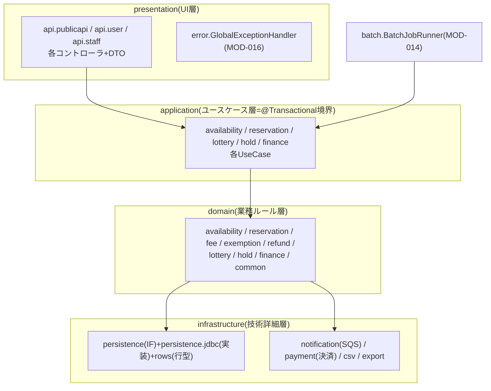
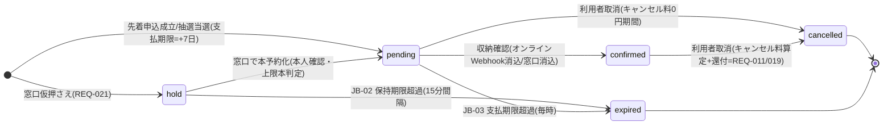

# 詳細設計書 12-00 総説・共通編

霞台市公共施設予約管理システム構築及び運用保守業務(霞情政第126号)

| 項目 | 内容 |
|---|---|
| 文書番号 | KSM-DDD-001-00(親:KSM-DDD-001) |
| 版 | 2.0 |
| 作成日 | 令和8年6月11日 |
| 作成者 | 受注者(当社)リードA/PMO |
| 承認 | 発注者確認待ち(G4検収コメント対応・P5着手前) |
| 関連文書 | KSM-BDD-001 1.2版(基本設計書)、KSM-BRL-001 1.1版、KSM-API-001(openapi.yaml)、module-index.md、KSM-ADR-001〜013、KSM-DEV-001/002、KSM-TSP-001、KSM-TRM-001、KSM-DMP-001 1.2版 |

## 改版履歴

| 版 | 日付 | 改版内容 |
|---|---|---|
| 1.0/1.1 | 令和8年6月10日 | (旧・単一ファイル 12_詳細設計書.md=KSM-DDD-001 として作成・改版。G3検収承認・市回答QA No.17〜21反映) |
| 2.0 | 令和8年6月11日 | **G4検収コメント対応:テンプレ(steering/design-templates/20-detailed-design.md)準拠の分冊再編(KSM-ADR-013)**。旧KSM-DDD-001 1.1版の全内容を10分冊へ継承(継承対応表=§1.3)。本再編と併せ、KSM-IMP-001 1.1版で「P5前に実施」とした2件の訂正を実施:**(訂正1=乖離D-1)旧§7.1の「決済代行をドメイン層に配置」をインフラ層配置(実装・ADR-001整合)へ訂正(分冊12-04)。(訂正2=乖離D-2)旧§6.1のバッチ実行方式をApplicationRunner+batch_job_locks(KSM-ADR-012)へ訂正(分冊12-05)** |

---

## 凡例(全分冊共通)

**本詳細設計書(全分冊)はIPA共通フレーム2013のソフトウェア詳細設計の成果物体系に準拠した14章構成を維持し、各章の記述形式のみ現代的記法(C4 Component・Mermaid sequenceDiagram/stateDiagram・OpenAPI・IaC参照)を採用している**(steering/design-templates/00-principles.md)。記載粒度の下限=「実装者がこの設計書だけで実装に着手できる」こと。各分冊は1モジュール=1節(見出しに MOD-xxx を含む=アンカー恒久)とし、モジュールと製造・単体テストの対応は module-index.md を正本とする。

## 1. はじめに・基本設計とのトレース

### 1.1 分冊構成

| 分冊 | 文書番号 | 範囲(モジュール) | 状態 |
|---|---|---|---|
| 12-00 総説・共通編(本書) | KSM-DDD-001-00 | MOD-014〜018(バッチ基盤・操作ログ・例外・起動・DBスキーマ) | 実装済 |
| 12-01 予約編 | KSM-DDD-001-01 | MOD-001〜005, 010 | 実装済 |
| 12-02 料金・減免・還付編 | KSM-DDD-001-02 | MOD-006〜008 | テスト済 |
| 12-03 抽選編 | KSM-DDD-001-03 | MOD-009 | テスト済 |
| 12-04 収納・決済・財務編 | KSM-DDD-001-04 | MOD-011, 013(+303/305/309骨格) | 実装済/スタブ/設計済 |
| 12-05 通知・バッチ編 | KSM-DDD-001-05 | MOD-012(+308骨格) | 実装済/設計済 |
| 12-06 フロントエンド編 | KSM-DDD-001-06 | MOD-101〜106 | 実装済 |
| 12-07 IaC・監視編 | KSM-DDD-001-07 | MOD-201〜207 | テスト済 |
| 12-08 職員管理・運用機能編(骨格) | KSM-DDD-001-08 | MOD-301, 302, 304, 306, 307, 310, 311 | 設計済(P5実装) |
| 12-09 移行・マスキング編(骨格) | KSM-DDD-001-09 | MOD-312, 313 | 設計済(P6/P4後半) |

### 1.2 基本設計の章ID対応・参照ADR一覧

| 基本設計(KSM-BDD-001 1.2版) | 詳細化する分冊 | 主な参照ADR |
|---|---|---|
| §3 アプリケーションアーキテクチャ | 本書§2 | ADR-001/004/012 |
| §4 機能設計・§5 画面設計 | 12-01/03/06/08 | − |
| §6 外部IF設計 | openapi.yaml+12-01/03/04 | ADR-003/004 |
| §7 データ設計 | 本書§6+各分冊§6 | ADR-005 |
| §8 バッチ・非同期 | 12-05 | ADR-008/012 |
| §9 インフラ・§10.4 監視 | 12-07 | ADR-006/007/009/010 |
| §11 セキュリティ | 本書§12+12-07/08 | ADR-002/003/010 |

### 1.3 旧KSM-DDD-001 1.1版からの継承対応表(廃止・分冊継承の記録)

旧・単一ファイル `12_詳細設計書.md` は**廃止**し、全内容を次のとおり継承した(欠落なし。ファイル処理の記録=KSM-DMP-001 1.2版 附表4)。旧版の章番号を参照している既存文書(KSM-TRM-001等)は本表で読み替える。

| 旧1.1版 | 内容 | 継承先 |
|---|---|---|
| §0 範囲・前提・G2残課題反映 | 前提・市回答 | 本書§1.5 |
| §1 画面設計 | 画面一覧・遷移・方針 | KSM-BDD-001 1.2版 §5(基本設計レベル)+12-06(実装画面詳細)+12-08(未実装画面) |
| §2 帳票設計 | 帳票一覧・様式要点 | KSM-BDD-001 §5.5(一覧)+12-04 §7(様式詳細) |
| §3 DB物理設計 | 方針・ER・テーブル・定義・インデックス | KSM-BDD-001 §7(ER・一覧)+本書§6(DDL・インデックス・トランザクション) |
| §4 API設計 | 方針・認証認可・一覧・入出力 | openapi.yaml(正本)+KSM-BDD-001 §6+12-01 §5(予約API詳細) |
| §5 認証詳細設計 | パスワードポリシー・職員MFA | 12-08(MOD-302)+12-07(Cognito IaC) |
| §6 バッチ・非同期処理設計 | JB/WK一覧・共通設計 | KSM-BDD-001 §8(一覧)+12-05(詳細。**D-2訂正反映**) |
| §7 外部IF設計 | 決済・SES・財務CSV・移行IF・マスキング | 12-04(決済・CSV。**D-1訂正反映**)+12-05(SES)+12-09(移行・マスキング) |
| §8 IaC詳細・環境パラメータ | 確定値・IPリスト・ログ保管 | 12-07(§8.1/8.2)+本書§11(ログ保管一覧=旧§8.3) |
| §9 残課題・申し送り解消状況 | QA No.17〜21クローズ | 本書§1.5 |
| 脚注 | 出典 | 各継承先分冊に再掲 |

### 1.4 モジュールと三工程の対応

module-index.md(02-deliverables/直下)を正本とする。本書§1.1の分冊×モジュール対応も同表から導出している。

### 1.5 前提条件(市回答の確定値。旧§0.2・§9の記録)

G2残課題(1〜6)・G3検収時質問(QA No.10〜21)は**全件クローズ済み**(唯一の継続=帳票様式の業務部会確認はP4第1週モック提示で対応中)。主な確定値:

| 事項 | 確定値(QA) |
|---|---|
| 接続元IPリスト | 14拠点・霞情政第201号で受領、IaCパラメータ登録済み(No.17) |
| 決済代行 | みらい収納サービス株式会社・市直接契約締結済み(令和8年6月5日)(No.18) |
| 職員MFA | 課単位貸与スマホTOTP+ハードウェアトークン10本(TOTP準拠・個人単位割当)(No.19) |
| DNS委任・SES認証 | 市側登録完了(令和8年6月9日)(No.20) |
| 財務会計CSV | 会計課様式第12号(Shift_JIS・CRLF・ヘッダなし・日計集計・9項目)(No.21) |
| キャンセル料/料金適用 | 7日前まで無料/6日前以降100%・適用基準日=申込日(No.11/12) |
| 上限・減免・抽選・仮押さえ | KSM-BRL-001 1.1版 §7のとおり当社案了承(No.10/13〜16) |

## 2. コンポーネント詳細(内部構造)

> 記法根拠:対象はレイヤード構成のコンポーネント分解であるため C4 Component(Mermaid)+型定義参照で記述。



- 依存方向はArchUnit(`LayeredArchitectureTest`)・dependency-cruiserで機械検査(KSM-DEV-001 §2)。ドメイン→インフラの参照は「インフラ層のインターフェース(persistence/notification)に限る」(同検査ルールの許容範囲)。
- 共通モジュールの節別詳細:

### MOD-014 バッチ実行基盤

- 製造:`batch/BatchJobRunner.java`(ApplicationRunner実装。`--job=JB-xx` 起動引数でジョブ切替=KSM-ADR-012)。
- 入出力:引数 `--job`(JB-01/02/03)→対応ユースケース呼出し→終了コード(0=成功/非0=失敗→ECSタスク失敗→CloudWatchアラーム)。
- 多重起動防止・冪等:`batch_job_locks`(ジョブ名×対象キー一意制約)+状態遷移UPDATEのWHERE前提状態。詳細手順は12-05 §8。

### MOD-015 操作ログ記録

- 製造:`infrastructure/persistence/AuditLogRepository.java`(IF)+`jdbc/JdbcAuditLogRepository.java`(append=INSERTのみ)+`rows/AuditLogRow.java`。
- 規約:全状態変更ユースケースは操作ログを**同一トランザクション内**に記録(REQ-024)。記録項目=操作者種別(利用者/職員/システム)・操作・対象・前後値要約・acted_at。追記専用(アプリロールにUPDATE/DELETE権限を付与しない)。
- 検索画面(SC-S12)はMOD-311(12-08)。月次パーティション保守・S3退避(JB-05)はP5実装。

### MOD-016 共通エラー処理

- 製造:`presentation/error/GlobalExceptionHandler.java`+`domain/common/DomainException.java`。
- 例外区分と応答は本書§9(例外・エラー処理設計)を正とする。

### MOD-017 アプリケーション起動・設定

- 製造:`YoyakuApplication.java`+`src/main/resources/application.yml`。
- 設定方針:秘匿情報は環境変数注入(`${YOYAKU_DB_PASSWORD}` 等←Secrets Manager。コード直書き禁止=KSM-DEV-002 S-42)。`server.error.include-stacktrace: never`。Jackson/データソースUTF-8(REQ-027)。

### MOD-018 DBスキーマ・マイグレーション

- 製造:`backend/src/main/resources/db/migration/V1__init.sql`(13テーブル+インデックス+制約)・`V2__seed_business_rules.sql`(KSM-BRL-001 1.1版確定値の初期マスタ)。
- 詳細は本書§6。

## 3. 処理詳細設計(共通規約)

> 記法根拠:対象はWeb API中心の処理手順であるため Mermaid sequenceDiagram+実装言語の型シグネチャを標準とする(分冊各§3)。

共通規約(全分冊適用):

1. トランザクション境界は application 層ユースケースのみ(`@Transactional` 配置をArchUnitで検査)。
2. 業務判定(上限・料金・取消・抽選)はKSM-BRL-001 1.1版を正とし、ドメイン層に実装。コントローラは変換と委譲のみ。
3. 時刻はユースケース引数で受け取り可能にし(`LocalDateTime now`)、テストで時刻制御可能とする。
4. 個人情報を返すAPI応答は `Cache-Control: no-store`(KSM-ADR-009)。

## 4. 状態遷移設計(予約ライフサイクル=全分冊共通の背骨)

> 記法根拠:状態を持つ処理のため Mermaid stateDiagram を必須採用(テンプレ早見)。



- **一貫性保証方針**:(1)上限カウント・二重予約判定の対象は isActive=hold/pending/confirmed のみ(`ReservationStatus#isActive`)。(2)有効状態のコマ一意性はDB部分一意インデックス `uq_active_slot`(WHERE status IN ('hold','pending','confirmed'))が最終防衛線。(3)状態遷移はWHERE句に前提状態を含むUPDATE(楽観制御)とし、遷移競合は影響行数0で検出。(4)取消・期限切れへの遷移時は同一トランザクションで還付計上・通知投入・操作ログ記録。
- 抽選申込の状態(申込→当選/落選→繰上げ)は12-03 §4、決済取引の状態は12-04 §4。

## 5. API詳細(共通)

**正本=`kasumidai-yoyaku/docs/openapi.yaml`(KSM-API-001)**。本書では共通仕様のみ定める:認証経路(BFF=KSM-ADR-004。P4は暫定ヘッダ=スタブS-1)、エラー形式(RFC 9457)、バージョニング(URI v1)、エンドポイント別の詳細は各分冊§5。

## 6. データアクセス詳細(DDL確定版・クエリ設計・排他制御)

> 記法根拠:DDL実体(Flyway)を正とし、本章は設計意図・インデックス・トランザクション境界を記述。

### 6.1 DDL確定版

`V1__init.sql` 実装済みテーブル(13):user_categories / users / facilities / slot_patterns / slots / units / fee_master / equipment / equipment_fees / reservation_limit_rules / cancellation_rules / closures / reservations / reservation_details / billings / payments / lottery_periods / lottery_entries / lottery_entry_details / audit_logs / batch_job_locks / notification_logs(※リレーション上の親子を含めた実装数。P5追加分=staffs/staff_facility_roles/payment_slips/exemption_applications/refunds/notices/monthly_facility_stats は12-08/12-04の各節で定義済み・マイグレーションV3以降で追加)。

主要制約(旧§3.4の継承):

```sql
-- 有効状態の明細のみを対象とする部分一意インデックス(二重予約のDBレベル防止。KSM-ADR-009決定3)
CREATE UNIQUE INDEX uq_active_slot ON reservation_details (unit_id, use_date, slot_id)
  WHERE status IN ('hold','pending','confirmed');
```

billings は算定内訳を `calculation_detail jsonb NOT NULL` に保持(監査・帳票再現用=KSM-BRL-001 §3.1)。audit_logs は追記専用・`acted_at` 月次レンジパーティション(運用化はJB-05=P5)・1年経過後S3退避で計3年保管(NFR-E06)。

### 6.2 インデックス方針(旧§3.5の継承)

| 対象 | インデックス | 用途 |
|---|---|---|
| reservation_details | uq_active_slot(部分一意)/(reservation_id) | 二重予約防止/予約展開 |
| reservations | (user_id, created_at desc)/(status, due_at) WHERE status='pending' | マイページ/支払期限バッチ |
| lottery_entries | (lottery_period_id, random_key)/(user_id, lottery_period_id)一意 | 抽選順序読出し/重複申込防止 |
| payments | (billing_id)/(gateway_transaction_id)一意/(paid_at) | 消込/取引照合/日計 |
| audit_logs | (acted_at)/(actor_type, actor_id, acted_at) | 期間検索/操作者検索 |
| closures | (unit_id, date_from, date_to) | 休館・優先枠の重なり判定 |
| fee_master | (unit_id, slot_id, user_category_id, valid_from desc) | 申込日時点の料金解決(QA No.12) |

方針:検索パターン(画面・バッチ)起点で定義し、書込み頻度の高い reservation_details への過剰なインデックスを避ける。P5性能テストで実行計画を検証し、追加・削除はマイグレーションで管理。容量試算:5年累計20GB未満(KSM-BDD-001 §7.4)。

### 6.3 トランザクション境界・排他制御

- 一括予約=単一トランザクションで全件成立/全件不成立(KSM-BRL-001 §2)。明細INSERT順は(unit_id, use_date, slot_id)昇順に正規化(デッドロック防止)。
- 楽観方式を基本とし行ロック長時間保持を避ける(申込API 100ms目標=NFR-B01余裕)。同時申込競合は一意制約違反→409。
- 空き表示(60秒キャッシュ)と実在庫の差は申込時の再検証で吸収(KSM-ADR-009決定3)。

## 7. 画面詳細

本編に共通画面はなし。実装済み画面=12-06、未実装画面=12-08。画面一覧・遷移=KSM-BDD-001 §5。

## 8. バッチ/非同期詳細

12-05を正とする(JB/WK一覧=KSM-BDD-001 §8.1)。本編のMOD-014(実行基盤)は§2参照。

## 9. 例外・エラー処理設計(全分冊共通の正)

> 記法根拠:例外区分表+ハンドリング方針+ログ出力規約(テンプレ#9)。

| 例外区分 | 実装 | HTTP応答 | ログ |
|---|---|---|---|
| 入力検証エラー | Bean Validation(`MethodArgumentNotValidException`) | 400+fields配列(項目特定と修正提案=REQ-014) | WARN(項目名のみ。入力値は記録しない) |
| 業務例外 | `DomainException`(problemType付き) | 422+RFC 9457 | INFO/WARN(業務判定の事実) |
| 一括予約競合 | `SlotConflictException`(ConflictReason全件) | 409+conflictItems | INFO |
| 技術例外 | その他Exception | 500(固定文言。内部情報非開示=KSM-DEV-002 S-23) | ERROR(スタックトレースはサーバログのみ) |

- ハンドリングは `GlobalExceptionHandler` に一元化(Controller内try-catch禁止)。problem type URI=`https://yoyaku.city.kasumidai.lg.jp/problems/{code}`。
- ログ出力規約:構造化ログ(JSON)。トレースID(ALBリクエストID)を全ログに付与(P5でMDC実装を確認)。個人情報・秘匿情報のログ出力禁止(KSM-DEV-002 S-43)。ログレベル=ERROR(要対応)/WARN(注意)/INFO(業務イベント)/DEBUG(devのみ)。

## 10. インフラ詳細

**IaCコード(`kasumidai-yoyaku/infra/`)を正とする。** 12-07参照。

## 11. 監視・運用詳細(共通)+ログ保管先・期間一覧

監視実体(アラーム13本・ダッシュボード・SNS)=MonitoringStack(12-07 §11)。SLI/SLO定義・ランブックはP6運用設計書で確定(KSM-BDD-001 §10.4の方針による)。

ログ保管先・期間一覧(NFR-E06。旧§8.3の継承):

| ログ | 一次保管 | 長期保管 | 期間 |
|---|---|---|---|
| 操作ログ(アプリ監査) | RDS(audit_logs。追記専用) | S3(月次退避=JB-05) | DB 1年+S3計3年 |
| 認証ログ(Cognito) | CloudWatch Logs | S3(エクスポート) | 計3年 |
| アクセスログ(CloudFront/ALB/WAF) | S3直接 | 同左(ライフサイクル) | 3年 |
| API監査(CloudTrail) | S3 | 同左 | 3年 |
| アプリケーションログ | CloudWatch Logs(prod=1年) | S3 | 1年 |

(いずれもNFR-E06の「1年以上」を充足。暗号化はログ用CMK=KSM-ADR-010)

## 12. セキュリティ実装詳細(共通)

- 実装規約の正=KSM-DEV-002(セキュア実装規約表。OWASP Top 10:2025全項)。機械検査=SpotBugs+FindSecurityBugs/ESLint/依存脆弱性検査(CI必須)。
- IAM・暗号化・SG・WAFの実体=IaC(12-07 §12)。cdk-nag AwsSolutionsChecks 0 violations(stg/prod)確認済み。
- SQLは全クラスでプリペアドステートメントのみ(S-51)。認可二重検査(S-13)はP5のBFF実装と併せて完成(スタブS-1)。

## 13. 単体テスト設計(共通方針)

- フレームワーク:JUnit 5+ArchUnit/Vitest/CDK assertions+Jest(KSM-TSP-001 §5.1)。
- 観点:KSM-BRL-001の境界値必須ケース(上限ちょうど/超過、適用日境界、端数切捨て、乱数再現、期限境界)+REQ-ID対応。各分冊§13に観点表。
- イグジット基準:全件成功+カバレッジ(ドメイン層分岐90%以上/全体行80%以上)。Java系のCI初回実行はP5冒頭(KSM-IMP-001 §5.1の申し送り)。
- モジュール×テストファイルの対応=module-index.md。

## 14. トレーサビリティ更新

**module-index.md(モジュール起点)および KSM-TRM-001(要件起点)に統合**(KSM-ADR-013決定5。テンプレ20が統合を許容)。各分冊はこの章で個別の表を持たず、両正本を参照する。

---

## 脚注

[^1]: 旧KSM-DDD-001 1.1版の脚注(Cognito TOTP・JIS X 8341-3・GS1-128・Flyway)は、内容を継承した各分冊(12-04/12-06/12-07/12-08・本書§6)に再掲済み。

以上
