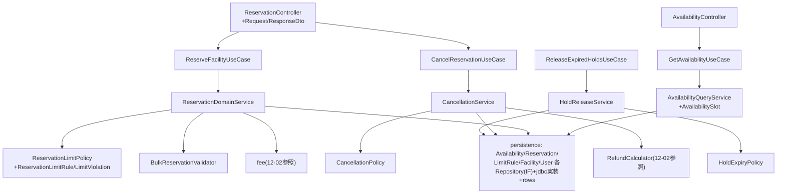
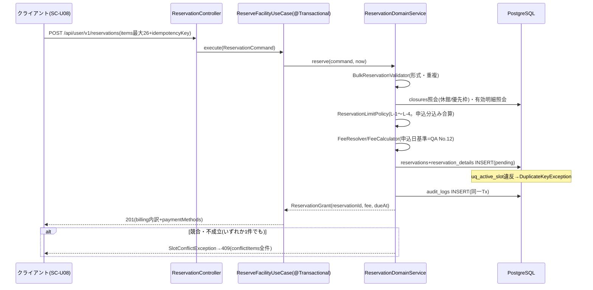

# 詳細設計書 12-01 予約編(空き照会・先着予約・上限・取消・仮押さえ)

霞台市公共施設予約管理システム構築及び運用保守業務(霞情政第126号)

| 項目 | 内容 |
|---|---|
| 文書番号 | KSM-DDD-001-01(親:KSM-DDD-001) |
| 版 | 2.0(分冊初版。旧KSM-DDD-001 1.1版 §1/§3/§4の該当範囲を継承) |
| 作成日 | 令和8年6月11日 |
| 作成者 | 受注者(当社)業務チームA(リードA監修) |
| 承認 | 発注者確認待ち |
| 対象モジュール | MOD-001(空き状況照会)/MOD-002(先着予約申込)/MOD-003(予約上限判定)/MOD-004(一括予約整合)/MOD-005(予約取消・キャンセル料)/MOD-010(仮押さえ期限管理) |
| 関連要件 | REQ-006/007/009/010/011/019/021、NFR-B01 |

> 凡例・共通規約(IPA準拠+記法現代化、例外処理、状態遷移、トランザクション規約)は12-00 総説・共通編による。

## 1. はじめに・基本設計とのトレース

| 基本設計(KSM-BDD-001 1.2版) | 本分冊での詳細化 |
|---|---|
| §4.1 機能F05/F06/F08/F16、§5.2 SC-U03/U08/U10 | 各モジュール節(§2〜§8) |
| §6.2 予約系API | §5(openapi.yaml詳細化) |
| §7.3 reservations/reservation_details/closures ほか | §6 |

参照ADR:ADR-005(部分一意制約)、ADR-008(期限バッチ)、ADR-009(キャッシュと再検証)。業務ルールの正=KSM-BRL-001 1.1版 §1(上限)/§2(一括整合)/§3.1(キャンセル料)/§6(仮押さえ)。

## 2. コンポーネント詳細

> 記法根拠:C4 Component(Mermaid)+実装型参照(対象=レイヤー内コンポーネント分解)。



### MOD-001 空き状況照会(REQ-006)

- 責務:施設×年月のコマ別空き状況(OPEN/RESERVED/CLOSED/PRIORITY)の組立て。閉鎖・優先枠(closures)と有効予約(uq_active_slot対象)を重ねて判定。
- 公開API(未ログイン)・個人情報なし・`Cache-Control: max-age=60, public`(KSM-ADR-009)。
- 型:`AvailabilityQueryService#query(facilityId, yearMonth) : List<AvailabilitySlot>`。

### MOD-002 先着予約申込(REQ-007)

- 責務:申込コマ列の検証(MOD-004)→上限判定(MOD-003)→料金算定(12-02)→予約+明細INSERT(pending・支払期限=申込+7日 `DEFAULT_PAYMENT_DUE_DAYS`)→通知投入→操作ログ。
- 型:`ReservationDomainService#reserve(ReservationCommand, LocalDateTime now) : ReservationGrant`、`#reserveForLotteryWin(...)`(抽選当選の予約化=12-03から利用)。
- 付帯設備指定(equipments)はP4実装範囲外(P5でマスタ保守MOD-310と併せて拡張。openapi.yaml注記)。

### MOD-003 予約上限判定(REQ-009)

- 責務:L-1月間コマ数/L-2同一日/L-3同時保有/L-4受付開始日(KSM-BRL-001 §1.1の確定初期値=V2シード)の判定。カウント対象=isActive(hold/pending/confirmed)。
- 型:`ReservationLimitPolicy#validate(...) : List<LimitViolation>`。ルールはマスタ(`reservation_limit_rules`)から `LimitRuleRepository` で解決(施設×利用者区分・適用開始日付き)。
- 職員代行の上限超過特例(理由必須・操作ログ)はMOD-310(P5)で画面実装。

### MOD-004 一括予約整合(REQ-010)

- 責務:申込コマ列の形式整合(最大26コマ・重複なし・同一日上限の事前判定)。全件成立/全件不成立(部分確定なし)。
- 型:`BulkReservationValidator#validate(List<SlotRequest>) : List<SlotConflict>`。不成立は `SlotConflictException`(reason=RESERVED/CLOSED/PRIORITY_SLOT/LIMIT_EXCEEDED)→409+全件一覧。

### MOD-005 予約取消・キャンセル料(REQ-011/019)

- 責務:取消事前表示(preview)と取消実行(cancel)。キャンセル料=**利用日7日前まで無料/6日前以降100%**(QA No.11確定。`cancellation_rules` マスタで施設別設定可)。還付見込=収納済額−キャンセル料(算定=12-02 MOD-008)。
- 型:`CancellationService#preview/#cancel(reservationId, userId, cancelDate) : CancellationResult(chargeYen, refundYen, freeCancelDeadline, cancelled)`。
- 本人リソース検査:reservation.user_id とトークン解決IDの一致を検証(P4は暫定ヘッダ=S-1)。
- **スタブ宣言(S-4)**:取消期限判定は予約内最先利用日で代替中。明細別取消期限はP5実装(module-index備考)。

### MOD-010 仮押さえ期限管理(REQ-021)

- 責務:保持期限超過の hold→expired 遷移(JB-02。15分間隔)+解放の操作ログ。期限初期値7日(QA No.16・施設別マスタ)。
- 型:`HoldExpiryPolicy#isExpired(...)`、`HoldReleaseService#releaseExpired(OffsetDateTime now) : int(解放件数)`。
- 窓口仮押さえ登録画面(SC-S02)はMOD-310(P5)。

## 3. 処理詳細設計

> 記法根拠:Web API中心のため sequenceDiagram(テンプレ早見)。

先着予約申込(主要系・異常系):



取消(preview→cancel)は §2 MOD-005 の型のとおり2段階(previewは読み取りのみ・cancelは状態遷移+還付計上+通知投入+操作ログを同一Tx)。仮押さえ解放(JB-02)は12-05 §8の共通バッチ手順に従う(対象抽出→WHERE status='hold' AND expire_at<now のUPDATE→解放件数ログ)。

## 4. 状態遷移設計

予約ライフサイクル(hold/pending/confirmed/cancelled/expired)の正=12-00 §4。本分冊の関与:申込(→pending)、仮押さえ(→hold、JB-02で→expired)、取消(→cancelled)。ガード条件:取消は isActive 状態のみ可、二重取消は前提状態WHEREの影響行数0で422。

## 5. API詳細

正本=openapi.yaml。本分冊対応:`GET /api/public/v1/availabilities`(MOD-001)、`POST /api/user/v1/reservations`(MOD-002)、`GET/POST /api/user/v1/reservations/{id}/cancellation`(MOD-005)。リクエスト/レスポンス例(旧§4.4の継承):

```
POST /api/user/v1/reservations
{ "facilityId": 10, "purpose": "バドミントン練習", "idempotencyKey": "f3a1...",
  "items": [ { "unitId": 101, "useDate": "2026-07-04", "slotId": 3 },
             { "unitId": 101, "useDate": "2026-07-11", "slotId": 3 } ] }
→ 201 { "reservationId": 9012, "status": "pending",
        "billing": { "baseAmount": 2400, "equipmentAmount": 0, "exemptionAmount": 0,
                     "billedAmount": 2400, "dueAt": "2026-06-18T...", "detail": [...] },
        "paymentMethods": ["online", "counter", "slip"] }
→ 409 { "type": ".../slot-conflict", "title": "選択コマの一部が予約できません",
        "conflictItems": [ { "unitId": 101, "useDate": "2026-07-11", "slotId": 3, "reason": "RESERVED" } ] }
```

バリデーション規則:facilityId/unitId/slotId=正数、purpose≦200字、items=1〜26件、idempotencyKey≦64字(Bean Validation。openapi.yamlのスキーマと1:1)。

## 6. データアクセス詳細

- 対象テーブル:reservations / reservation_details / closures / reservation_limit_rules / cancellation_rules / users / user_categories / facilities / units / slots(DDL=V1。共通方針=12-00 §6)。
- 主要クエリ:有効明細の競合判定(uq_active_slot対象のSELECT→INSERT、最終防衛はDB一意制約)/月間・同日カウント(`countActiveSlotsByMonth` 等。isActive条件)/期限超過抽出(`(status,due_at)` 部分インデックス・`hold+expire_at`)。
- 排他制御:楽観方式+INSERT順正規化(12-00 §6.3)。

## 7. 画面詳細

SC-U03(空きカレンダー)・SC-U08(予約ウィザード)・SC-U07/U10(マイページ・取消)の項目定義・イベント=12-06 §7。レイアウト方針=KSM-BDD-001 §5.5。

## 8. バッチ/非同期詳細

JB-02(仮押さえ解放・15分間隔)・JB-03(支払期限超過取消・毎時)の起動・冪等・リカバリ=12-05 §8(共通手順)。本分冊は業務判定(HoldExpiryPolicy・期限超過の遷移条件)を所掌。

## 9. 例外・エラー処理設計

12-00 §9の共通規約による。本分冊固有:SlotConflictException(409)の conflictItems は**全件**返却(部分成立を見せない=KSM-BRL-001 §2.1-3)。

## 10. インフラ詳細

12-07参照(本分冊固有のリソースなし)。

## 11. 監視・運用詳細

ピーク時p95応答(OPS-ALM-002/003=NFR-B01閾値)・ECSスケール(抽選期間暖機)=12-07 §11。

## 12. セキュリティ実装詳細

本人リソース検査(S-11)・Bean Validation必須(S-53)・プリペアドステートメント(S-51)=12-00 §12/KSM-DEV-002。

## 13. 単体テスト設計

| モジュール | テストファイル(module-index) | 観点(REQ対応・境界値) |
|---|---|---|
| MOD-003 | ReservationLimitPolicyTest | L-1月間=ちょうど上限/超過、L-2同日、L-3同時保有、L-4受付開始日(区分別)(REQ-009) |
| MOD-004 | BulkReservationValidatorTest | 全件成立/一部競合で全件不成立、26コマ上限、重複コマ(REQ-010) |
| MOD-005 | CancellationPolicyTest | 7日前境界(無料)/6日前境界(100%)(REQ-011=QA No.11) |
| MOD-010 | HoldExpiryPolicyTest | 期限ちょうど/超過の判定(REQ-021) |
| MOD-001/002 | (UT未作成。JDBC結合依存のためP5 ITで検証=module-index状態列に明示) | 申込→明細展開・キャッシュヘッダ(REQ-006/007) |

## 14. トレーサビリティ更新

module-index.md(MOD-001〜005, 010)および KSM-TRM-001(REQ-006/007/009/010/011/019/021 行)による(12-00 §14)。

以上
