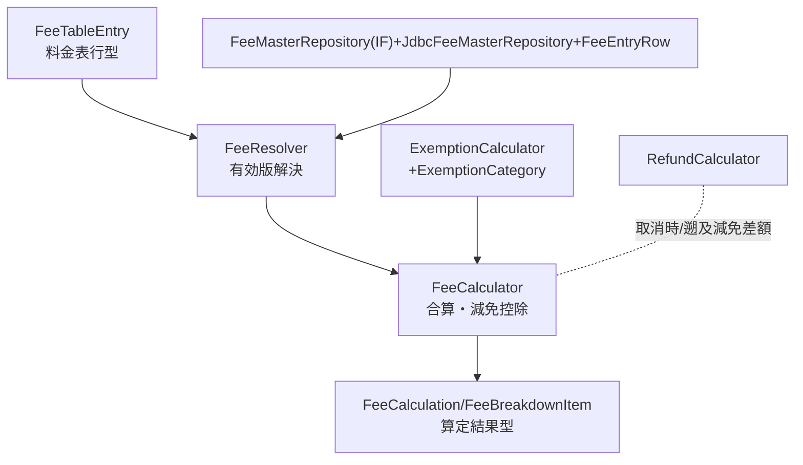
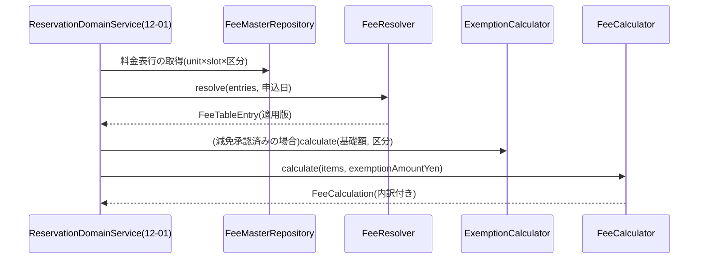

# 詳細設計書 12-02 料金・減免・還付編

霞台市公共施設予約管理システム構築及び運用保守業務(霞情政第126号)

| 項目 | 内容 |
|---|---|
| 文書番号 | KSM-DDD-001-02(親:KSM-DDD-001) |
| 版 | 2.0(分冊初版。旧KSM-DDD-001 1.1版 §3.3/§3.5の該当範囲を継承) |
| 作成日 | 令和8年6月11日 |
| 作成者 | 受注者(当社)業務チームB(リードB監修) |
| 承認 | 発注者確認待ち |
| 対象モジュール | MOD-006(料金算定)/MOD-007(減免算定)/MOD-008(還付算定) |
| 関連要件 | REQ-015/018/019 |

> 凡例・共通規約は12-00 総説・共通編による。計算仕様の正=KSM-BRL-001 1.1版 §3(料金)/§4(減免・還付)。

## 1. はじめに・基本設計とのトレース

基本設計:KSM-BDD-001 §4.1(F10/F13/F14)・§7.3(fee_master/equipment/billings)。参照ADR:ADR-005。減免WF画面・還付管理画面はP5実装(12-08 MOD-304/305)。本分冊は計算エンジン(ドメイン層)を所掌する。

## 2. コンポーネント詳細

### MOD-006 料金算定(REQ-015)

- 算定式(KSM-BRL-001 §3.1):明細料金=基本料金(施設×面室×コマ×利用者区分)+Σ付帯設備料金。請求額=Σ明細−減免額。
- **料金解決の適用基準日=申込(使用許可)日**(QA No.12確定):`FeeResolver#resolve(entries, applicationDate)` が valid_from≦申込日<次版valid_from の有効版を返す。マスタは円単位実額保持(乗除算なし=端数解釈差の排除。市外加算もマスタ実額)。
- 型:`FeeCalculator#calculate(List<FeeBreakdownItem>, exemptionAmountYen) : FeeCalculation(baseAmountYen, equipmentAmountYen, exemptionAmountYen, billedAmountYen, items)`。減免額>請求基礎額は拒否(異常値防御)。
- 算定内訳は billings.calculation_detail(JSONB)へ保存(帳票・監査で再現可能=RP-01/02)。

### MOD-007 減免算定(REQ-018)

- 減免額=請求額(基本+設備)×減免率、**円未満切捨て**(KSM-BRL-001 §4.3)。区分=全額免除100%/半額50%/個別決定0〜100%(QA No.13確定)。複数該当時は**最有利1区分**のみ適用(併用不可)。
- 型:`ExemptionCalculator#calculate(chargeableAmountYen, ExemptionCategory or ratePercent) : long`。減免はキャンセル料算定の基礎額にも適用(減免後額に料率適用)。
- 申請受付・承認WF・支払期限自動延伸(承認/否認確定+7日)はMOD-304(12-08)。

### MOD-008 還付算定(REQ-019)

- 還付対象=取消時の収納済額−キャンセル料、および遡及減免の差額(2算定メソッド)。
- 型:`RefundCalculator#refundOnCancellation(paidYen, chargeYen)`/`#refundOnRetroactiveExemption(paidYen, recalculatedYen)`。
- 還付方法(口座振込/窓口現金)・消込・一覧出力(RP-03)はMOD-305(12-08)。オンライン決済の取消期間内はカード会社経由取消を優先(12-04)。

## 3. 処理詳細設計

分岐・例外:適用版なし=DomainException(料金未設定)、減免額>基礎額=DomainException、円未満は切捨てのみ(四捨五入禁止)。

## 4. 状態遷移設計

本分冊のモジュールは無状態(純粋計算)。請求・収納・減免申請の状態は12-04/12-08。

## 5. API詳細

専用エンドポイントなし(予約API応答のbilling内訳として露出=openapi.yaml ReservationResponse)。

## 6. データアクセス詳細

- 対象テーブル:fee_master(版管理。`ix_fee_master_resolve`=(unit_id, slot_id, user_category_id, valid_from DESC))/equipment/equipment_fees/billings(calculation_detail JSONB)。
- 注意:fee_masterの版は論理削除しない(過去請求の再現性=監査要件)。改定はvalid_fromの新版INSERTのみ。

## 7. 画面詳細

料金内訳表示=12-06(SC-U08確認画面・SC-U10還付見込)。マスタ保守画面(SC-S07)=12-08 MOD-310。

## 8. バッチ/非同期詳細

該当なし(計算はオンライン同期。遡及減免の還付計上は承認操作時=MOD-304)。

## 9. 例外・エラー処理設計

12-00 §9の共通規約による(固有:適用版なし・減免超過=DomainException 422)。

## 10. インフラ詳細

12-07参照(本分冊固有のリソースなし)。

## 11. 監視・運用詳細

12-07 §11(共通アラーム)による。固有監視項目なし。

## 12. セキュリティ実装詳細

12-00 §12による。固有:減免証憑(S3保存)はCMK暗号化(MOD-304実装時)。

## 13. 単体テスト設計

| モジュール | テストファイル | 観点(REQ対応・境界値) |
|---|---|---|
| MOD-006 | FeeCalculatorTest / FeeResolverTest | 合算・減免控除・減免超過拒否/改定日境界(valid_from前日・当日)・適用基準日=申込日(REQ-015=QA No.12) |
| MOD-007 | ExemptionCalculatorTest | 100%/50%/個別率、円未満切捨て、最有利区分選択(REQ-018=QA No.13) |
| MOD-008 | RefundCalculatorTest | 取消還付(キャンセル料0/100%)・遡及減免差額(REQ-019) |

(全テスト=Vitest/JUnitで作成済み・通過。フロントエンド側の同一ルール=12-06 MOD-105)

## 14. トレーサビリティ更新

module-index.md(MOD-006〜008)および KSM-TRM-001(REQ-015/018/019 行)による。

以上
