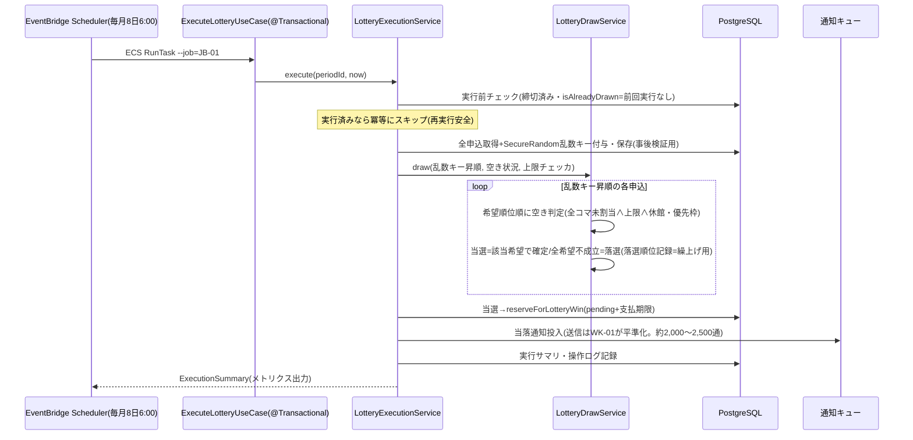
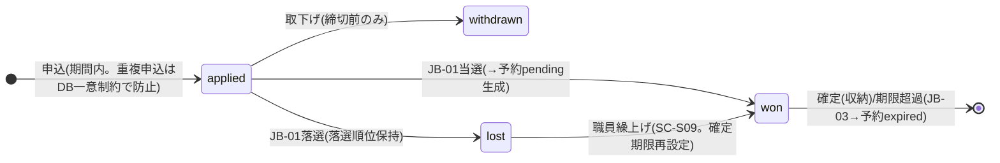

# 詳細設計書 12-03 抽選編

霞台市公共施設予約管理システム構築及び運用保守業務(霞情政第126号)

| 項目 | 内容 |
|---|---|
| 文書番号 | KSM-DDD-001-03(親:KSM-DDD-001) |
| 版 | 2.0(分冊初版。旧KSM-DDD-001 1.1版 §6.1(JB-01)/§3.3の該当範囲を継承) |
| 作成日 | 令和8年6月11日 |
| 作成者 | 受注者(当社)業務チームA(リードA監修) |
| 承認 | 発注者確認待ち |
| 対象モジュール | MOD-009(抽選) |
| 関連要件 | REQ-008、NFR-B01 |

> 凡例・共通規約は12-00による。抽選アルゴリズムの正=KSM-BRL-001 1.1版 §5(QA No.14/15確定)。

## 1. はじめに・基本設計とのトレース

基本設計:KSM-BDD-001 §4.1(F07)・§8.1(JB-01)・§5.3(SC-S09)。参照ADR:ADR-008(バッチ分離)、ADR-012(実行方式)。

## 2. コンポーネント詳細(### MOD-009 抽選)

```mermaid
flowchart TB
    LAC[LotteryAdminController<br>(職員再実行経路)] --> ELU[ExecuteLotteryUseCase]
    BJR["BatchJobRunner --job=JB-01(12-00)"] --> ELU
    ELU --> LES[LotteryExecutionService<br>実行統制・冪等・サマリ]
    LES --> LDS[LotteryDrawService<br>抽選アルゴリズム(純粋関数)]
    LDS --> LE[LotteryEntry/LotteryPreference<br>LotteryResult/SlotAvailability]
    LES --> WLC[WinLimitChecker<br>当選時の上限再判定]
    LES --> RDS_["ReservationDomainService#reserveForLotteryWin(12-01)"]
    LES --> REPO["LotteryRepository(IF)+JdbcLotteryRepository+rows"]
    LES --> NQ["NotificationQueue(12-05)"]
```

- 責務分離:**LotteryDrawService=決定論的アルゴリズム**(乱数キーを入力として受け取り、SecureRandomは注入。シード固定でテスト再現可能)。**LotteryExecutionService=実行統制**(実行前チェック・冪等判定 isAlreadyDrawn・当選の予約化・通知投入・サマリ記録)。
- 主要型:`LotteryDrawService#draw(List<KeyedEntry>, SlotAvailability, WinLimitChecker) : List<LotteryResult>`、`LotteryExecutionService#execute(lotteryPeriodId, now) : ExecutionSummary(entryCount, wonCount, lostCount)`。

## 3. 処理詳細設計

アルゴリズム(KSM-BRL-001 §5.3の実装手順):



- 公平性:乱数キー昇順処理=申込時刻に依存しない(KSM-BRL-001 §5.3)。乱数キー・処理順・判定結果を抽選実行ログとして保存し市が事後検証可能(議会・監査対応)。
- 当選時の上限再判定(WinLimitChecker=KSM-BRL-001 §5.4):超過する希望は不成立として次希望を評価。複数施設グループはグループ逐次実行。
- **繰上げ**:落選順位リストに基づく職員操作(SC-S09。自動繰上げなし=QA No.15)。繰上げAPI(POST .../promotions)はP5実装(openapi.yaml designed)。

## 4. 状態遷移設計



一貫性保証:当落確定と予約生成は同一トランザクション。won→予約pendingの支払期限=当落通知から7日(QA No.14)。

## 5. API詳細

正本=openapi.yaml:`POST /api/staff/v1/lottery-periods/{id}/executions`(実装済み=200 ExecutionSummary)、`POST /api/user/v1/lottery-entries`・`POST .../promotions`(designed=P5)。

## 6. データアクセス詳細

- 対象テーブル:lottery_periods / lottery_entries(random_key・当落状態。`(lottery_period_id, random_key)` 順序読出しインデックス・`(user_id, lottery_period_id)` 一意)/ lottery_entry_details(希望順位×unit×日×コマ)。
- 申込=同期の軽量INSERT(瞬間10件/秒はRDB余裕内=NFR-B01)。抽選読出しは期間IDで一括取得(N+1禁止)。

## 7. 画面詳細

SC-S09(職員抽選管理)の実装画面=12-06 MOD-104。SC-U09(利用者申込)=P5(12-08系画面と併せて)。

## 8. バッチ/非同期詳細

- JB-01:起動=EventBridge Scheduler(毎月8日6:00。日時はDBマスタ照合方式=IaC変更不要)。冪等=isAlreadyDrawn+batch_job_locks。失敗=P1-CRITICALアラーム(OPS-ALM-012)→9:00までに未確定の場合の再実行・窓口周知手順はP6運用手順書(QA No.14申し送り)。再実行経路=職員API(§5)。
- 当落通知はSQS投入のみ(送信平準化=WK-01。12-05)。

## 9. 例外・エラー処理設計

12-00 §9による。固有:抽選実行失敗時はロールバック(部分当選を残さない)。実行前チェック不成立(締切前・実行済み)=DomainException 422。

## 10. インフラ詳細

12-07参照:EventBridge Scheduler(JB-01)・抽選期間暖機スケーリング=AppStack。

## 11. 監視・運用詳細

12-07 §11による。固有:JB-01失敗=P1-CRITICAL(OPS-ALM-012)・実行サマリのカスタムメトリクス。再実行手順=P6運用手順書(QA No.14)。

## 12. セキュリティ実装詳細

12-00 §12による。固有:乱数=SecureRandom(暗号論的乱数=KSM-BRL-001 §5.3)。抽選実行ログの改ざん防止(追記専用=MOD-015)。

## 13. 単体テスト設計

| テストファイル | 観点(REQ-008・KSM-BRL-001 §5) |
|---|---|
| LotteryDrawServiceTest | シード固定の再現性/乱数キー昇順処理/希望順位の評価順/全希望不成立=落選順位記録/当選時上限再判定/休館・優先枠の除外 |

実行統制(LotteryExecutionService)の冪等・予約化はJDBC結合依存のためP5 ITで検証(KSM-TSP-001 §5.2「抽選の業務結合」)。

## 14. トレーサビリティ更新

module-index.md(MOD-009)および KSM-TRM-001(REQ-008 行)による。

以上
