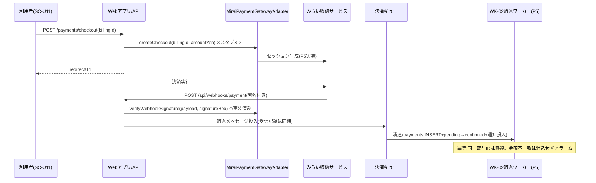
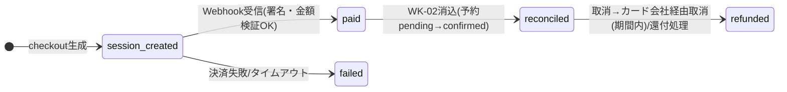

# 詳細設計書 12-04 収納・決済・財務編

霞台市公共施設予約管理システム構築及び運用保守業務(霞情政第126号)

| 項目 | 内容 |
|---|---|
| 文書番号 | KSM-DDD-001-04(親:KSM-DDD-001) |
| 版 | 2.0(分冊初版。旧KSM-DDD-001 1.1版 §2/§7.1/§7.3の継承。**乖離D-1の訂正を反映**) |
| 作成日 | 令和8年6月11日 |
| 作成者 | 受注者(当社)業務チームB(リードB監修) |
| 承認 | 発注者確認待ち |
| 対象モジュール | MOD-011(財務会計CSV出力)/MOD-013(決済代行連携=スタブS-2)/MOD-303(窓口収納・納付書=P5)/MOD-305(還付管理画面=P5)/MOD-309(帳票PDF生成=P5) |
| 関連要件 | REQ-016/017/019/020/025 |

> 凡例・共通規約は12-00による。

## 1. はじめに・基本設計とのトレース

基本設計:KSM-BDD-001 §4.1(F11/F12/F14/F15)・§6.3(決済・財務CSV)・§5.5(帳票一覧)。参照ADR:ADR-008(Webhook非同期消込)、ADR-011(JasperReports)。

**訂正記録(乖離D-1。KSM-IMP-001 1.1版 §4.1)**:旧KSM-DDD-001 §7.1の「決済代行は料金確定のビジネスルールを扱うためドメイン層に配置する」旨の記述は誤りであり、**「決済代行はインフラ層の外部IFアダプタとして実装する」に訂正する**(本版で実施)。根拠:外部IFはインフラ層に隔離するレイヤー規約(KSM-DEV-001 §2)・ArchUnit検査・実装実態(`infrastructure.payment.*`)との整合。料金確定のビジネスルール自体は12-02(ドメイン層)が所掌し、決済はその結果(請求額)の収納手段である。

## 2. コンポーネント詳細

```mermaid
flowchart TB
    FEC[FinanceExportController] --> EFU[ExportFinanceCsvUseCase]
    EFU --> FES[FinanceExportService<br>(ドメイン層:期間検証・日計組立て・操作ログ)]
    FES --> PR["PaymentRepository(IF)+JdbcPaymentRepository<br>+PaymentDailySummaryRow"]
    FES --> F12[Form12CsvFormatter<br>(インフラ層:様式第12号整形)]
    F12 --> SCW[SafeCsvWriter<br>(CSVインジェクション対策)]
    PG[PaymentGateway(IF)<br>※インフラ層=D-1訂正] --> MPA[MiraiPaymentGatewayAdapter<br>createCheckout=スタブS-2<br>verifyWebhookSignature=実装済み]
```

### MOD-011 財務会計CSV出力(REQ-020)

- 様式:**会計課様式第12号「歳入データ取込様式」(QA No.21確定)**=CSV(Shift_JIS(windows-31j)・CRLF・ヘッダ行なし・日計集計形式)。項目9:(1)伝票日付YYYYMMDD(2)会計年度(3)会計区分コード(4)歳入科目コード(款項目節細節)(5)収納方法コード(窓口現金/コンビニ/オンライン)(6)金額(7)件数(8)摘要(施設名・対象期間)(9)施設コード。還付はマイナス計上でなく還付区分の別行出力(会計課確認済み)。
- 型:`FinanceExportService#export(fromDate, toDate, staffId) : ExportResult(content, filename, lineCount)`。出力履歴は操作ログへ記録(出力監査=REQ-024)。応答ヘッダ:attachment+`Cache-Control: no-store`。
- フォーマッタはインフラ層に隔離(様式変更時に差替え可能)。P5で会計課テスト取込により検証。
- `SafeCsvWriter`:先頭が `= + - @` のフィールドにシングルクォート前置(CSVインジェクション対策=KSM-DEV-002 S-55)。

### MOD-013 決済代行連携(REQ-016)【スタブS-2】

| 項目 | 設計(旧§7.1の継承+D-1訂正) |
|---|---|
| 事業者 | みらい収納サービス株式会社(市直接契約締結済み・令和8年6月5日=QA No.18)。コンビニ収納代行+オンライン決済(クレジット+コード決済2種) |
| 方式 | リダイレクト型(ホスト型決済ページ):カード情報は当社システム非経由、PCI DSS適用範囲最小化(SAQ A相当) |
| IF配置 | **インフラ層**に `PaymentGateway`(IF)+`MiraiPaymentGatewayAdapter`(実装)。事業者固有はアダプタに隔離(D-1訂正後の正) |
| フロー | (1)決済セッション生成(billingId・金額)→(2)決済ページへリダイレクト→(3)Webhook受信(HMAC-SHA256署名検証=実装済み。受信記録は同期・消込はSQS経由非同期=WK-02)→(4)ブラウザ復帰時はポーリング(Webhook先着を正) |
| 整合性 | 取引ID=billing_id起点一意(`uq_payments_gateway_tx`)。Webhook冪等(同一取引ID再通知は無視)。金額照合不一致は消込せずアラーム |
| 障害時 | 決済代行障害時は窓口収納・納付書へ誘導(オンライン決済のみ縮退) |
| スタブ | `createCheckout()` は UnsupportedOperationException(接続仕様書受領後にP5実装・サンドボックス結合=KSM-TSP-001 §5.2) |

### MOD-303 窓口収納・納付書発行(REQ-017)【P5実装・設計済み骨格】

- 現金収納消込(SC-S04):payments INSERT(method=counter)+billing状態遷移+領収書(RP-01)。収納日計(RP-06)。
- 納付書(RP-02):payment_slipsテーブル(発行連番・GS1-128データ・有効期限。V3マイグレーションで追加)。バーコード=GS1-128(AI(91)・44桁固定長)、GS1 Japan標準料金代理収納ガイドライン準拠[^1]。桁割は接続仕様書受領後に確定・実スキャナ検証(P5 IT)。再発行時は旧票無効化(発行連番管理)。

### MOD-305 還付管理画面(REQ-019)【P5実装・設計済み骨格】

- refundsテーブル(対象payment・算定額・状態:計上→支払依頼→完了)。一覧出力RP-03。算定エンジンは実装済み(12-02 MOD-008)。

### MOD-309 帳票PDF生成(RP-01〜07)【P5実装・設計済み骨格】

- JasperReports Library(KSM-ADR-011):jrxml帳票定義をリポジトリ版管理・様式IDと版をフッタ印字。S3(CMK暗号化)保存+署名付き一時URL。大量出力は非同期(SQS→ワーカー)。統計帳票(RP-04/05)は集計テーブル(monthly_facility_stats=MOD-306)参照。帳票様式モックはP4第1週に業務部会提示済み(唯一の継続事項)。

## 3. 処理詳細設計



財務CSV(MOD-011)の処理:期間検証(from≦to・年度内)→`PaymentRepository#findDailySummaries`(日計集計クエリ)→Form12整形(9項目・収納方法コード別)→SafeCsvWriter→Shift_JISエンコード→操作ログ→ダウンロード応答。

## 4. 状態遷移設計(決済取引)



一貫性:消込はSQS経由非同期だが、Webhook受信記録(同期)を正とし、再通知・順序逆転に対して冪等。

## 5. API詳細

正本=openapi.yaml:`POST /api/staff/v1/finance-exports`(実装済み)、`POST /api/user/v1/payments/checkout`・`POST /api/webhooks/payment`・`POST /api/staff/v1/payments`・`/payment-slips`・`GET /refunds`(designed=P5)。

## 6. データアクセス詳細

- 実装済み:payments(method_code・gateway_transaction_id一意・(paid_at)日計インデックス)、billings。
- P5追加(V3〜):payment_slips、refunds。日計集計クエリは(paid_at)インデックスで期間絞込み→収納方法×日付×施設でGROUP BY。

## 7. 画面詳細・帳票詳細

SC-S04/S06/S14の項目定義はP5実装時に12-08様式で確定(SC-S14のAPI・出力仕様は本分冊§2が確定済み)。帳票一覧・様式要点=KSM-BDD-001 §5.5+本分冊§2(MOD-303/309)。

## 8. バッチ/非同期詳細

WK-02(決済消込):SQS常駐消費・最大3回再試行→DLQ→アラーム(12-05共通)。冪等=notification_logs/取引ID一意。

## 9. 例外・エラー処理設計

12-00 §9による。固有:Webhook署名不一致=401で拒否+WARNログ。金額照合不一致=消込せずERRORログ+アラーム。

## 10. インフラ詳細

12-07参照(SQS決済キュー=AppStack、Secrets Manager=StatefulStack)。

## 11. 監視・運用詳細

12-07 §11による。固有:決済IF失敗アラーム(KSM-BDD-001 §10.4)・DLQ滞留。

## 12. セキュリティ実装詳細

12-00 §12による。固有:秘匿情報(webhook-secret・決済APIキー)=Secrets Manager注入(S-42)。外部URLはユーザー入力を使用しない(SSRF対策=S-14)。CSVインジェクション対策=SafeCsvWriter(S-55)。

## 13. 単体テスト設計

| モジュール | テストファイル | 観点 |
|---|---|---|
| MOD-011 | Form12CsvFormatterTest / SafeCsvWriterTest | 様式第12号9項目・Shift_JIS/CRLF/ヘッダなし・還付別行/インジェクション文字エスケープ(REQ-020) |
| MOD-013 | (署名検証はP5 IT。createCheckoutはスタブのためUT対象外=module-index状態列) | Webhook署名・冪等(REQ-016) |
| MOD-303/305/309 | P5作成 | 納付書GS1-128実スキャナ検証(IT)・還付状態遷移・帳票様式 |

## 14. トレーサビリティ更新

module-index.md(MOD-011/013/303/305/309)および KSM-TRM-001(REQ-016/017/019/020 行)による。

---

[^1]: GS1 Japan「GS1-128シンボルによる標準料金代理収納ガイドライン」(現行版:第6版系、2024年3月版を確認)。https://www.gs1jp.org/standard/barcode/gs1-128/payment_service.html (参照日:令和8年6月10日。旧KSM-DDD-001 1.1版脚注3の継承)

以上
