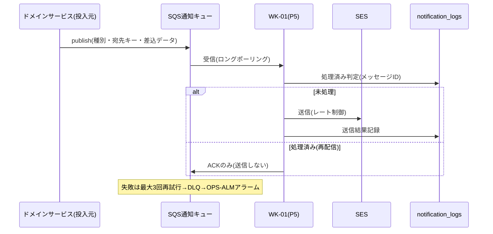

# 詳細設計書 12-05 通知・バッチ編

霞台市公共施設予約管理システム構築及び運用保守業務(霞情政第126号)

| 項目 | 内容 |
|---|---|
| 文書番号 | KSM-DDD-001-05(親:KSM-DDD-001) |
| 版 | 2.0(分冊初版。旧KSM-DDD-001 1.1版 §6/§7.2の継承。**乖離D-2の訂正を反映**) |
| 作成日 | 令和8年6月11日 |
| 作成者 | 受注者(当社)基盤チーム+業務チームA |
| 承認 | 発注者確認待ち |
| 対象モジュール | MOD-012(メール通知投入)/MOD-308(通知ワーカーWK-01・決済消込WK-02=P5) ※バッチ実行基盤MOD-014は12-00 §2 |
| 関連要件 | REQ-012/016、NFR-C02 |

> 凡例・共通規約は12-00による。

## 1. はじめに・基本設計とのトレース

基本設計:KSM-BDD-001 §8(バッチ・非同期一覧)・§6.3(SES)。参照ADR:ADR-008(SQS+ワーカー/Scheduler+RunTask)、**ADR-012(バッチ実行方式)**。

**訂正記録(乖離D-2。KSM-IMP-001 1.1版 §4.1)**:旧KSM-DDD-001 §6.1の「バッチジョブランナー」記述を、実装実態に合わせ**「ApplicationRunner(`BatchJobRunner`)+`--job=JB-xx` 引数切替+`batch_job_locks` による冪等性担保(Spring Batch非採用)」に確定する**(本版で実施)。決定理由・代替案・トレードオフはKSM-ADR-012を正とする。

## 2. コンポーネント詳細

```mermaid
flowchart TB
    subgraph 投入側(実装済み)
        SVC["各ドメインサービス<br>(予約確定/抽選当落/取消)"] --> NQ["NotificationQueue(IF)"]
        NQ --> SNQ["SqsNotificationQueue<br>(yoyaku-{env}-queue-notification)"]
    end
    subgraph 消費側(P5実装=MOD-308)
        SQSQ[SQS通知キュー+DLQ] --> WK1["WK-01 通知ワーカー<br>(SES送信・平準化・抑止)"]
        SQSP[SQS決済キュー+DLQ] --> WK2["WK-02 決済消込(12-04)"]
        WK1 --> SES[Amazon SES]
        WK1 --> NL[(notification_logs<br>二重送信防止)]
    end
    SNQ --> SQSQ
```

### MOD-012 メール通知投入(REQ-012)【実装済み(投入側)】

- 型:`NotificationQueue#publish(NotificationMessage)`(IF)/`SqsNotificationQueue`(SQS実装)。投入元=予約確定・抽選当落・取消の各サービス(同一トランザクション完了後に投入)。
- 送信種別(旧§7.2):仮申請確認/本登録完了/予約確定/抽選受付・当落/取消・還付/支払期限前リマインド(3日前)。

### MOD-308 通知ワーカー・決済消込ワーカー(WK-01/02)【P5実装・設計済み骨格】

| 項目 | 設計(旧§7.2/§6.1の継承) |
|---|---|
| 形態 | Fargate常駐1タスク(WK-01とWK-02は同一タスク内の別リスナー)。同一Spring Bootコードベースの起動プロファイル |
| 送信ドメイン | `yoyaku.city.kasumidai.lg.jp`(SPF/DKIM/DMARC市側登録完了=QA No.20。SESドメイン検証ステータス確認をP5環境構築作業記録に残す) |
| 平準化 | SES送信レートに合わせて消費(当落一斉約2,000〜2,500通のスパイクをワーカー側で平準化) |
| 二重送信防止 | notification_logsの処理済み判定(SQS少なくとも1回配信前提の冪等) |
| バウンス | SNS経由でバウンス・苦情受信→notification_logs記録→連続バウンスのアドレスは送信抑止フラグ(SES評価維持) |
| 文面管理 | テンプレート(差込項目付き)をDB管理し職員が確認可能。個人情報は本文最小限(詳細はログイン後参照へ誘導) |

## 3. 処理詳細設計



## 4. 状態遷移設計

通知メッセージ:投入→処理中→送信済み/抑止(バウンス)/DLQ(要手動再処理=P6ランブック)。予約状態への影響なし(通知は副作用であり業務状態と分離)。

## 5. API詳細

専用APIなし(SQS IF)。Webhook受信は12-04。

## 6. データアクセス詳細

notification_logs(V1実装済み:メッセージID・送信結果・バウンス状態)。文面テンプレートテーブルはP5(V3〜)。

## 7. 画面詳細

該当なし(お知らせ管理SC-S11は12-08 MOD-307)。

## 8. バッチ/非同期詳細(IPO・冪等・リカバリの正=旧§6.2の継承)

| ジョブ | I(入力) | P(処理) | O(出力) | 冪等性・リカバリ |
|---|---|---|---|---|
| JB-01 抽選(12-03) | 抽選期間ID・申込全件 | 乱数キー付与→抽選→予約化 | 当落・予約・通知投入・サマリ | isAlreadyDrawn+batch_job_locks。失敗=P1アラーム→職員API再実行 |
| JB-02 仮押さえ解放(12-01) | 期限超過hold | hold→expired(WHERE前提状態) | 解放件数・操作ログ | 再実行安全(対象0件で正常終了) |
| JB-03 支払期限超過取消 | 期限超過pending | pending→expired+通知投入 | 取消件数・通知 | 同上+通知はnotification_logsで二重防止 |
| JB-04 日次集計(P5=MOD-306) | 前日収納・予約実績 | monthly_facility_stats更新 | 集計行 | UPSERT(再実行で同一結果) |
| JB-05 ログ退避(P5) | 1年経過パーティション | S3エクスポート→デタッチ | S3オブジェクト | 退避済み判定 |
| WK-01/02 | SQSメッセージ | §3 | SES送信/消込 | 冪等+DLQ |

- 実行方式(全JB共通):EventBridge Scheduler→ECS RunTask→`BatchJobRunner --job=JB-xx`(ADR-012)。スケジュール定義はIaC(AppStack実装済み:Scheduler×4)。抽選日時はDBマスタ照合方式。
- 失敗時挙動:ジョブ失敗=CloudWatchアラーム(JB-01=重大/JB-04=警告)。再処理ランブック=P6。

## 9. 例外・エラー処理設計

12-00 §9による。固有:ワーカーの処理失敗はメッセージ再試行(最大3回)→DLQ。ジョブ失敗=非0終了→ECSタスク失敗。

## 10. インフラ詳細

12-07参照:SQS×4キュー+DLQ・enforceSSL・KMS暗号化・EventBridge Scheduler×4(AppStack)。

## 11. 監視・運用詳細

12-07 §11による:SQS滞留・DLQ・バッチJB-01失敗アラーム(OPS-ALM)。DLQ再処理ランブック=P6。

## 12. セキュリティ実装詳細

12-00 §12による。固有:通知本文の個人情報最小化(詳細はログイン後参照へ誘導)。SES送信ドメイン認証(SPF/DKIM/DMARC=QA No.20)。

## 13. 単体テスト設計

| モジュール | テストファイル | 観点 |
|---|---|---|
| MOD-012 | (投入IFはJDBC/SQS結合依存のためP5 ITで検証=module-index状態列に明示) | 投入呼出しの網羅(予約確定・当落・取消=REQ-012) |
| MOD-308 | P5作成 | 二重送信防止・バウンス抑止・DLQ再処理(KSM-TSP-001 §5.2非同期観点) |

## 14. トレーサビリティ更新

module-index.md(MOD-012/014/308)および KSM-TRM-001(REQ-012/016 行)による。

以上
