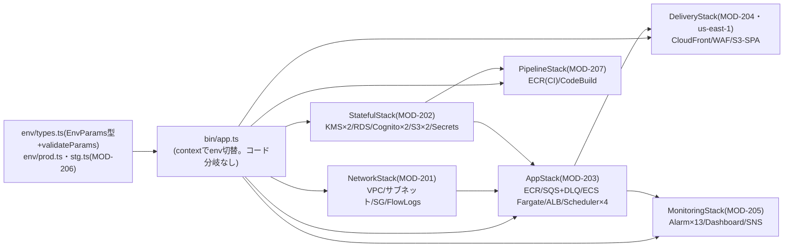

# 詳細設計書 12-07 IaC・監視編

霞台市公共施設予約管理システム構築及び運用保守業務(霞情政第126号)

| 項目 | 内容 |
|---|---|
| 文書番号 | KSM-DDD-001-07(親:KSM-DDD-001) |
| 版 | 2.0(分冊初版。旧KSM-DDD-001 1.1版 §8(IaC詳細・環境パラメータ)の継承) |
| 作成日 | 令和8年6月11日 |
| 作成者 | 受注者(当社)基盤チーム(基盤チームリード) |
| 承認 | 発注者確認待ち |
| 対象モジュール | MOD-201(NetworkStack)/MOD-202(StatefulStack)/MOD-203(AppStack)/MOD-204(DeliveryStack)/MOD-205(MonitoringStack)/MOD-206(環境パラメータ・エントリポイント)/MOD-207(PipelineStack) |
| 関連要件 | NFR-A01〜A04/B01/B03/C01/C02/E01/E02/E05/E06/E08/F02 |

> 凡例:**IaCコード(`kasumidai-yoyaku/infra/`)を詳細設計の正とする**(テンプレ#10。00-principlesの標準記法)。本書はコードへの参照と設計意図に徹する。品質事実:`tsc --noEmit` 0エラー/`cdk synth`(stg/prod)成功/cdk-nag AwsSolutionsChecks **0 violations**/CDK Assertionsテスト20件全通過(KSM-IMP-001 1.1版 §3.2)。

## 1. はじめに・基本設計とのトレース

基本設計:KSM-BDD-001 §9(インフラ・方式設計)・§10(非機能)・§2.3(C4 Container)。参照ADR:ADR-001/003/005/006/007/009/010。リポジトリ・CODEOWNERS統制=KSM-REP-001(IaCのA=基盤チームリード、`infra/security/` 相当のセキュリティ設定=リードA追加承認)。

## 2. コンポーネント詳細(スタック構成=C4 Componentに相当)

### MOD-201 NetworkStack

VPC(10.0.0.0/16・2AZ)・public/private-app/private-db各サブネット・NAT GW(prod=2/stg=1)・SG(ALB→app:8080、app→db:5432のみ。0.0.0.0/0インバウンドなし=Assertionsで固定)・VPC Flow Logs(CloudWatch Logs)。設計意図:KSM-BDD-001 §9.2。

### MOD-202 StatefulStack

KMS CMK×2(dataKey/logKey・年次自動ローテーション=ADR-010)/RDS for PostgreSQL(prod=db.t4g.medium マルチAZ・gp3 100GB・backupRetention=7日・preferredBackupWindow 17:00-18:00 UTC(JST 2:00)・storageEncrypted・deletionProtection(prod)・removalPolicy=RETAIN(prod)/SNAPSHOT(stg))/Cognito×2(userPool=MFA OPTIONAL、staffPool=**MFA REQUIRED・TOTP(RFC 6238)**[^1]・passwordMinLength=IaCパラメータ(prod=12)・英大小数字必須(staffは記号も))/S3×2(dataBucket・logBucket=365日ライフサイクル)/Secrets Manager(CMK暗号化。ローテーションLambdaはP5=cdk-nag SMG4 suppression記録済み)。

### MOD-203 AppStack

ECR(スキャンon push)/SQS×4(通知・決済+各DLQ。KMS暗号化・enforceSSL)/ECS Fargate(apiサービス=0.5vCPU/1GB×desired2〜max8・CPU60%ターゲット追跡・scaleOut60s/scaleIn300s、workerサービス1タスク)/ALB(CloudFrontプレフィックスリスト+カスタムオリジンヘッダ検証)/EventBridge Scheduler×4(JB-01〜04)+**lotteryWarmup**(毎月1〜7日8:45に4タスク暖機=NFR-B01)/CloudWatch Logs(prod=1年/stg=1か月)・ALBアクセスログ→logBucket。

### MOD-204 DeliveryStack(us-east-1)

CloudFront(SPA静的配信+空き照会キャッシュTTL=`availabilityCacheTtlSec`(60秒)・TLSv1.2_2021・アクセスログ→logBucket)/WAF WebACL(CLOUDFRONT):AWSManagedRulesCommonRuleSet+KnownBadInputsRuleSet+RateLimit(2000req/5min)+**StaffPathIpRestriction**(`/staff/*`・`/api/staff/*` を14拠点以外403=NFR-E08)/S3-SPA(パブリックアクセスブロック・OAC)。

### MOD-205 MonitoringStack

CloudWatch Alarms 13本(OPS-ALM-001〜013:ALB 5xx・p95応答3秒=P2-WARNING/5秒=P1-CRITICAL(NFR-B01閾値)・ECS CPU/Memory・RDS CPU/Storage/Connections・SQS滞留/DLQ・バッチJB-01失敗)/Dashboard/SNS(KMS暗号化。P1-CRITICALに通知アクション)。命名=P1-CRITICAL/P2-WARNING接頭辞。P6運用設計書と機械突合(steering/iac規約4)。

### MOD-206 環境パラメータ・エントリポイント

`env/types.ts`(EnvParams型+`validateParams`:**prodでstaffAllowedCidrs空=デプロイ時エラー**の恒久安全装置)/`env/prod.ts`(QA No.17確定の14拠点CIDR:市庁舎本庁 203.0.113.8/29、市直営有人施設10拠点 198.51.100.11〜20/32、指定管理者3者 192.0.2.33/65/97/32=霞情政第201号)/`env/stg.ts`(検証用IP暫定登録)/`bin/app.ts`(context切替。コード分岐なし=ADR-007)/`lib/common/tags.ts`(必須タグProject/Env/ManagedBy/CostCenter)。

主要パラメータ確定値(旧§8.1の継承):

| パラメータ | prod | stg | 根拠 |
|---|---|---|---|
| domainName | yoyaku.city.kasumidai.lg.jp | stg.yoyaku.city.kasumidai.lg.jp | QA No.20(DNS委任・SES認証 市側登録完了=令和8年6月9日) |
| availabilityCacheTtlSec | 60 | 60 | ADR-009(30〜120秒で調整可) |
| apiDesiredCount / max | 2 / 8 | 1 / 2 | KSM-BDD-001 §10.2 |
| lotteryWarmupSchedule | 毎月1〜7日 8:45 4タスク | なし | 同上 |
| passwordPolicy(利用者) | minLength=12・英大小数字必須 | 同左 | G2残課題5市了承 |
| staffSessionHours / userSessionHours | 12 / 24 | 同左 | ADR-004 |
| staffAllowedCidrs | 14拠点確定値 | 検証用暫定 | QA No.17。変更=市文書依頼→IaC変更→CI/CD適用(標準5営業日・緊急1営業日) |

### MOD-207 PipelineStack(CI実行基盤)

ECR(CI用 `-ci` リポジトリ)+CodeBuild(品質ゲートのCI初回実行=KSM-IMP-001 §5.1のJava系検査を実行する基盤)。**制度判断記録**:CodeCommitは2024年7月以降新規利用停止のため、CodeBuildのGitHubソース直接参照を採用(コード内ヘッダに記録。詳細設計の本節と環境構築成果物(KSM-ENV-001=P5納品予定)で詳述)。ECR URIはSSM Parameter Store経由でAppStackと連携。付帯実体:`buildspec.yml`(品質ゲート実行順序=Checkstyle→ArchUnit/JUnit→JaCoCo→SpotBugs→Dockerビルド→ECRプッシュ。KSM-DEV-001 §7と1:1)・`backend/Dockerfile`(Java 21マルチステージ・非rootユーザー実行)。**単体テスト(Assertions)未追加**(P5冒頭で test/stacks.test.ts へ追加=module-index備考)。

## 3. 処理詳細設計

デプロイフロー:PR→CI(tsc/cdk synth/cdk-nag/Jest)→レビュー(CODEOWNERS=基盤リード+セキュリティはリードA)→`cdk diff` 承認→デプロイ(dev→stg→prod同一アーティファクト昇格=ADR-007)。コンソール手作業変更は原則禁止(NFR-C01。緊急手作業は24時間以内にIaC反映+記録=ADR-006)。

## 4. 状態遷移設計

該当なし(宣言的構成)。スタック間依存=bin/app.ts の addDependency(Stateful→App→Monitoring等)。

## 5. API詳細

該当なし。

## 6. データアクセス詳細

該当なし(RDS定義はMOD-202、スキーマは12-00 §6)。

## 7. 画面詳細

該当なし。

## 8. バッチ/非同期詳細

Scheduler定義(JB-01〜04)=MOD-203。業務側設計=12-05。

## 9. 例外・エラー処理設計

デプロイ失敗=CloudFormationロールバック。validateParams違反=synth時エラー(prod IP空・必須パラメータ欠落)。

## 10. インフラ詳細

本分冊全体が該当(IaCコードが正)。リソース名⇔構成図ノード⇔CDKソースの対応表=`infra/docs/resource-map.md`(P5で生成自動化=KSM-BDD-001 §9.2)。

## 11. 監視・運用詳細

- SLI/SLO:可用性(稼働率99.5%=NFR-A02)・遅延(p95 3秒/5秒=NFR-B01)をSLIとし、P6運用設計書でSLO・エラーバジェット運用を確定(KSM-BDD-001 §10.4の方針)。アラーム実体=MOD-205(13本)が既にNFR閾値で定義済みであり、運用設計書の監視項目一覧と機械突合する。
- ランブック(障害シナリオ3本以上)=P6運用設計書(RDSフェイルオーバー・DLQ滞留・抽選JB-01失敗を最低限含める)。

## 12. セキュリティ実装詳細

- IAM最小権限:人とワークロード(タスクロール)分離。`Action:*`×`Resource:*`併用禁止=cdk-nagで機械検査(AwsSolutionsChecks 0 violations。正当理由付きsuppressionはコード内に記録:SMG4=P5ローテーション実装予定、COG8=Plusティア不要、S1=ログバケット自己参照回避 等)。
- 暗号化:RDS/S3/SQS/SNS/ECR=CMK(MOD-202/203/205)。SPA静的アセット=SSE-S3。通信=TLSv1.2_2021。
- ネットワーク統制:SG最小許可・WAF IP制限(14拠点)・踏み台なし(ECS Exec+Session Manager監査ログ付き)。
- ベースライン突合:KSM-BDD-001 §11の対応表+本分冊の実体参照で、設計書⇔IaC突合が成立する。

## 13. 単体テスト設計

| モジュール | テストファイル | 観点(20件通過済み) |
|---|---|---|
| MOD-201 | infra/test/stacks.test.ts | VPC作成・SG 0.0.0.0/0インバウンド不存在 |
| MOD-202 | 同上 | KMS×2・年次ローテーション・RDS暗号化・バックアップ7日・Cognito MFA=REQUIRED・S3ブロックパブリック・削除保護 |
| MOD-203 | 同上 | ECRスキャン・SQS KMS/DLQ・ECSサービス2件・ALB・Scheduler4件 |
| MOD-205 | 同上 | Alarm13件・Dashboard・SNS・P1アクション・命名規則 |
| MOD-204 | (us-east-1のWAFはAssertions対象外=手動確認。P5でテスト追加検討) | WAFルール4本・IPSet14拠点 |
| MOD-206 | validateParams(types.ts内。prod空IPエラー) | パラメータ検証 |
| MOD-207 | **未作成(P5冒頭で追加)** | CodeBuild・ECR-CI |

## 14. トレーサビリティ更新

module-index.md(MOD-201〜207)および KSM-TRM-001(NFR各行のIaC対応列)による。

---

[^1]: AWS「TOTP software token MFA - Amazon Cognito」(TOTPソフトウェアトークン=RFC 6238。専用ハードウェアMFAデバイス方式は非サポート→シード書込可能型トークンで対応)。https://docs.aws.amazon.com/cognito/latest/developerguide/user-pool-settings-mfa-totp.html (参照日:令和8年6月10日。旧KSM-DDD-001 1.1版脚注1の継承)

以上
