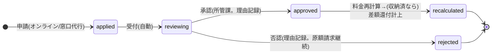

# 詳細設計書 12-08 職員管理・運用機能編(P5実装分の骨格)

霞台市公共施設予約管理システム構築及び運用保守業務(霞情政第126号)

| 項目 | 内容 |
|---|---|
| 文書番号 | KSM-DDD-001-08(親:KSM-DDD-001) |
| 版 | 2.0(分冊初版。旧KSM-DDD-001 1.1版 §1.3/§3.3/§5の該当範囲(設計済み内容)を継承した骨格分冊) |
| 作成日 | 令和8年6月11日 |
| 作成者 | 受注者(当社)業務チームA/B |
| 承認 | 発注者確認待ち |
| 対象モジュール | MOD-301(利用者登録・本人確認)/MOD-302(認証BFF・認可=スタブS-1)/MOD-304(減免申請・承認WF)/MOD-306(統計・月次集計)/MOD-307(お知らせ管理)/MOD-310(マスタ保守・供用管理・窓口画面)/MOD-311(操作ログ検索画面) |
| 関連要件 | REQ-001/003/004/017(画面)/018(WF)/022/023/024(検索)/025/026、NFR-E02 |

> 本分冊は**P5実装予定モジュールの骨格**である(KSM-ADR-013:未実装分は章立て+設計済み内容の再配置)。各節の設計はP3で確定済みの内容(旧KSM-DDD-001 1.1版)を正として再配置しており、P5実装着手時に項目定義・処理詳細を同節へ追記して完成させる。

## 1. はじめに・基本設計とのトレース

基本設計:KSM-BDD-001 §4.1(F01/F03/F13/F17〜F21)・§5.3(SC-Sxx一覧)・§9.4(職員アクセス統制)。参照ADR:ADR-002/003/004。

## 2. コンポーネント詳細(モジュール別の設計済み内容)

### MOD-301 利用者登録・本人確認(REQ-001/004)【P5】

- 二段階登録:オンライン仮申請(SC-U04。メールアドレス検証・有効期限付き)→職員本人確認(SC-S03。確認待ち一覧・差戻し)→本登録→ID通知。users.registration_statusカラム(V1実装済み)で状態表現。
- パスワード再設定=Cognito標準フロー(メール認証・リンク有効期限1時間)。プロフィール変更=PUT /profile。
- API:POST /api/public/v1/registrations、PUT /api/staff/v1/registrations/{id}/approval、PUT /api/user/v1/profile(openapi.yaml designed)。

### MOD-302 認証BFF・認可インターセプタ(REQ-003/023、NFR-E02)【スタブS-1→P5完成】

- BFF方式(KSM-ADR-004):Cognito 2プールの認可コードフローをバックエンドが仲介、httpOnly/Secure/SameSite=Lax Cookie。アクセストークン30分・絶対上限=利用者24h/職員12h。
- 利用者認証(旧§5.1):パスワード最小12桁・英大小数字必須(IaCパラメータ=12-07)。ロックアウト=Cognitoマネージド動作(段階的遅延。G2残課題5市了承済み:回数・時間の画面設定は提供せず、変更はIaC変更管理)。
- 職員MFA(旧§5.2):課単位貸与スマホTOTP基本+共用端末用**TOTP(RFC 6238)準拠・シード書込可能型ハードウェアトークン10本(市調達済み・個人単位割当=QA No.19)**。アカウントは職員個人単位(共用アカウントはREQ-024と両立しないため設けない)。初回ログイン時TOTP登録強制。リセット=SC-S13からシステム管理者が実行(手順書=P6)。
- 認可:`staff_facility_roles`(ロールadmin/dept/counter/designated/readonly×施設)を共通インターセプタで強制+ユースケース内二重検査(KSM-DEV-002 S-12/13)。利用者APIは本人リソースのみ(トークン解決IDを正とし、ボディのIDを信用しない=S-11)。
- 将来拡張:OIDC外部IdP(デジタル認証アプリ)連携可能な構成を維持(REQ-003=QA No.4)。
- **現状(スタブS-1)**:dev限定の暫定ヘッダ X-Dev-User-Id / X-Dev-Staff-Id。本番経路ではALB+Cognito Authorizerで構造的に遮断。

### MOD-304 減免申請・承認WF(REQ-018)【P5】

- WF:申請(SC-U12。証憑添付=S3・CMK暗号化)→受付→審査(SC-S05。所管課ロール×担当施設)→承認/否認(理由必須・操作ログ)→料金再計算(12-02)→通知。申請中の支払期限は自動延伸(確定+7日)。収納後承認=遡及減免の差額還付自動計上(12-02 MOD-008)。
- テーブル:exemption_applications(V3〜)。

### MOD-306 統計・月次集計(REQ-025)【P5】

- JB-04(日次1:00)が monthly_facility_stats を更新(UPSERT冪等)。SC-S10で施設別/月別利用率・収納額・減免額の照会+CSV/PDF(RP-04/05=12-04 MOD-309)。年度集計=4/1〜3/31区切り。オンライン照会から重い集計クエリを排除(NFR-B01)。

### MOD-307 お知らせ管理(REQ-026)【P5】

- noticesテーブル(公開期間・本文)。SC-S11掲載・更新→公開キャッシュ無効化連動(CloudFront invalidation)。公開側=SC-U01/GET /notices。

### MOD-310 マスタ保守・供用管理・窓口画面(REQ-015/021/022)【P5】

- SC-S07:施設・面室・コマ・料金・付帯設備・利用者区分ルール保守(適用開始日付き版管理。過去版は削除しない=12-02 §6)。
- SC-S08:休館日・保守点検日・優先利用枠(closures)設定→一般予約制限・空き表示連動。
- SC-S02:窓口代行予約・電話仮押さえ(2ペイン。上限超過特例=理由必須+操作ログ=KSM-BRL-001 §1.2-3)。保持期限既定値(施設別・初期値7日=QA No.16)。
- API:PUT /fee-master・/closures、POST /api/staff/v1/reservations(designed)。

### MOD-311 操作ログ検索画面(REQ-024)【P5】

- SC-S12:操作者・期間・操作種別での検索+CSV出力(RP-08)。adminロール限定。検索は audit_logs のインデックス(acted_at/actor)起点。記録側は実装済み(12-00 MOD-015)。

## 3. 処理詳細設計

各モジュールのsequenceDiagramはP5実装着手時に本節へ追記(下限:本書§2の設計済みフロー記述で実装着手可能であることをリードA/Bが確認済み)。減免WFの状態遷移を§4に先行確定。

## 4. 状態遷移設計(減免申請=設計確定済み)

利用者登録の状態(仮申請→本登録/差戻し/期限切れ)はusers.registration_statusで同様に管理(P5で図を追記)。

## 5. API詳細

openapi.yaml の designed 群(§2の各節に列挙)。P5実装時にスキーマ確定(x-implementation-status を implemented へ更新)。

## 6. データアクセス詳細

P5追加テーブル(V3以降のマイグレーション):staffs / staff_facility_roles / payment_slips / exemption_applications / refunds / notices / monthly_facility_stats。列定義は旧KSM-DDD-001 §3.3の確定内容(KSM-BDD-001 §7.3に再掲)を正とする。

## 7. 画面詳細

SC-S01〜S14・SC-U04/U06/U07/U09/U12 の項目定義表はP5実装時に本節へ追記(画面一覧・ロール・方針=KSM-BDD-001 §5が確定済み)。

## 8. バッチ/非同期詳細

JB-04/JB-05=12-05 §8。

## 9. 例外・エラー処理設計

12-00 §9の共通規約による(P5実装時に各画面のエラーメッセージ規約を追記)。

## 10. インフラ詳細

12-07参照:Cognito×2プール・MFA設定=StatefulStack、WAF職員パスIP制限=DeliveryStack。

## 11. 監視・運用詳細

12-07 §11による。固有:Cognito認証失敗の監視・MFAリセット手順(P6運用手順書=QA No.19申し送り)。

## 12. セキュリティ実装詳細

12-00 §12による。MOD-302はセキュリティ実装の中核のため、P5実装時にKSM-DEV-002(S-11〜13/21/72)との突合表を本節へ追記。証憑添付=S3・CMK暗号化(MOD-304)。

## 13. 単体テスト設計

P5作成。必須観点(KSM-TSP-001 §5.2):権限マトリクス試験(ロール×施設×API)・改ざんトークン拒否・仮申請有効期限境界・減免WF状態遷移・集計突合(日計⇔月次)。

## 14. トレーサビリティ更新

module-index.md(MOD-301〜311)および KSM-TRM-001 による。

以上
