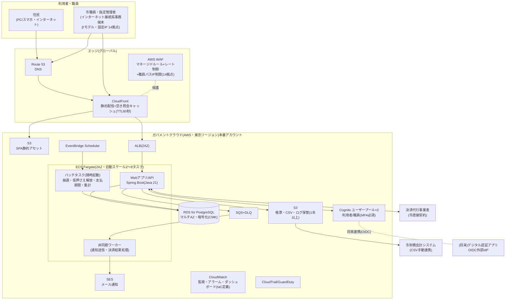

# 基本設計書(システム方式設計編)

霞台市公共施設予約管理システム構築及び運用保守業務(霞情政第126号)

| 項目 | 内容 |
|---|---|
| 文書番号 | KSM-BDD-001 |
| 版 | 1.0(初版) |
| 作成日 | 令和8年6月10日 |
| 作成者 | 受注者(当社)プロジェクトチーム(リードA=アーキテクト/基盤チーム) |
| 承認 | 発注者検収待ち(G2) |
| 関連文書 | KSM-RDD-001(要件定義書)、KSM-TEC-001(技術選定理由書)、KSM-DEV-001(開発標準書)、KSM-ORG-001(体制設計・責任分界表)、KSM-REP-001(リポジトリ戦略)、KSM-TRM-001(トレーサビリティマトリクス 1.1版)、KSM-ADR-001〜010(02-deliverables/adr/) |

## 改版履歴

| 版 | 日付 | 改版内容 | 作成・承認 |
|---|---|---|---|
| 1.0 | 令和8年6月10日 | 初版作成(P2システム方式設計)。G1検収時の申し送り回答(接続元IP制限の許可対象=市庁舎本庁1拠点・有人施設10拠点・指定管理者事務所3拠点の計14拠点)を§4.4に反映 | 当社リードA/発注者検収待ち |

---

## 0. 前提条件・本書の範囲

1. 本書は、要件定義書(KSM-RDD-001、G1検収承認済み)を入力とするシステム方式設計(全体構成・AWS構成・ネットワーク構成・可用性・セキュリティ・性能・コスト概算)である。RFP第6章の「システム方式設計書(全体構成、ネットワーク構成、クラウド構成図)」に対応する。
2. 画面・帳票・データベース(物理)・外部インタフェース詳細の基本設計(アプリ編)は、業務部会での画面確認を経てP2内で別冊(KSM-BDD-002)として追補提出する(本書§11 残課題)。
3. 重要な設計判断はすべてADR(02-deliverables/adr/ KSM-ADR-001〜010)に記録した。本書はADRの決定を前提に方式を記述する(ADR一覧は§10)。
4. **G1申し送り回答の反映**:接続元IP制限(NFR-E08)の許可対象は「市庁舎(本庁・固定IP 1拠点)、有人施設10拠点、指定管理者事務所3拠点(いずれも固定IP契約済み)」の計14拠点として設計する。確定IPリストは市から別途文書で提供予定(受領後、IaCパラメータに登録。§11 残課題)。

## 1. 設計方針

| # | 方針 | 根拠 |
|---|---|---|
| D-1 | **フルマネージド・サーバレス指向**:OS・ミドルウェアのパッチ運用を伴うコンポーネントを持たない(EC2非使用)。コンピューティングはECS Fargate、DBはRDS、認証はCognito、配信はCloudFront | NFR-C03(1か月以内パッチ適用)・インフラ要員0.5人月/月の体制与件・運用経費2割削減(調達目的3) |
| D-2 | **ピーク特化設計**:抽選申込初日9時台の瞬間集中(NFR-B01:100req/秒・抽選1,500件/時)に対し、(1)未ログイン照会のCDNキャッシュ分離 (2)アプリ層の自動水平スケール (3)申込受付と重い処理(抽選・通知)の非同期分離、の3層で対処 | NFR-B01〜B03、現行システム最大の苦情要因の解消 |
| D-3 | **IaC全面管理**:全リソースをAWS CDK(TypeScript)で定義し、手作業構成変更を原則禁止。構成図⇔IaC実体の1:1突合(§3.3) | NFR-C01、steering/iac規約 |
| D-4 | **ステートレス・スケールアウト前提**:アプリ層はセッション状態を持たない(ADR-004)。スケールイン・AZ切替でユーザ影響なし | NFR-A02、NFR-B03 |
| D-5 | **適正水準の原則**:人口5万人・34施設・予算与件に対し過剰な構成(マルチリージョンDR、常時オンコール、ElastiCache等の追加レイヤ)は採らない。判断根拠を各ADRのトレードオフに記録 | CLAUDE.md判断成果物の義務、NFR-A05、月額600千円の運用保守費 |
| D-6 | **市の標準準拠システム群との運用管理共通化**(QA No.2の代替記載義務):§9に整合方針を記載 | QA No.2回答 |

## 2. 全体アーキテクチャ

### 2.1 論理構成



### 2.2 アプリケーション構成(レイヤー)

開発標準書(KSM-DEV-001)に定めるとおり、バックエンド・フロントエンドとも **UI(presentation)→アプリケーション(application)→ドメイン(domain)→インフラ(infrastructure)の一方向依存** とし、ArchUnit/dependency-cruiserで機械検査する。Webアプリ/API・非同期ワーカー・バッチは**単一のSpring Bootコードベース**(起動プロファイル差し替え)とし、保守対象を1系統に保つ(体制与件:アプリ部8名)。

### 2.3 環境構成

| 環境 | 場所 | AWSアカウント | 費用負担 | 用途 |
|---|---|---|---|---|
| 本番(prod) | ガバメントクラウド | 本システム専用アカウント(市がGCAS経由で利用申請) | 市 | 本番サービス |
| 検証(stg) | ガバメントクラウド | 本番と別アカウント | 市 | 受入テスト・性能テスト・リハーサル・パッチ検証 |
| 開発(dev) | 受注者保有AWS(国内リージョン) | 受注者 | 受注者 | 開発・単体/結合テスト。**本番個人情報の保存禁止・テストデータはマスキング(NFR-E09)** |

環境差分はCDKのパラメータ(環境別設定ファイル)で管理し、コード分岐は行わない(steering/iac規約1、ADR-007/KSM-REP-001)。

## 3. AWS構成

### 3.1 採用サービス一覧と要件対応

| 区分 | サービス | 主な設計値(本番) | 充足する要件 | ADR |
|---|---|---|---|---|
| コンピューティング | **ECS Fargate**(Fargate起動タイプ) | APIサービス:0.5vCPU/1GB×常時2タスク(AZ分散)、ターゲット追跡スケーリング(CPU 60%)で最大8タスク。ワーカー1タスク。バッチはRunTaskで随時起動 | NFR-B03、NFR-C03、NFR-A02 | ADR-001 |
| データベース | **RDS for PostgreSQL** | db.t4g.medium マルチAZ、gp3 100GB、自動バックアップ日次・保持7日(7世代)、保存時暗号化(CMK) | REQ-005、NFR-A02〜A04、NFR-E01 | ADR-005 |
| 認証 | **Cognito** | ユーザープール×2(利用者/職員)。職員プールはMFA(TOTP)必須。OIDC外部IdP連携可能な構成(将来デジタル認証アプリ) | REQ-003、NFR-E02 | ADR-002/003 |
| 配信 | **CloudFront + S3** | SPAアセット静的配信、空き照会API(GET・未ログイン)を短TTL(60秒)キャッシュ | REQ-006、NFR-B01 | ADR-009 |
| WAF/DDoS | **AWS WAF + Shield Standard** | CloudFront用Web ACL:AWSマネージドルール(共通・SQLi・既知不正入力)+レートベースルール+職員パスのIP許可(14拠点) | NFR-E05、NFR-E08 | ADR-003 |
| 非同期 | **SQS + EventBridge Scheduler** | 通知キュー+DLQ。抽選(毎月8日)・仮押さえ解放・支払期限取消・日次集計をスケジュール起動 | REQ-008、REQ-012、REQ-021 | ADR-008 |
| メール | **SES** | 予約確定・当落・取消通知(月間約5,000〜10,000通)。バウンス処理をSNS連携 | REQ-012 | ADR-008 |
| 鍵管理 | **KMS(カスタマー管理キー)** | データ用・ログ用CMK。年次自動ローテーション | NFR-E01 | ADR-010 |
| 監視 | **CloudWatch**(+Synthetics 1カナリア) | アラーム・ダッシュボードをIaC定義(steering/iac規約4)。詳細閾値はP6運用設計で確定 | NFR-C02 | − |
| 監査 | **CloudTrail / GuardDuty / AWS Config(記録のみ)** | 全API監査証跡、脅威検知。ログ保管1年以上(S3) | NFR-E06 | − |
| 秘匿情報 | **Secrets Manager** | DB認証情報・決済代行APIキー等 | NFR-E01 | − |
| その他 | Route 53、ACM(証明書自動更新)、ECR、S3(帳票・ログ) | − | NFR-C02(証明書期限) | − |

### 3.2 VPC・リソース命名

steering/iac規約2に従い `yoyaku-{env}-{role}` で命名し、全リソースに必須タグ(`Project=kasumidai-yoyaku`、`Env`、`ManagedBy=cdk`、`CostCenter=jouhou-seisaku`)を付与する。

```
VPC: yoyaku-prod-vpc (10.0.0.0/16、2AZ)
├─ public subnet ×2     : ALB(yoyaku-prod-alb)、NAT GW×2(yoyaku-prod-nat-a/c)
├─ private app subnet ×2: ECS Fargate(yoyaku-prod-app / -worker / -batch)
└─ private db subnet ×2 : RDS(yoyaku-prod-db)マルチAZ
   S3 Gatewayエンドポイント(無料)を使用。SG: ALB→app(8080)、app→db(5432)のみ許可。
   0.0.0.0/0インバウンドはCloudFront経由443のみ(ALBはCloudFrontマネージドプレフィックスリスト
   +カスタムオリジンヘッダ検証で直接アクセスを遮断)。SSH/RDPは全環境で開放しない(踏み台なし。
   調査はECS Exec＋Session Managerの監査ログ付き一時アクセスに限定)。
```

### 3.3 構成図⇔IaC突合方式(steering/iac規約5)

構成図(§2.1)の各ノードはCDKコンストラクトID(=リソース名 `yoyaku-{env}-{role}`)と1:1対応させ、対応表(リソース名⇔構成図ノード⇔CDKソースパス)をIaCリポジトリの `infra/docs/resource-map.md` として維持する(P4で生成を自動化)。命名規則準拠はcdk-nagカスタムルールで機械検査する。

## 4. ネットワーク構成

### 4.1 前提(QA No.3回答・確定)

- 市庁内ネットワークは**β'モデル相当**(業務端末・グループウェア等をインターネット接続系に配置)[^1]。職員・指定管理者は**インターネット接続系の事務端末から住民と同一経路**で本システムへアクセスする。
- 本システムは**マイナンバー利用事務系・LGWAN接続系とは接続しない**。
- ガバメントクラウドとの接続は**インターネット経由(TLS1.2以上)**。ガバメントクラウド接続サービス(専用線)は利用しない。

### 4.2 経路設計

```
[住民]──HTTPS──▶ CloudFront(+WAF) ──▶ S3(静的) / ALB ──▶ ECS Fargate ──▶ RDS
[職員・指定管理者(14拠点・固定IP)]──HTTPS──▶ 同上(職員向けパスはWAFでIP制限+Cognito職員プールMFA)
[本システム]──HTTPS(アウトバウンド・NAT GW経由)──▶ 決済代行API
[財務会計連携]CSVダウンロード(職員操作)──手動──▶ 庁内財務会計システム(自動連携なし=REQ-020)
```

### 4.3 ドメイン・証明書

`yoyaku.city.kasumidai.lg.jp`(市保有ドメインのサブドメイン。市と協議の上確定)。証明書はACMで発行・自動更新し、有効期限アラームを設定(NFR-C02)。TLS1.2以上(セキュリティポリシー TLSv1.2_2021、TLS1.3対応)。

### 4.4 職員アクセス統制(NFR-E08。G1申し送り回答反映)

| 項目 | 設計 |
|---|---|
| 対象パス | `/staff/*`(職員向け画面)、`/api/staff/*`(職員向けAPI) |
| 統制1:接続元IP制限 | WAF IPSet(許可リスト)に**14拠点**(市庁舎本庁1+有人施設10+指定管理者事務所3。いずれも固定IP契約済み)のグローバルIPを登録。リスト外からの職員パスアクセスは403。確定IPリストは市提供文書の受領後にIaCパラメータへ登録(§11残課題) |
| 統制2:多要素認証 | Cognito職員プールでMFA(TOTPアプリ)必須(NFR-E02)。市標準端末(Windows 11+Edge)で追加ソフト不要(TOTPは貸与スマートフォン又はハードウェアトークン。市と運用協議) |
| 統制3:権限 | ロール(管理者/所管課/窓口/指定管理者/参照)×施設のアクセス制御(REQ-023)。認可はアプリ層で実施 |
| 変更管理 | IP追加・削除は市(システム管理者)の依頼により受注者がIaCパラメータ変更→CI/CD経由で適用(手作業変更禁止。NFR-C01)。標準リードタイム5営業日、緊急時1営業日 |
| 例外時運用 | 固定IP変更・新拠点追加は同上。**リスト外(自宅等)からの職員アクセスは提供しない**(市の運用と整合確認済みの前提。変更時は市と協議) |

## 5. 可用性・バックアップ設計

### 5.1 可用性方式(NFR-A01〜A02)

| 層 | 方式 | 単一障害点の排除 |
|---|---|---|
| 配信 | CloudFront(グローバル冗長) | AWSマネージド |
| アプリ | ECS Fargate 2タスク以上を常時2AZへ分散。ALBヘルスチェックで自動切離し・自動再起動 | AZ障害時も縮退継続 |
| DB | RDSマルチAZ(同期レプリケーション・自動フェイルオーバー、通常60〜120秒程度[^2]) | AZ障害時自動切替 |
| NAT | AZごとに1基(計2基) | AZ障害の他AZ波及防止 |

- 稼働率99.5%(月間許容停止約3.6時間)に対し、本構成の主要マネージドサービスSLA(ALB/ECS/RDSマルチAZ各99.99%等)の合成で十分な余裕を確保する。
- 計画停止は月1回4時間以内(NFR-A01)。アプリ更新はローリングデプロイで無停止、計画停止はRDSメンテナンス等に限定し、火〜木 2:00〜6:00、抽選期間(毎月1〜7日)・月初を回避。

### 5.2 バックアップ・復旧(NFR-A03〜A04)

| 対象 | 方式 | 世代・保管先 |
|---|---|---|
| DB | RDS自動バックアップ(日次スナップショット+トランザクションログ) | 保持7日(=7世代以上)。スナップショットはリージョン内複数AZ冗長のマネージドストレージに保管(NFR-A04の別AZ保管要件を充足)。PITRにより実効RPOは5分程度(要求はRPO24時間) |
| S3(帳票・ログ) | バージョニング+ライフサイクル | 1年以上(NFR-E06) |
| 構成 | IaC(Git)+ECRイメージ | 環境全体をコードから再構築可能(RTO対策) |

- **復旧手順(RTO 12時間以内)**:広範な障害時はIaCによる環境再構築(2〜3時間)+最新スナップショットからのDB復元(1時間程度)+検証で、12時間以内に復旧可能。手順はP6運用設計書のランブックとして文書化し、復旧訓練を実施。
- **広域災害対策(NFR-A05・参考提案、必須外)**:大阪リージョンへのRDSスナップショット自動コピー(日次・7世代)+S3クロスリージョンレプリケーション。概算追加費用:**月額約3千円(約20ドル)**+初期実装約500千円。マルチリージョンDR(ホットスタンバイ)は本市規模に過剰であり提案しない。

## 6. セキュリティ設計

| 項目 | 設計 | 要件 |
|---|---|---|
| 通信暗号化 | 全経路TLS1.2以上。HTTP→HTTPSリダイレクト。ALB-ECS間はVPC内(プライベートサブネット) | NFR-E01 |
| 保存暗号化 | RDS・S3・SQS・CloudWatch Logs・バックアップすべて暗号化。個人情報を含むDB/S3はカスタマー管理CMK(ADR-010) | NFR-E01 |
| 認証 | 利用者:Cognito(ID/パスワード+メール検証。パスワードポリシーはIaCパラメータで設定・変更管理)。職員:Cognito別プール+MFA必須+IP制限 | NFR-E02、E08 |
| アプリ対策 | OWASP Top 10:2025[^3]対応をセキュア実装標準(KSM-DEV-001 §6)として規定し、SAST/依存ライブラリ検査をCIで強制。稼働前に第三者脆弱性診断(プラットフォーム+Webアプリ)(P5) | NFR-E04 |
| WAF/DDoS | AWS WAFマネージドルール+レートベースルール、Shield Standard | NFR-E05 |
| ログ | アクセス(CloudFront/ALB/WAF)・操作(アプリ監査ログ→DB+S3)・認証(Cognito→CloudWatch Logs)・API監査(CloudTrail)を**1年以上**保存。保管先・期間一覧は別表(アプリ編KSM-BDD-002に収録) | NFR-E06、REQ-024 |
| IAM | 最小権限。人(運用者)とワークロード(タスクロール)を分離。`Action:*`×`Resource:*`の併用禁止(cdk-nagで機械検査) | steering/iac規約3 |
| 開発環境 | 本番個人情報の保存禁止。移行データを用いるテストは検証環境(ガバクラ)に限定し、開発環境はマスキング済みデータのみ | NFR-E09 |

## 7. 性能設計(NFR-B01〜B03)

### 7.1 負荷の見立てと対処の対応

| 負荷シナリオ(KSM-RDD-001 §5.2確定値) | 対処 |
|---|---|
| 未ログイン空き照会(2秒以内)・ピーク時の照会集中 | CloudFront短TTLキャッシュ(60秒)+S3静的アセット配信でアプリ層から分離。キャッシュヒット時は数十ms |
| 通常時3秒以内/繁忙時5秒以内(95%タイル)、100req/秒バースト | ECSターゲット追跡スケーリング(2→8タスク)。抽選期間(毎月1〜7日 8:45〜10:00)は**スケジュールスケーリングで事前に4タスクへ暖機**(スパイク立ち上がりの追従遅れを排除) |
| 抽選申込 瞬間10件/秒 | 申込受付は軽量な同期書込(単一INSERT+上限チェック)でRDBの余裕内。抽選実行(重い処理)は月1回のバッチに分離(ADR-008) |
| 通知一斉送信(当落 約2,000〜2,500通) | SQS経由の非同期送信でAPI応答と分離。SES送信レートに合わせワーカーが平準化 |
| 5年後1.5倍(B02) | DB容量・接続数とも余裕(db.t4g.medium基準で利用率試算20%未満)。アーキテクチャ変更不要。さらに超過時はRDS→Auroraスナップショット移行パスを温存 |

### 7.2 検証

P5性能テストでピーク再現シナリオ(抽選初日9時台)を実施し、KSM-RDD-001 §5.2の確定値を合否基準とする(NFR-B04)。検証環境(stg)を本番同等スペックへ一時増強して測定(終了後に縮退。市負担クラウド利用料への影響は事前に市へ提示)。

## 8. 監視・運用方式(概要。詳細はP6運用設計書)

体制与件(夜間休日は外部委託一次受付のみ・常時オンコールなし)と市規模に適正な水準とする。

| 区分 | 監視項目(代表) | 通知 |
|---|---|---|
| 死活 | Synthetics外形監視(トップ+空き照会、5分間隔)、ALBヘルスチェック | 重大:SNS→外部委託一次受付+当社運用チーム(メール/電話)。重大障害は検知後1時間以内に市へ第一報(NFR-C02)。フェイルオーバー・タスク再起動は自動(人手対応を待たない設計) |
| リソース | ECS CPU/メモリ、RDS CPU/接続数/ストレージ、SQS滞留・DLQ | 警告:翌開庁日対応 |
| エラー | ALB 5xx率、アプリエラーログ、決済IF失敗 | 重大/警告を閾値で区分(閾値はP6で確定) |
| 期限 | ACM証明書、Cognito関連、RDSメンテナンス通知 | 警告 |

アラーム・ダッシュボードはすべてCDKで定義し、P6運用設計書の監視項目一覧と機械突合する(steering/iac規約4)。パッチ運用(NFR-C03)は、Fargateプラットフォーム・RDSマイナーバージョンともマネージド自動適用+検証環境での事前確認とし、対象を最小化する。

## 9. 標準準拠システム群との運用管理共通化方針との整合(QA No.2代替記載)

本システムは標準化対象外システムであるが、市の標準準拠システム群と同一のガバメントクラウド(AWS)基盤上に構築することで、次の運用管理を共通化し、基盤運用の共通化とスケールメリットによる経費削減(RFP 1.3(1))に整合させる。

1. **利用申請・アカウント管理**:GCASによる利用申請・アカウント払い出しの市側手続(単独利用方式)に整合し、本システム用アカウント(本番・検証)を市の既存ガバクラ環境と同一の管理枠組みに収容する[^4]。受注者は申請に必要な構成情報の整理等を技術支援する(QA No.3)。
2. **監査・統制**:CloudTrail・Config・GuardDutyの有効化、必須タグ(CostCenter等)によるコスト按分、IAM最小権限の方針を市の既存ガバクラ運用基準と同一の考え方で適用する。
3. **コスト管理**:月次のクラウド利用料実績報告(NFR-C07)を市の情報政策課の予算管理様式に合わせて提供し、年1回の最適化提案で標準準拠システム群側の知見(リザーブド/Savings Plans適用等)と整合させる。
4. **ネットワーク**:本システムはインターネット公開系であり専用線(ガバメントクラウド接続サービス)は利用しないが、職員アクセス統制(MFA+IP制限)は市セキュリティポリシー・総務省ガイドライン(令和8年3月27日改定版)[^1]のβ'モデルの考え方に適合させる。

## 10. ADR一覧(02-deliverables/adr/)

| ID | 題名 | 決定 |
|---|---|---|
| KSM-ADR-001 | コンピューティング方式 | ECS Fargate(単一実行基盤。Lambda・EC2は却下) |
| KSM-ADR-002 | 利用者認証方式 | Amazon Cognito(利用者プール。OIDC外部IdP連携可能な構成で将来のデジタル認証アプリ連携に対応) |
| KSM-ADR-003 | 職員認証・アクセス統制方式 | Cognito職員専用プール+MFA(TOTP)必須+WAFによる接続元IP制限(14拠点) |
| KSM-ADR-004 | セッション管理方式 | BFF方式+JWTステートレス(httpOnly/Secure Cookie)。セッションストア(ElastiCache)非採用 |
| KSM-ADR-005 | データストア(P1方針の正式化) | Amazon RDS for PostgreSQL マルチAZ |
| KSM-ADR-006 | IaCツール(P1方針の正式化) | AWS CDK(TypeScript)+cdk-nag |
| KSM-ADR-007 | リポジトリ戦略 | モノレポ(アプリ+IaC同居)・環境差分はパラメータ管理・トランクベース開発 |
| KSM-ADR-008 | 非同期処理方式(抽選処理ほか) | SQS+ワーカー(通知系)/EventBridge Scheduler+ECS RunTask(抽選・期限系バッチ) |
| KSM-ADR-009 | 公開照会の配信・キャッシュ方式 | CloudFront+S3(SPA静的配信)+空き照会APIの短TTLキャッシュ |
| KSM-ADR-010 | 暗号鍵管理方式 | KMSカスタマー管理キー(CMK)・自動ローテーション |

## 11. コスト概算

### 11.1 AWS利用料(市負担分=ガバメントクラウド上の本番・検証のみ。QA No.9整合)

前提:東京リージョン公表単価(参照日:令和8年6月10日)[^5]、1ドル=155円、税抜。開発環境(受注者AWS)は受注者負担のため**本表に含まない**。

| 項目 | 本番(月額USD) | 検証(月額USD) | 備考 |
|---|---|---|---|
| ECS Fargate | 55 | 6 | 本番:常時2タスク(0.5vCPU/1GB)+ピークスケール分+ワーカー。検証:平日日中のみ起動 |
| ALB | 35 | 20 | 時間料+LCU |
| NAT Gateway | 95 | 46 | 本番2基(AZ冗長)、検証1基 |
| RDS for PostgreSQL | 200 | 45 | 本番:db.t4g.mediumマルチAZ+gp3 100GB。検証:db.t4g.smallシングルAZ・夜間休日停止運用 |
| CloudFront/Route 53 | 16 | 3 | 月35万PV+ピーク |
| AWS WAF | 11 | 8 | Web ACL+マネージドルール+リクエスト[^6] |
| Cognito | 0 | 0 | 月間アクティブ約3,000〜5,000人<無料枠10,000MAU[^7] |
| SQS/EventBridge/SES | 2 | 1 | 月間メール約1万通以下 |
| CloudWatch(監視・ログ) | 25 | 8 | ログ・アラーム約30本・ダッシュボード・Synthetics 1本 |
| KMS/Secrets Manager/ECR/S3 | 14 | 8 | CMK×2ほか |
| CloudTrail/GuardDuty/Config | 12 | 5 | 監査・脅威検知 |
| **小計** | **約465** | **約150** | |

| 集計 | 金額 |
|---|---|
| 月額合計 | **約615ドル ≒ 約95千円/月(税抜)** |
| 年額 | **約7,380ドル ≒ 約1,150千円/年(税抜)** |
| 5年(63か月)総額 | **約6,000千円(税抜)** |
| 感度 | 為替±20%・利用増を見込み **月額77〜120千円** のレンジで市予算化を推奨 |

参考:現行インフラ関連経費は年額7,200千円(別紙1)。クラウド利用料(年約1,150千円)+運用・保守費(年7,200千円=月額600千円)としても、ハードウェア更改費(5年周期の再投資)が不要となり、運用経費2割削減目標(調達目的3)の達成見込みを維持する(詳細試算はP6運用設計時に更新)。コスト最適化(検証環境の停止運用、Fargate/RDSのSavings Plans・リザーブド適用)は稼働後の年次提案(NFR-C07)で行う。

### 11.2 構築工数概算

平均単価700千円/人月(税抜)。構築予算上限48,000千円(税込)との整合を確認済み。

| フェーズ | 工数(人月) | 主な内容 |
|---|---|---|
| P1 要件定義(実績) | 6 | 要件確定・技術選定・QA対応 |
| P2 基本設計 | 9 | 方式設計・ADR・アプリ基本設計(画面/帳票/DB/外部IF)・開発標準・体制設計 |
| P3 詳細設計 | 8 | 詳細設計・テスト計画・パラメータ設計 |
| P4 実装・環境構築 | 21 | アプリ実装・単体、IaC・CI/CD、移行ツール |
| P5 テスト | 8 | 結合・総合・性能・脆弱性対処、本番構築 |
| P6 移行・運用設計 | 5 | 移行リハ2回・運用設計・研修・マニュアル |
| プロジェクト管理(横断) | 3 | PM/PMO |
| **合計** | **60人月** | **約42,000千円(税抜)≒46,200千円(税込)+リスク予備約1,800千円=予算上限48,000千円内** |

## 12. 残課題(G2検収時申し送り)

| # | 事項 | 期限・担当 |
|---|---|---|
| 1 | 接続元IP制限:14拠点の確定IPリスト文書の受領→IaCパラメータ登録 | P3開始まで/市(情報政策課)→当社 |
| 2 | 決済代行事業者の選定候補提案書(KSM-PAY-001)の提出と市の直接契約手続開始(G1申し送り回答) | R8.12中に当社提出→P2期間中に市手続開始 |
| 3 | 基本設計書(アプリ編:画面・帳票・DB・外部IF。KSM-BDD-002)の追補提出 | R9.1中(業務部会の画面確認後)/当社 |
| 4 | MFA(TOTP)の職員側手段(貸与端末/ハードウェアトークン)の運用協議 | P3開始まで/市・当社 |
| 5 | NFR-E02「パスワードポリシー設定可能」の充足方式(管理画面からの自由設定ではなくIaCパラメータの変更管理で実現)の市側確認 | G2検収時/市 |
| 6 | サブドメイン(yoyaku.city.kasumidai.lg.jp想定)の確定とDNS委任手続 | P3開始まで/市・当社 |

---

## 脚注(制度・標準・料金の出典。いずれもWeb検索で現行版を確認)

[^1]: 総務省「地方公共団体における情報セキュリティポリシーに関するガイドライン」(令和8年3月27日改定版)。β/β'モデル(業務端末等をインターネット接続系に配置)を規定。https://www.soumu.go.jp/main_sosiki/kenkyu/chiho_security_r03/index.html (参照日:令和8年6月10日)
[^2]: AWS「Amazon RDS Multi-AZ deployments」(マルチAZ配置のフェイルオーバー動作)。https://aws.amazon.com/rds/features/multi-az/ (参照日:令和8年6月10日)
[^3]: OWASP Foundation「OWASP Top 10:2025」(2025年11月公開の現行版)。https://owasp.org/Top10/2025/ (参照日:令和8年6月10日)
[^4]: デジタル庁 GCASガイド「ガバメントクラウド利用検討の基本的な考え方について」(2025年3月10日公開)。https://guide.gcas.cloud.go.jp/general/basic-concept (参照日:令和8年6月10日)
[^5]: AWS公式料金ページ(東京リージョン):AWS Fargate料金 https://aws.amazon.com/fargate/pricing/ 、Amazon RDS for PostgreSQL料金 https://aws.amazon.com/rds/postgresql/pricing/ (いずれも参照日:令和8年6月10日。本概算は参照日時点の公表単価と1ドル=155円による試算であり、月次実績報告(NFR-C07)で実額管理する)
[^6]: AWS WAF料金(Web ACL 5ドル/月、ルール1ドル/月、100万リクエストあたり0.60ドル)。https://aws.amazon.com/waf/pricing/ (参照日:令和8年6月10日)
[^7]: Amazon Cognito料金(Essentialsティア:月間アクティブユーザー10,000まで無料枠)。https://aws.amazon.com/cognito/pricing/ (参照日:令和8年6月10日)

以上
